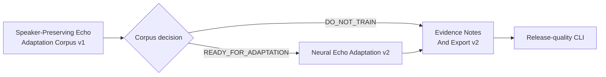

# Current Goal

Status: current

Updated: 2026-07-23

The stable product path is `murmurmark meeting -> first Ctrl-C -> final result`. Batch output remains
authoritative. Live output is advisory and shadow-only.

Roadmap status and dependency truth live in
`docs/roadmap/murmurmark-cli-roadmap.plan.yaml`. This file expands the one executable goal in human
terms. `scripts/check-planning-consistency.py` keeps the representations aligned.

## Speaker-Preserving Echo Adaptation Corpus v1

OpsKarta nearest goal: Speaker-Preserving Echo Adaptation Corpus v1: доказать, что из локальных
MurmurMark-сессий можно воспроизводимо собрать privacy-safe и session-disjoint supervision для
remote-only, local-only и double-talk, а затем выпустить READY_FOR_ADAPTATION либо точный
DO_NOT_TRAIN без обучения и изменения production.

Two increasingly capable suppression attempts now have the same safety ceiling:

- classical state-level suppression removed remote-risk but deleted quiet or short `Me` inside
  remote-active intervals;
- pretrained Microsoft DEC removed all bounded remote-risk in the hard counterexamples, but
  protected-local recall fell to `45.45%`, chronology recall to `0%`, and incremental runtime
  reached `52.85%` of `local_fir`.

The second result rules out a simple engine swap. The next shortest reliable step is to prove
whether MurmurMark has enough local, legally usable and correctly separated supervision to adapt a
model around its real acoustic domain. Training before that proof would be expensive guesswork.

## Completed Immediate Predecessor

[Neural Residual Echo Suppression v1](../research/2026-07-23-neural-residual-echo-v1.md) established:

- a pinned, offline Microsoft DEC ONNX adapter and secondary AECMOS metric;
- exact 16 kHz duration, no hidden normalization and fail-open baseline selection;
- two modes: post-`local_fir` primary and raw-mic domain-shift control;
- deterministic candidate audio and corpus decision;
- `3.49s -> 0s` bounded ASR-visible remote-risk;
- mandatory failure on protected local speech, chronology, double-talk and runtime;
- no full shadow run and no production apply path;
- final `DO_NOT_PROMOTE` fingerprint
  `eff4119d7e19b90dc2b7e6f03caf1b762d29f6c46c97b3141764db76764200f3`.

`local_fir_role_masked` remains production.

## Execution Scope

1. Freeze eligible local-only, remote-only, double-talk, opening and chronology intervals with raw,
   aligned-remote, speaker-state, transcript and evidence hashes.
2. Define inclusion and exclusion rules. Ambiguous speaker identity, clipped audio, uncertain
   alignment, stale evidence or missing local references stay out of training supervision.
3. Build session-disjoint train, development and immutable hard-test splits. No interval from one
   session may cross split boundaries.
4. Materialize paired examples locally:
   clean/protected near-end target, aligned remote reference, measured or replayed echo mixture,
   speaker state and word-level protected content.
5. Cover both measured speaker playback and controlled synthetic augmentation. Preserve a separate
   real hard-test split so synthetic success cannot hide domain failure.
6. Define pre-training oracle checks: reconstruction, exact duration, no target leakage,
   remote-removal headroom, protected-word coverage and licensing/privacy manifest.
7. Publish `READY_FOR_ADAPTATION` only if the corpus supports a meaningful, leakage-free training
   experiment; otherwise publish exact `DO_NOT_TRAIN`.

## Safety Contract

- raw CAF and current derived inputs are read-only;
- corpus artifacts are local and excluded from public source control;
- no speech or text is uploaded;
- split assignment is by session, never by random clip;
- protected `Me` words and chronology intervals remain immutable acceptance examples;
- a synthetic target may not be treated as real evidence;
- AECMOS and signal similarity remain secondary; word-level local preservation owns the gate;
- this goal does not train, promote or apply a model;
- absent consent, uncertain provenance or inadequate supervision yields `DO_NOT_TRAIN`.

## Definition Of Done

- every candidate interval has provenance, inclusion reason and SHA-256 inputs;
- train/dev/hard-test splits are deterministic and session-disjoint;
- local-only, remote-only and double-talk coverage is measured by seconds and sessions;
- both known hard counterexamples are immutable test items, never training items;
- paired audio has exact duration/timeline and passes finite, clipping and leakage checks;
- a privacy/licensing manifest states what may remain local, be redistributed or never leave the
  machine;
- an oracle report quantifies whether the target is learnable and useful for MurmurMark;
- repeated runs produce identical manifests and split fingerprints;
- missing or ambiguous evidence fails closed for corpus inclusion and leaves production untouched;
- the final report says `READY_FOR_ADAPTATION` or exact `DO_NOT_TRAIN`;
- README, architecture, contracts, runbook, roadmap and OpsKarta are synchronized;
- tests pass, changes are committed and pushed, and the tree is clean.

## Route After This Goal

## Out Of Scope

- neural training or fine-tuning;
- production Echo Guard changes;
- capture, raw CAF, whisper.cpp or Live Shadow changes;
- cloud models or cloud audio;
- target-speaker extraction;
- individual remote-speaker diarization;
- UI.
