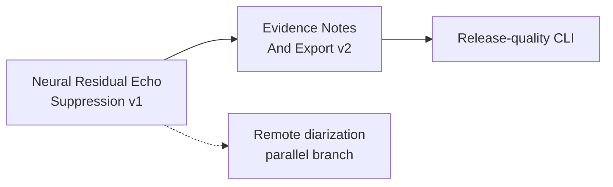

# Current Goal

Status: current

Updated: 2026-07-23

The stable product path is `murmurmark meeting -> first Ctrl-C -> final result`. Batch output remains
authoritative. Live output is advisory and shadow-only.

Roadmap status and dependency truth live in
`docs/roadmap/murmurmark-cli-roadmap.plan.yaml`. This file expands the one executable goal in human
terms. `scripts/check-planning-consistency.py` keeps the representations aligned.

## Neural Residual Echo Suppression v1

OpsKarta nearest goal: Neural Residual Echo Suppression v1: проверить локальный remote-conditioned
suppressor на frozen overlap-контрпримерах и выпустить corpus-wide PROMOTE либо точный
DO_NOT_PROMOTE без изменения local_fir baseline.

Echo Suppression Promotion v1 completed with a reproducible `DO_NOT_PROMOTE`. Its best classical
candidate, `coverage_v2_remote_gate_local_fir`, reduced bounded ASR-visible remote-risk seconds by
`68.2845%` and stayed within the runtime budget, but passed only `3/5` applicable speaker sessions.
On the two failures, protected local retention fell to `45.45%` and chronology recall to `0%`.
`local_fir_role_masked` therefore remains the production input.

Objective: test whether a local speech-aware residual suppressor can distinguish transformed remote
echo from near-end speech during double-talk. The result must be an isolated candidate and a
reproducible `PROMOTE_NEURAL_RESIDUAL_ECHO_V1` or `DO_NOT_PROMOTE`; no model may silently enter the
normal path.

## Completed Immediate Predecessor

[Echo Suppression Promotion v1](../research/2026-07-23-echo-suppression-promotion-v1.md) established:

- one canonical signed timing contract:
  `echo_at_mic(t) ~= remote(t - delay(t))`;
- exact role-aware `local_fir` baseline and separate engine-native/canonical candidate audio;
- aligned WebRTC AEC3, SpeexDSP, Offline AEC and bounded coverage candidates;
- cheap audio/runtime gates, bounded `large-v3` ASR probes and deterministic corpus decisions;
- a frozen nine-session corpus with speaker, headphones/low-leak, office, group, long and no-speech
  examples;
- an automatic fail-open production policy;
- `DO_NOT_PROMOTE` because no candidate preserved protected local speech and chronology on every
  applicable session.

The decisive counterexamples are frozen:

- `2026-07-20_15-15-26-live`: a longer local phrase starts during remote activity;
- `2026-07-20_16-30-42-live`: a short local acknowledgement occurs in a mixed/order interval.

They are mandatory hard negatives for the next candidate.

## Execution Scope

1. Freeze the promotion corpus, failed intervals, input hashes, exact baseline and current
   `DO_NOT_PROMOTE` policy.
2. Define a model-neutral local inference contract:
   aligned remote, mic mixture, classical echo estimate and optional speaker state in; residual
   cleaned mic and provenance out.
3. Select at most two justified local candidates:
   one pretrained remote-conditioned residual AEC model, plus an optional target-speaker rescue only
   when reliable per-session enrollment exists.
4. Wrap inference in an offline, deterministic, bounded worker. Missing model, unsupported runtime,
   excessive latency, NaN, clipping or sparse output must fail open.
5. Run cheap signal gates, then bounded ASR on remote-risk, protected-local, opening, double-talk and
   chronology windows. Use full shadow transcription only for a candidate passing every session
   gate.
6. Publish a corpus report and keep production on `local_fir` unless every promotion gate passes.

## Safety Contract

- raw CAF, capture, `local_fir`, primary whisper.cpp and current transcript profiles do not change;
- all model inference is local and derived;
- no model training is required in the normal pipeline;
- candidate audio may not pass by muting or globally attenuating the mic;
- every protected local utterance, greeting, acknowledgement and double-talk phrase must survive;
- remote content, chronology, verdict, notes evidence and guarded export may not regress;
- weak enrollment, missing weights, model failure or contradictory judges select baseline;
- a second full-session ASR is laboratory-only and runs only for a passing finalist;
- automatic selection requires an exact corpus decision and matching fingerprints.

## Definition Of Done

- the model interface, weights provenance, license and reproducible local setup are documented;
- at least one remote-conditioned residual candidate is evaluated on all applicable frozen sessions;
- the two known local-loss counterexamples have explicit ASR and audio dispositions;
- ASR-visible remote-risk seconds improve by at least `25%`;
- remote-caused mandatory review seconds improve by at least `15%`;
- confirmed and protected local recall are at least `99%`, with no individual protected loss;
- chronology, double-talk, remote content, verdict, notes and export do not regress;
- ordinary runtime overhead is at most `25%`, or the candidate remains a clearly optional slow lab;
- repeated runs produce identical decisions and fingerprints;
- missing models and helper failures pass automated fail-open tests;
- a corpus-wide `PROMOTE_NEURAL_RESIDUAL_ECHO_V1` or exact `DO_NOT_PROMOTE` is published;
- README, architecture, contracts, runbook, roadmap and OpsKarta are synchronized;
- the completed work is installed locally, committed and pushed with a clean tree.

## Route After This Goal

## Out Of Scope

- capture or raw CAF format changes;
- replacement of the primary whisper.cpp ASR;
- cloud models or cloud audio;
- broad neural-model training;
- individual remote-speaker diarization;
- Live Shadow promotion, LLM synthesis and UI.
