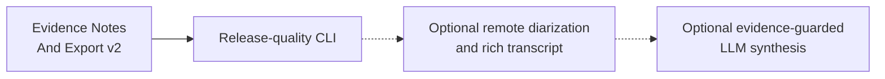

# Current Goal

Status: current

Updated: 2026-07-23

The stable product path is `murmurmark meeting -> first Ctrl-C -> final result`. Batch output remains
authoritative. Live output is advisory and shadow-only.

Roadmap status and dependency truth live in
`docs/roadmap/murmurmark-cli-roadmap.plan.yaml`. This file expands the one executable goal in human
terms. `scripts/check-planning-consistency.py` keeps the representations aligned.

## Evidence Notes And Export v2

OpsKarta nearest goal: Evidence Notes And Export v2: превратить выбранный transcript profile,
structured quality verdict и unresolved review evidence в один deterministic handoff bundle,
который либо готов к локальному Markdown/Obsidian export, либо явно заблокирован с точными evidence
IDs, без LLM и внешних записей.

The CLI already creates extractive notes, quality verdicts and guarded exports. The remaining
product gap is coherence: users should not have to infer which profile, review queue, notes file or
export command is authoritative. A single handoff contract must carry the selected transcript,
claim-level evidence, unresolved risks and export readiness together.

## Completed Immediate Predecessor

[Speaker-Preserving Echo Adaptation Corpus v1](../research/2026-07-23-speaker-preserving-echo-adaptation-corpus-v1.md)
completed with reproducible `DO_NOT_TRAIN`:

- nine frozen sessions were split into five train, two dev and two immutable hard-test sessions;
- all raw, production-derived, transcript and evidence SHA-256 values remained unchanged;
- local-only target coverage passed with `192s` train and `96s` dev;
- no remote-only interval passed the frozen confidence gate;
- synthetic paired supervision therefore remained empty;
- hard-test retained four protected-local and four chronology items, but only `6s` double-talk and
  no independently confirmed opening acknowledgement;
- privacy checks passed and no training was performed;
- replay matched `414/414` files;
- decision fingerprint:
  `32a07efc3614bbcc68aeab3b0b77610b000981d989a7a2df096429a959899507`.

Speaker-Preserving Neural Echo v2 is blocked for this evidence scope.
`local_fir_role_masked` remains production.

## Execution Scope

1. Define one versioned handoff schema over the selected transcript profile, quality verdict,
   evidence notes, review progress and export blockers.
2. Make claim IDs stable. Every outline, decision, action, risk and open question shown to the user
   must cite existing utterance/evidence IDs.
3. Separate confirmed, candidate and unresolved claims. Extractive heuristics may propose content,
   but may not silently upgrade review-required evidence.
4. Produce one deterministic local bundle containing:
   - readable notes;
   - machine-readable evidence notes;
   - quality verdict;
   - selected transcript reference and fingerprint;
   - unresolved review items;
   - export readiness and exact next command.
5. Make Markdown and Obsidian exports consume that bundle instead of independently rediscovering
   profile state.
6. Preserve guarded behavior:
   - ready sessions may export;
   - ready-with-review sessions remain explicit;
   - blocked/failed sessions cannot appear complete.
7. Add corpus checks for stale profile selection, missing evidence IDs, unsupported claims,
   orphaned review items and nondeterministic output.
8. Keep the normal meeting path local, resumable and bounded. No cloud or external writes.

## Safety Contract

- raw CAF, Echo Guard, ASR and transcript profiles are read-only;
- notes cannot invent facts outside cited transcript/evidence rows;
- unresolved evidence remains visible in the bundle and readable notes;
- export cannot bypass quality/readiness blockers;
- stale transcript or evidence fingerprints fail closed;
- Obsidian output is a local file proposal, not an automatic vault mutation;
- source control receives schemas, fixtures and aggregate tests, never private meeting content;
- no LLM is required in this goal.

## Definition Of Done

- one versioned handoff bundle is the source of truth for notes and export;
- every user-visible claim has valid evidence IDs;
- selected transcript/profile and fingerprints agree with readiness;
- unresolved review burden is present in JSON and Markdown;
- guarded export consumes the handoff and rejects stale or blocked input;
- repeated runs are byte-stable;
- fixture and real-session corpus checks cover ready, review-required, blocked and no-speech paths;
- existing v1 notes/export behavior remains available through compatible aliases where needed;
- capture, audio preprocessing, ASR and transcript outputs are unchanged;
- README, architecture, contracts, runbook, roadmap and OpsKarta are synchronized;
- tests pass, changes are committed and pushed, and the tree is clean.

## Route After This Goal

## Out Of Scope

- capture, Echo Guard or ASR changes;
- neural echo training;
- individual remote-speaker diarization;
- generated LLM summaries;
- automatic writes to external systems;
- UI.
