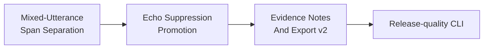

# Current Goal

Status: current

Updated: 2026-07-20

The stable product path remains `record -> process --full -> next -> finish`. Batch output is
authoritative. Live output stays advisory and shadow-only.

Roadmap status and dependency truth live in
`docs/roadmap/murmurmark-cli-roadmap.plan.yaml`. This file expands the one executable goal in human
terms. `scripts/check-planning-consistency.py` keeps the two representations aligned.

## Mixed-Utterance Remote Span Separation v1

OpsKarta nearest goal: Mixed-Utterance Remote Span Separation v1: доказательно отделить remote-span внутри смешанных Me-реплик, сохранив уникальные локальные префиксы, хвосты, роли и порядок слов.

Speaker-Mode Transcript Quality Hardening v1 established the next limiting class. Whole-utterance
deletion is too coarse: many remaining `Me` candidates contain both remote-supported words and
unique or protected local content. Keeping the whole utterance leaves recognizable remote speech;
dropping it loses genuine `Me` speech.

Objective: isolate only the remote-supported span and publish the remaining local islands when
word-level audio evidence proves the split. Ambiguous mixtures remain unchanged and explicit.

## Completed Predecessor

Speaker-Mode Transcript Quality Hardening v1 completed with a reproducible `DO_NOT_PROMOTE`:

- `18` acoustic sessions and `22` profile sessions were frozen with raw CAF SHA-256 identities;
- automatic acoustic classification matched all `17` labeled sessions;
- the sparse-overrange limiter passed the full corpus and raised accepted Echo Guard candidates
  from `11` to `13`; the latest `97` minute speaker session now passes the clean-audio gate;
- `59` duplicate rows / `161.720s` and `14` chronology rows / `62.690s` received deterministic local
  evidence;
- three chronology rows / `15.530s` support lossless retime, one / `1.460s` is confirmed
  double-talk and one / `2.440s` is confirmed genuine `Me`;
- no whole `Me` utterance satisfied the independent deletion gates;
- duplicate/leak reduction was `2.7%` and mandatory review reduction `7.9%`, below the required
  `25%` and `15%` gates;
- raw capture, remote text, local recall and paired chronology metrics did not regress.

The shadow profile `speaker_mode_hardening_v1` is therefore not selected. The promoted fallback
remains `residual_local_recall_v1`.

## Safety Contract

- freeze the mixed-utterance queue, source profile and raw/input SHA-256 identities;
- use exact and speaker-bounded clean, raw, role-masked and remote clips;
- require word timestamps from at least two mic views plus authoritative remote timing;
- require calibrated Target-Me evidence for every retained local island;
- remove only a contiguous remote-supported span; never synthesize missing words;
- preserve original local token order, role, protected work markers and all remote utterances;
- reject a patch when ASR views, speaker state, target voice or remote-forbidden checks conflict;
- keep the candidate in an isolated profile until corpus-wide gates pass;
- missing models or evidence fail open to unchanged text plus `needs_review`.

## Definition Of Done

- every frozen mixed utterance has a deterministic disposition and provenance;
- every applied split preserves all independently supported local tokens and remote content;
- no previously confirmed `Me`, local-recall recovery, chronology repair, note citation or guarded
  export regresses;
- aggregate remote duplicate/leak seconds decrease by at least `25%` and mandatory review burden by
  at least `15%` on the frozen speaker corpus;
- additional processing time stays within `25%` of authoritative batch runtime;
- repeated runs produce identical decisions and output fingerprints;
- the corpus publishes `PROMOTE` or a reproducible `DO_NOT_PROMOTE` with the exact evidence ceiling;
- tests, contracts, runbook, current goal, roadmap and OpsKarta are updated;
- the completed change is committed, pushed and installed locally.

## Route After This Goal

## Out Of Scope

- capture, raw CAF and ScreenCaptureKit changes;
- a second full-session ASR pass or replacement of whisper.cpp;
- cloud models and manual labels required by the normal path;
- individual remote-speaker diarization;
- Live Shadow promotion, LLM synthesis and UI.
