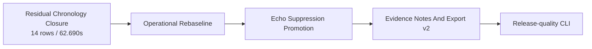

# Current Goal

Status: active

Updated: 2026-07-19

The stable product path remains `record -> process -> next -> finish`. Batch output is
authoritative. Live output stays advisory and shadow-only.

Roadmap status and dependency truth live in
`docs/roadmap/murmurmark-cli-roadmap.plan.yaml`. This file defines the executable goal in human
terms. The two must agree; `scripts/check-planning-consistency.py` enforces that contract.

## Residual Chronology Closure v1

OpsKarta nearest goal: Residual Chronology Closure v1: доказательно разобрать 14 chronology строк / 62.690s и применять только lossless split, retime или reorder без изменения слов и ролей.

The selected `residual_local_recall_v1` profile has closed the separate local-recall class. The
remaining coherent class is `14` chronology rows / `62.690s`: places where valid `Me` and
`Colleagues` content exists, but utterance boundaries or timestamps can publish turns in the wrong
order.

Objective: give every row a deterministic disposition and repair only when source segments,
word-level timestamps and track evidence prove a lossless transformation.

## Completed Predecessor

Residual Local Recall Closure v1 completed with `PROMOTE_RESIDUAL_LOCAL_RECALL_V1`:

- all `13` rows / `48.073s` have stable outcomes and provenance;
- `9` rows / `26.953s` closed safely;
- `5` were already covered, `1` was a duplicate/paraphrase and `3` were remote-supported;
- `4` rows / `21.120s` remain explicit because evidence is weak or mixed;
- no synthetic `Me` utterance was inserted;
- all nine session verdicts and all evidence-note utterance references passed no-regression gates;
- the `66` audio-review rows and `14` chronology rows remained unchanged.

## Safety Contract

- freeze the exact 14-row queue, source profile and SHA-256 identities;
- keep utterance words and roles immutable;
- allow only proven `split`, `retime`, `reorder`, `already_correct` or `needs_review` outcomes;
- preserve token order within every utterance and preserve all remote content;
- do not insert local speech or revisit the 66 audio-review dispositions;
- reject a repair when word timestamps, source segments or track evidence disagree;
- keep the candidate in an isolated profile until corpus-wide promotion gates pass;
- missing models or evidence fail open to `needs_review`.

## Definition Of Done

- all 14 rows have deterministic outcomes, reasons and provenance;
- every applied repair is lossless and derived from frozen timing evidence;
- known crossed-turn patterns are ordered correctly without text, role or local-recall regression;
- the selected input profile, raw CAF and excluded queues remain unchanged;
- verdict, review burden, evidence notes and guarded export do not regress;
- repeated runs produce identical decisions and fingerprints;
- the corpus publishes either `PROMOTE` or a reproducible `DO_NOT_PROMOTE` with a measured evidence
  ceiling;
- tests, contracts, runbook, current goal and roadmap are updated;
- the completed change is committed and pushed.

## Route After This Goal

A `DO_NOT_PROMOTE` still completes the chronology hypothesis and unblocks the operational
rebaseline. It preserves `residual_local_recall_v1` as the selected profile.

## Out Of Scope

- capture, raw CAF and Echo Guard changes;
- primary ASR changes or new transcription;
- local-recall insertion and audio-review reclassification;
- Live Shadow promotion;
- remote diarization;
- LLM synthesis and UI.

Detailed previous goal evidence is archived in the corpus artifacts and Git history.
