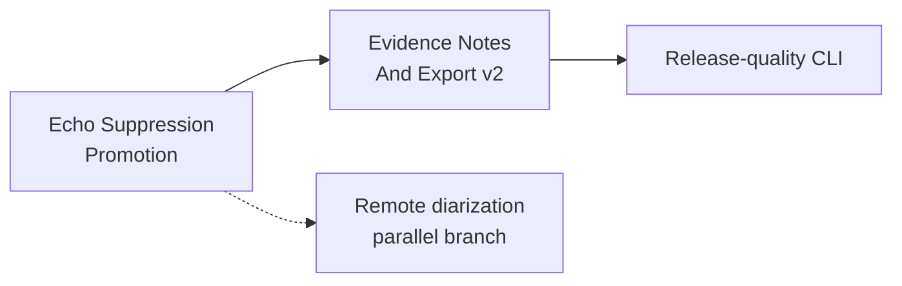

# Current Goal

Status: current

Updated: 2026-07-23

The stable product path is `murmurmark meeting -> first Ctrl-C -> final result`. Batch output remains
authoritative. The old `record -> process -> enrich/next -> finish` path stays available for
diagnostics and recovery; `process --full` remains an explicit compatibility path. Live output is
advisory and shadow-only.

Roadmap status and dependency truth live in
`docs/roadmap/murmurmark-cli-roadmap.plan.yaml`. This file expands the one executable goal in human
terms. `scripts/check-planning-consistency.py` keeps the representations aligned.

## Echo Suppression Promotion

OpsKarta nearest goal: Echo Suppression Promotion: выбрать на замороженном корпусе один
воспроизводимый derived-audio candidate, который заметно уменьшает распознаваемую remote-речь в Me,
сохраняет подтверждённую локальную речь и проходит единый corpus-wide no-regression contract.

Post-ASR cleanup has reached a measured ceiling. Mixed-Utterance Remote Span Separation v1 found
remote-supported spans in retained `Me` utterances, but no row had enough independent evidence to
remove the remote words while proving the identity of every local prefix or tail. More permissive
text cleanup would trade remote leakage for lost genuine speech.

Objective: move the quality boundary back to derived audio. Compare the existing `local_fir`
baseline with bounded echo-suppression candidates, then promote exactly one candidate only if
remote speech falls below the ASR-detectable threshold while confirmed local speech, order,
verdict, notes and export remain intact. A reproducible `DO_NOT_PROMOTE` is valid when no candidate
passes.

## Completed Immediate Predecessor

Mixed-Utterance Remote Span Separation v1 completed with a reproducible `DO_NOT_PROMOTE`:

- the frozen scope contains `12` mixed `Me` rows / `54.940s` across `7` sessions;
- all rows have deterministic word-level evidence and explicit provenance;
- `7` rows are `probable_asr_noise`, `5` are `ambiguous`, and all remain `needs_review`;
- remote spans are often supported by clean/raw mic views and authoritative remote ASR, but the
  surrounding local islands lack reliable Target-Me identity or conflict with remote timing/state;
- no split was applied, so duplicate/leak and mandatory-review reduction are both `0%`, below the
  required `25%` and `15%`;
- raw CAF, frozen inputs, remote utterances, local recall, chronology, notes evidence, verdict and
  output fingerprints did not regress;
- the final cached evidence replay added `0.11%` of authoritative batch runtime, below the `25%`
  ceiling;
- `mixed_utterance_separation_v1` remains isolated and is not eligible for automatic selection.

The corpus report is
`sessions/_reports/mixed-utterance-separation-v1/mixed_utterance_separation_corpus_report.json`.
The result closes the hypothesis responsibly: current evidence can identify suspicious mixed
utterances, but cannot safely edit them.

## Other Completed Foundations

One-Command Meeting Lifecycle v1 is complete. `murmurmark meeting --target-bundle system` owns
durable capture, ordinary authoritative processing, bounded enrichment, conservative suggested
review and guarded export. It is journaled, idempotent and resumable, and checks raw CAF SHA-256
before and after processing.

Evidence-Backed Me Completion v2 is promoted for its frozen two-session scope. It closed `3/6`
local-recall rows / `22.4/35.85s`, materialized two independently confirmed local fragments,
recognized one already-present fragment and removed one duplicate ASR tail. Ambiguous intervals
remain explicit.

Speaker-Mode Transcript Quality Hardening v1 completed with `DO_NOT_PROMOTE`. It proved acoustic
mode classification and several safe retimes, but whole-utterance cleanup reached only `2.7%`
duplicate reduction and `7.9%` review reduction. Together with the mixed-span ceiling, this is the
reason to improve the audio layer next.

## Execution Scope

1. Freeze the representative speaker/headphone/open-space corpus, selected input profiles and all
   raw/derived SHA-256 identities.
2. Reuse the existing ASR-positive echo-candidate laboratory and compare `local_fir` with available
   classical candidates such as WebRTC AEC3 and SpeexDSP; add another candidate only when evidence
   justifies it.
3. Measure remote ASR detectability, remote-forbidden hits, calibrated Target-Me preservation,
   local-only island recall, chronology, clean-audio integrity and runtime per session.
4. Reject candidates independently per session before considering corpus promotion. Missing tools,
   weak calibration, silent/sparse output or local loss must fail open to `local_fir`.
5. Publish one frozen corpus report with exact candidate fingerprints, session decisions and
   `PROMOTE_ECHO_SUPPRESSION` or `DO_NOT_PROMOTE`.
6. Integrate automatic selection only after promotion; preserve `local_fir` as fallback outside the
   proven scope.

## Safety Contract

- raw mic/remote CAF and capture code remain unchanged;
- every candidate is derived, reproducible and removable;
- remote speech reduction alone never authorizes promotion;
- confirmed local words, short reactions and double-talk must survive;
- a candidate may be accepted for one session and rejected for another;
- missing helpers, models or calibration produce baseline fallback, not a broken transcript;
- the primary whisper.cpp model and transcript timeline contract do not change;
- selection requires exact corpus decision, session membership, input hashes and output
  fingerprints;
- no experiment may silently replace the authoritative transcript.

## Definition Of Done

- one immutable corpus and baseline are published with reproducible SHA-256 identities;
- every candidate/session pair has an explicit accept/reject reason and complete provenance;
- promoted output, if any, reduces ASR-detectable remote leakage by at least `25%`;
- confirmed local-speech recall is at least `99%` of baseline and no protected local utterance is
  lost;
- chronology, remote content, verdict, notes evidence, guarded export and capture health do not
  regress;
- additional ordinary processing time stays within `25%`, or the candidate remains an explicit
  optional slow path;
- repeated runs produce identical decisions and fingerprints;
- automatic selection remains impossible without corpus-wide promotion;
- tests cover clean speaker playback, headphones/low leak, double-talk, short local reactions,
  missing helpers, candidate failure and stale hashes;
- README, contracts, runbooks, current goal, roadmap and OpsKarta are synchronized;
- the completed work is installed locally, committed and pushed with a clean tree.

## Route After This Goal

## Out Of Scope

- capture or raw CAF format changes;
- replacement of the primary whisper.cpp ASR;
- cloud models or manual labels required by the normal path;
- individual remote-speaker diarization;
- Live Shadow promotion, LLM synthesis and UI.
