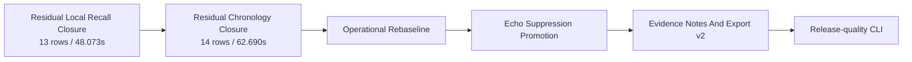

# Current Goal

Status: active

Updated: 2026-07-19

The stable product path remains `record -> process -> next -> finish`. Batch output is
authoritative. Live output stays advisory and shadow-only.

Roadmap status and dependency truth live in
`docs/roadmap/murmurmark-cli-roadmap.plan.yaml`. This file defines the executable goal in human
terms. The two must agree; `scripts/check-planning-consistency.py` enforces that contract.

## Residual Local Recall Closure v1

OpsKarta nearest goal: Residual Local Recall Closure v1: доказательно разобрать 13 local-recall
строк / 48.073s и восстановить только word-timestamp-backed remote-forbidden Me speech.

The selected `residual_me_evidence_v1` profile leaves `93` explicit review rows / `307.683s`.
Residual Audio Evidence Arbitration v1 classified all `66` audio-review rows / `196.920s`, but only
`1` row / `0.640s` passed the full closure gates. Its reproducible result is `DO_NOT_PROMOTE`.

The next coherent class is therefore `13` local-recall rows / `48.073s`: intervals with independent
local-speech evidence where the authoritative dialogue may lack a complete `Me` utterance.

Objective: give every row a stable outcome and complete provenance, then insert only independently
confirmed local speech with lossless word timestamps and remote-forbidden evidence.

## Safety Contract

- freeze the exact 13-row queue and all input hashes;
- use exact or speaker-bounded mic raw, mic clean, role-masked and remote evidence;
- require word-level timestamps inside the supported local interval;
- reject remote-text support, weak Target-Me enrollment and unresolved mixed speech;
- do not overlap, paraphrase or replace existing `Me` content;
- do not change the 66 audio-review dispositions or 14 chronology rows;
- keep the candidate in an isolated profile until corpus-wide promotion gates pass;
- missing models or evidence fail open to `needs_review`.

## Definition Of Done

- all 13 rows have deterministic outcomes, reasons and provenance;
- every insertion is backed by independent local evidence and lossless timestamps;
- local recall improves without chronology, remote-like `Me`, notes, verdict or export regression;
- frozen raw CAF and selected baseline artifacts remain unchanged;
- repeated runs produce identical decisions and fingerprints;
- the corpus publishes either `PROMOTE` or a reproducible `DO_NOT_PROMOTE` with a measured evidence
  ceiling;
- tests, contracts, runbook, current goal and roadmap are updated;
- the completed change is committed and pushed.

## Route After This Goal

A `DO_NOT_PROMOTE` still completes the current hypothesis and unblocks the chronology contract. It
preserves `residual_me_evidence_v1` as the selected profile instead of forcing a weak improvement.

## Out Of Scope

- capture and raw CAF changes;
- Echo Guard implementation;
- primary ASR changes;
- mutation of the 66 audio-review or 14 chronology rows;
- Live Shadow promotion;
- remote diarization;
- LLM synthesis and UI.

Detailed previous goal evidence is archived in
`docs/history/current-goal-through-2026-07-19.md`.
