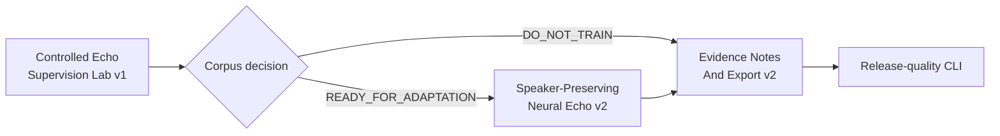

# Current Goal

Status: current

Updated: 2026-07-24

The stable product path remains `murmurmark meeting -> first Ctrl-C -> final result`. Batch output is
authoritative. Live output is advisory and shadow-only.

Roadmap status and dependency truth live in
`docs/roadmap/murmurmark-cli-roadmap.plan.yaml`. This file expands the one executable goal in human
terms. `scripts/check-planning-consistency.py` keeps the representations aligned.

## Controlled Echo Supervision Lab v1

OpsKarta nearest goal: Controlled Echo Supervision Lab v1: построить локальный управляемый
speaker-mode протокол с известными remote-only echo, local-only target и synthetic double-talk,
собрать session-disjoint train/dev/hard-test corpus и выпустить READY_FOR_ADAPTATION либо точный
DO_NOT_TRAIN без обучения и изменения production.

The previous passive corpus could confirm clean local speech, but could not obtain trustworthy
remote-only echo supervision from ordinary meetings. This goal creates that missing evidence under
a controlled protocol instead of weakening inclusion thresholds.

The laboratory models the normal speaker-mode path:

```text
x = digital remote played through the built-in speakers
d = measured acoustic echo of x while the user is silent
s = measured local Me speech while remote is silent
y = s + gain * d

training input  = y + aligned x
training target = s
```

No model is trained in this goal. `local_fir_role_masked` remains production.

## Frozen Contract

`policies/controlled-echo-supervision-v1.json` freezes before the first evaluation:

- the phase schedule and required scenarios;
- inclusion and exclusion thresholds;
- whole-session train/dev/hard-test assignment;
- minimum coverage and oracle gates;
- privacy, redistribution and local-only processing policy;
- synthetic mixture gains and reconstruction tolerance.

The policy may be changed only to repair a demonstrated contract or implementation defect. It may
not be tuned after observing capture outcomes merely to pass a gate.

## Execution Scope

1. Provide the user-facing commands:
   - `murmurmark echo-lab prepare`;
   - `murmurmark echo-lab capture --out SESSION --scenario SCENARIO`;
   - `murmurmark echo-lab inspect SESSION`;
   - `murmurmark corpus echo-supervision build|replay|status`.
   The exact user procedure lives in
   `docs/runbooks/controlled-echo-supervision-lab.md`.
2. Generate generic Russian remote TTS locally and fingerprint every stimulus.
3. Run each capture through the normal durable raw writer, without Live Shadow or a second capture
   process.
4. Schedule silence, remote-only, local-only, keyboard/noise, controlled double-talk and protected
   opening/backchannel phases.
5. Record planned and actual monotonic timestamps, audio-device metadata, output volume, source WAV
   hashes, raw hashes and derived hashes.
6. Treat the schedule as the source of expected state. Signal metrics, local faster-whisper,
   Target-Me and speaker state may validate or exclude an interval, never invent its ground truth.
7. Fail closed when local speech contaminates remote-only, remote contaminates local-only, timing is
   stale, audio clips, a validator is missing or an artifact hash changes.
8. Materialize measured local targets, measured remote echo, aligned remote references, synthetic
   double-talk, measured double-talk hard-test and silence/noise controls.
9. Pair target and measured echo only inside one split. Never normalize. Exclude non-finite,
   clipped, misaligned or incorrectly reconstructed pairs.
10. Freeze at least four train, one dev and one controlled hard-test capture. Existing real
    neural-AEC counterexamples remain immutable hard-test only.
11. Produce deterministic private corpus artifacts under
    `sessions/_reports/controlled-echo-supervision-v1/`.
12. End with exactly one reproducible decision: `READY_FOR_ADAPTATION` or `DO_NOT_TRAIN`.

## Safety Contract

- raw mic/remote CAF and production-derived artifacts are read-only after recording;
- the laboratory never starts Live Shadow, a second recorder, cloud processing or training;
- `speaker_state` is corroborating evidence, not truth;
- missing faster-whisper, Target-Me, source audio or provenance excludes affected intervals;
- user voice, prompts, WAV files and work content stay ignored and local;
- tracked files may contain schemas, generic policy, synthetic fixtures and aggregate metrics only;
- synthetic and measured double-talk remain explicitly distinguishable;
- hard-test sessions and existing real counterexamples never enter train or dev;
- production Echo Guard and ASR remain unchanged.

## Definition Of Done

- the complete CLI command surface works and has one accurate capture runbook;
- at least six accepted speaker-mode sessions exist: four train, one dev and one hard-test;
- every phase has provenance, an outcome and explicit inclusion or exclusion reasons;
- train contains at least `480s` local-only, `480s` remote-only and `1800s` synthetic mixtures;
- dev contains at least `120s` local-only, `120s` remote-only and `300s` synthetic mixtures;
- controlled hard-test contains at least `60s` measured double-talk;
- at least 30 protected local items and 10 opening/backchannel items are retained;
- session leakage is zero and existing real counterexamples remain hard-test only;
- reconstruction, clipping, finite-audio, contamination, privacy and immutability gates pass;
- replay is byte-stable and SHA tampering fails closed;
- the final decision is `READY_FOR_ADAPTATION` or a precise `DO_NOT_TRAIN`;
- no training or production promotion has run;
- README, architecture, contracts, runbook, roadmap and OpsKarta agree;
- all checks pass, changes are committed and pushed, and the tree is clean.

## Required Private Outputs

```text
sessions/_reports/controlled-echo-supervision-v1/
  frozen_corpus.json
  phase_inventory.jsonl
  exclusion_report.json
  split_manifest.json
  supervision_manifest.jsonl
  oracle_report.json
  privacy_licensing_manifest.json
  corpus_decision.json
  corpus_decision.md
  replay_report.json
  examples/
```

## Route After This Goal



## Out Of Scope

- model training or fine-tuning;
- capture, main ASR or production Echo Guard changes;
- cloud services;
- publication of the private corpus or weights;
- mandatory external microphones;
- individual remote-speaker diarization;
- UI.
