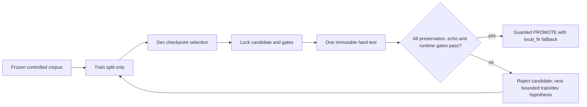

# Current Goal

Status: current

Updated: 2026-08-03

The stable product path remains `murmurmark meeting -> first Ctrl-C -> final result`. Batch output is
authoritative. Live output is advisory. Production Echo suppression remains `local_fir_role_masked`
until a fingerprinted candidate passes every gate below.

Roadmap status and dependency truth live in
`docs/roadmap/murmurmark-cli-roadmap.plan.yaml`. This file expands the one executable goal in human
terms. `scripts/check-planning-consistency.py` keeps the representations aligned.

## Speaker-Preserving Neural Echo v2

OpsKarta nearest goal: Speaker-Preserving Neural Echo v2: создать и безопасно продвинуть локальный
causal или hybrid pre-ASR suppressor, который на frozen train/dev/hard и real-meeting regressions
удаляет remote из mic лучше local_fir без потери Me; отказ отдельного candidate не завершает цель,
production меняется только после corpus-wide PROMOTE с fail-open local_fir.

## Starting Evidence

Controlled Echo Supervision Lab v1 completed with `READY_FOR_ADAPTATION`:

- corpus fingerprint: `be7b68f3267a20bfbd2fcf186587107e4201517e4edb3abbda3287857b008ffd`;
- deterministic replay: `1465/1465`;
- train: five captures, `620s` local-only, `640s` remote-only, `1804s` synthetic mixtures;
- dev: one capture, `124s` local-only, `128s` remote-only, `352s` synthetic mixtures;
- hard test: one capture and `68s` measured double-talk;
- protected evidence: 392 local/opening items across the accepted corpus;
- failed corpus gates: none.

The private archive pins all eight controlled recordings, including the excluded negative attempt,
through `sessions/_reports/private-pins/controlled-echo-supervision-v1/pinned_sessions.json`. Raw
CAF, inspection inputs, split ownership and corpus artifacts are immutable evaluation evidence.

## Objective

Build and safely promote a local causal or hybrid remote-conditioned suppressor that removes
materially more remote leakage than `local_fir_role_masked` while preserving genuine `Me`,
especially short openings and double-talk. Its clean mic output must be the audio presented to the
primary ASR.

The goal is complete only with:

```text
PROMOTE_SPEAKER_PRESERVING_NEURAL_ECHO_V2
```

A candidate-level `DO_NOT_PROMOTE` remains valuable evidence and keeps production safe, but does not
complete this goal. It starts the next bounded train/dev hypothesis. Promotion is guarded by exact
model, policy and corpus fingerprints and retains `local_fir` as fail-open fallback.

## Audio-First Contract

- candidate audio, not repaired transcript text, is the intervention under evaluation;
- primary whisper.cpp runs directly on the candidate clean mic track;
- suppression comparisons disable post-ASR remote-duplicate deletion and role cleanup;
- transcript cleanup remains a safety net, but contributes zero credit to Echo reduction;
- a candidate that sounds clean by proxy metrics but loses local words cannot be promoted;
- a candidate that needs downstream remote deletion to pass cannot be promoted.

## Frozen Boundary

- Train data may optimize weights and preprocessing parameters.
- Dev may select checkpoints and bounded hyperparameters.
- Hard-test audio is evaluated once after the candidate and thresholds are locked.
- A hard-test failure rejects that candidate. Any later candidate requires a newly versioned
  held-out hard set chosen before further tuning; the failed hard set cannot become training data.
- No dev/hard target may enter training, augmentation, normalization fitting or threshold tuning.
- Raw CAF and accepted corpus materialization are read-only.
- Baselines are the current production `local_fir_role_masked` and pinned Microsoft DEC model.
- AECMOS remains secondary; word and speaker preservation gates are authoritative.
- Missing models, changed hashes, non-finite audio or incomplete provenance fail open to `local_fir`.

## Execution Scope

1. Freeze a v2 training policy before the first hard-test result: architecture family, causal
   context, features, augmentation bounds, seeds, checkpoint selection and acceptance gates.
2. Reproduce `local_fir` and DEC baselines on exact train/dev/hard manifests and store byte-stable
   reports.
3. Implement a deterministic local training harness. Evaluate the smallest useful causal
   residual-mask, complex-spectral or hybrid classical/neural family that can export to ONNX/Core
   ML and run without cloud services.
4. Train only on the train split. Preserve measured local targets, measured echo paths and explicit
   mixture gains in every batch provenance row.
5. Select one checkpoint using dev only, freeze its SHA-256, then run the immutable hard test once.
6. Measure echo reduction, local speech distortion, Target-Me retention, opening/double-talk recall,
   direct candidate-audio ASR preservation, chronology, clipping, silence behavior and runtime.
7. Materialize an isolated `speaker_preserving_neural_echo_v2` candidate. Do not overwrite current
   preprocessing or transcript artifacts during evaluation.
8. Add guarded selection with exact corpus/model/policy compatibility and automatic `local_fir`
   fallback for every failure mode.
9. Reject failing candidates without changing production and continue bounded train/dev iteration.
   Run hard-test only after weights and gates are locked; do not tune against its result.
10. Run corpus replay and ordinary meeting regressions, then issue guarded PROMOTE. Post-ASR cleanup
    is disabled when measuring the candidate's contribution.
11. Update README, architecture, contracts, runbook, current goal, roadmap and OpsKarta; commit and
    push the finished decision.

## Acceptance Gates

- corpus membership, split isolation and every source SHA match the frozen manifests;
- training and inference are deterministic within the documented tolerance;
- remote-only echo improves materially over `local_fir`, not merely over raw mic;
- the candidate clean track is the actual mic input to primary ASR in evaluation and production;
- local-only reconstruction and ASR do not regress beyond predeclared bounds;
- protected opening and hard double-talk items retain their expected local speech;
- no remote text is manufactured as `Me`, and no genuine `Me` is removed to improve an audio score;
- chronology, clipping, finite-value and no-speech controls pass;
- runtime and memory fit the supported local machine or the candidate remains shadow-only;
- ordinary meeting corpus verdict, notes evidence and guarded export do not regress;
- no promotion metric depends on downstream deletion of remote-like transcript spans;
- unsupported environment, stale model or any gate failure selects `local_fir_role_masked`.

Exact numeric thresholds belong in the tracked v2 policy and must be frozen before the hard-test
run. They may not be lowered after observing the result.

## Definition Of Done

- one model/training contract and one immutable evaluation manifest exist;
- baselines and the selected candidate have reproducible reports;
- train/dev/hard leakage checks pass;
- the hard test has exactly one recorded evaluation for the frozen candidate;
- every accepted or rejected candidate has full provenance;
- a promoted pre-ASR profile passes every controlled and real-meeting gate and is selected by the
  normal pipeline;
- rejected candidates do not close the goal or change production;
- failure paths demonstrably return to `local_fir` without breaking transcription;
- automated unit, integration, corpus replay and runtime tests pass;
- the final decision and its evidence are documented, committed and pushed.

## Outside This Goal

- cloud training or inference;
- changing capture, durable raw writing or the main whisper.cpp ASR;
- diarization of individual `Colleagues`;
- Live Shadow promotion;
- LLM synthesis, external issue creation and UI work.

## Main Artifacts

```text
policies/speaker-preserving-neural-echo-v2.json
sessions/_reports/speaker-preserving-neural-echo-v2/
  frozen_training_manifest.json
  baseline_report.json
  training_manifest.json
  checkpoint_manifest.json
  evaluation_report.json
  corpus_decision.json
  corpus_decision.md
  replay_report.json
```


```mermaid
flowchart LR
    A["Frozen controlled corpus"] --> B["Train split only"]
    B --> C["Dev checkpoint selection"]
    C --> D["Lock candidate and gates"]
    D --> E["One immutable hard test"]
    E --> F{"All preservation, echo and runtime gates pass?"}
    F -->|"yes"| G["Guarded PROMOTE with local_fir fallback"]
    F -->|"no"| H["Reject candidate; next bounded train/dev hypothesis"]
    H --> B
```
