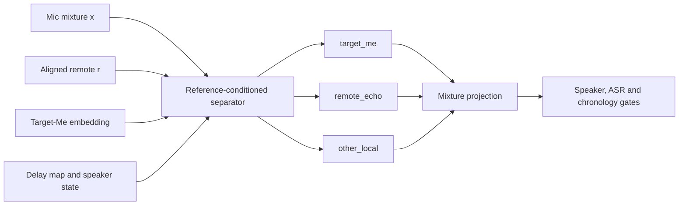

# Reference-Conditioned Target-Me Separation v1

Date: 2026-08-04

Status: complete, `DO_NOT_PROMOTE_REFERENCE_CONDITIONED_TARGET_ME_SEPARATION_V1`

Production baseline: Speaker-Preserving Neural Echo v2

## Question

Can MurmurMark turn the microphone mixture into an ASR-safe Target-Me stem by combining the exact
digital remote reference, personalized local-speaker evidence and mixture-consistent source
separation, while preserving every protected local word during double-talk?

The goal is not generic denoising and not blind music demixing. The desired decomposition is:

```text
x_mic = s_target_me + d_remote_echo + n_other_local + reconstruction_residual
```

Only `s_target_me` may become a candidate `mic_for_asr.wav`. Every other stem remains available for
audit and reconstruction.

## What Transfers From Music Separation

Modern music separators learn source-specific waveform or time-frequency representations, predict
several stems and reconstruct long recordings with overlapping windows. Useful transferable ideas
are:

- multi-output estimation rather than destructive one-output subtraction;
- hybrid waveform and spectral context;
- explicit target queries or source embeddings;
- overlap-add inference over bounded windows;
- mixture-consistency projection so estimated stems account for the input;
- a residual or `other` stem instead of silently discarding unexplained energy.

The analogy has a hard limit. A separator can force its outputs to sum exactly to the input while
still assigning part of a quiet word to the wrong stem. Music systems are also trained on much
larger multitrack collections and remain approximate. MurmurMark therefore treats reconstruction as
an accounting invariant and uses local-word, speaker identity, remote-forbidden and chronology
evidence for semantic safety.

## Why MurmurMark Has A Better-Conditioned Problem

Blind source separation sees only a mixture. MurmurMark additionally has:

- the digital far-end signal before loudspeaker and room coloration;
- a measured delay trajectory and local FIR echo estimate;
- controlled Target-Me enrollment;
- local-only, remote-only, synthetic and measured double-talk examples;
- speaker-state intervals;
- direct whisper.cpp word evidence and frozen transcript counterexamples.

The separator should use these as conditions, not ask a general-purpose model to rediscover them.

## Candidate Design



Preferred first trainable candidate:

- 16 kHz mono, deterministic chunking;
- complex STFT masks or bounded complex spectral mapping;
- a remote encoder with cross-conditioning into the mixture path;
- Target-Me embedding applied through FiLM/gating at several resolutions;
- three decoders or masks for `target_me`, `remote_echo` and `other_local`;
- explicit residual assignment after decoding;
- multi-resolution STFT and waveform losses;
- asymmetric protected-speech loss with a much larger penalty for deleting Target-Me than for
  retaining remote residue.

An established SpeakerBeam, Asteroid or WeSep recipe may be used as a baseline only after license,
runtime, determinism and offline installation are recorded. A full HT-Demucs-scale model is not the
first step: the private corpus is too small to justify training it from scratch.

## Data Strategy

The existing controlled corpus owns train/dev/hard isolation. No example may cross session splits.

```text
train:
  measured local-only + measured remote echo + split-local synthetic mixtures

dev:
  independent controlled sessions and synthetic mixtures from dev sources only

hard:
  measured double-talk, protected openings, chronology failures, no-speech and real corpus rows
```

Synthetic mixtures must use measured room/speaker echo rather than the pristine digital remote as
the echo target. Gains, delay drift, equalization, clipping and background noise may be augmented
inside one split. Measured real double-talk without an independent clean local target is evaluation
or MixIT-style adaptation evidence, never supervised ground truth.

## Experiment Ladder

1. **Freeze**: fingerprint v2 baseline, corpus ownership, raw/derived sources and protected rows.
2. **Oracle ceiling**: evaluate ideal ratio and complex masks on paired controlled examples. Stop if
   even the oracle representation loses protected words after deterministic reconstruction.
3. **Overfit probe**: prove that one small batch can be reconstructed and separated before a full
   training run.
4. **Reference-only baseline**: estimate the echo stem from remote and leave the residual as local.
5. **Target-conditioned separator**: add Target-Me identity and the `other_local` stem.
6. **Dev selection**: select architecture and thresholds without reading hard-test outcomes.
7. **Hard stop gate**: any protected-local, opening, chronology or double-talk regression ends full
   evaluation with DO_NOT_PROMOTE.
8. **Sealed corpus shadow**: compare direct candidate whisper.cpp output with v2, with downstream
   duplicate cleanup disabled for credit.
9. **Decision**: publish a fingerprinted PROMOTE or DO_NOT_PROMOTE report.

## Measured Result

The experiment completed on 2026-08-04:

| Gate | Result |
|---|---|
| Frozen source and model verification | `READY_FOR_ORACLE_CEILING` |
| Controlled audio hashes | `1456/1456` passed |
| Sealed production corpus | `12/12`, unchanged |
| Train/dev oracle source pairs | `451/88` |
| Ideal complex Target-Me SNR p05 | `58.383 dB` |
| Ideal complex Target-Me SI-SDR p05 | `58.385 dB` |
| Ideal complex echo SNR p05 | `48.578 dB` |
| Four-row overfit loss reduction | `98.595%` |
| Overfit Target-Me SNR improvement median | `15.020 dB` |
| Overfit echo SNR median | `15.116 dB` |
| Hard-test opened | no |
| Oracle decision | `ORACLE_CEILING_PASSED` |
| Overfit decision | `OVERFIT_FEASIBILITY_PASSED` |
| Train/dev attempt 1 | `10.987 dB` Target-Me, `7.123 dB` echo, rejected |
| Train/dev attempt 2 | `11.470 dB` Target-Me, `7.788 dB` echo, rejected |
| Locked train/dev gates | `12.0 dB` Target-Me, `8.0 dB` echo |
| Independent non-target local speech rows | `0` |
| Distinct Target-Me enrollment vectors | `1` |
| Sealed corpus opened | no |
| Final fingerprint | `e3c925f005f0e85e7dc22e555e2a25701a1b297372babcc3551339da861324a3` |

The first numerical pilot used an unnecessarily strict `-80 dB` residual-accounting threshold.
The observed residue was about `-62 dB` while source reconstruction remained exact and both source
SNR gates had wide margin. The policy records one revision to `-60 dB`, locked before any trainable
candidate, model selection or hard-test access. This threshold concerns only STFT numerical
residue; semantic gates were not weakened.

The first candidate trained for six epochs and passed seven of nine dev gates. A single bounded
revision extended training to twelve epochs without changing data, architecture or thresholds. It
also passed seven of nine gates. Loss continued to decrease, but further extension would tune to the
same dev set rather than answer the semantic question.

The stronger blocker is identifiability. All model rows used one fixed Target-Me enrollment. The
only independently labelled `other_local` targets were keyboard and silence; there was no clean
speech from another nearby person. A model can therefore conserve the mixture and improve echo
metrics while assigning non-target local speech to `target_me`. No correct-versus-wrong enrollment
ablation can be grounded by this frozen train/dev set.

The candidate lock denied hard-test access. No candidate audio was materialized for the sealed
twelve-session corpus, all twelve sessions remain on the exact v2 baseline, and post-ASR cleanup
received no credit. Repeating `decide` produced the same final fingerprint.

## Outputs

Planned isolated layout:

```text
derived/preprocess/reference-conditioned-target-me-separation-v1/
  input_manifest.json
  model_manifest.json
  chunks.jsonl
  stems/
    target_me.wav
    remote_echo.wav
    other_local.wav
  reconstruction_report.json
  asr_shadow/
  session_report.json

sessions/_reports/reference-conditioned-target-me-separation-v1/
  frozen_inputs.json
  preflight_report.json
  oracle_ceiling_report.json
  overfit/
  train-dev-attempt-01/
  train-dev-attempt-02/
  data_card.json
  model_card.json
  experiment_manifest.json
  corpus_report.json
  corpus_report.md
  decision.json
  decision.md
```

Private audio and trained weights remain ignored. Tracked schemas, policies, model cards and
aggregate decisions must not expose meeting content or absolute workstation paths.

## Promotion Boundary

Production selection remains unchanged until the complete frozen decision passes. A candidate
publication must reuse the transactional v2 fallback mechanism:

```text
fresh v2 baseline
  -> isolated three-stem inference
  -> reconstruction and bounded audio gates
  -> direct candidate whisper.cpp
  -> protected local/remote/chronology/no-speech gates
  -> transactional candidate publication | byte-exact v2 fallback
```

Audio quality, exact remix, speaker similarity or aggregate SI-SDR cannot independently authorize
publication.

## Decision And Next Prerequisite

The final decision is `DO_NOT_PROMOTE_REFERENCE_CONDITIONED_TARGET_ME_SEPARATION_V1`. This is not a
rejection of reference-conditioned separation. The oracle showed a wide representation ceiling,
and overfit showed that the bounded network can learn individual mixtures. The frozen evidence does
not identify the requested three-way speaker assignment well enough for promotion.

The next prerequisite is **Target-Me Identifiability Corpus v1**. It must add independently known
non-target local speech, multiple speaker identities, correct and wrong enrollment controls and
speaker-disjoint train/dev/hard ownership. Only that corpus can tell whether a separator actually
uses the Target-Me query rather than learning a constant local/echo prior.

## References

- Hybrid Demucs: <https://arxiv.org/abs/2111.03600>
- HT-Demucs: <https://arxiv.org/abs/2211.08553>
- Personalized Acoustic Echo Cancellation: <https://arxiv.org/abs/2205.15195>
- Mixture Invariant Training: <https://arxiv.org/abs/2006.12701>
- MixIT adaptation for real meetings: <https://arxiv.org/abs/2110.10739>
- Asteroid: <https://github.com/asteroid-team/asteroid>
- WeSep: <https://github.com/wenet-e2e/wesep>
