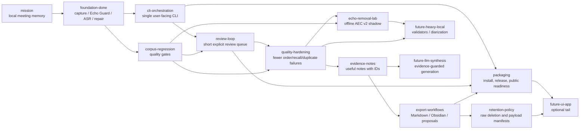

# MurmurMark CLI Roadmap

This roadmap is mirrored as an opskarta v3 plan:

- `docs/roadmap/murmurmark-cli-roadmap.plan.yaml`
- no calendar dates;
- dependencies, statuses and effort instead of delivery promises;
- CLI-first, local-first, evidence-backed.

## Product Direction

MurmurMark should become a dependable local CLI pipeline for sensitive meetings:

1. record local `mic` and `remote` tracks;
2. process them locally;
3. produce a transcript with visible uncertainty;
4. produce evidence-backed notes;
5. offer a short review queue when needed;
6. export reviewed artifacts;
7. plan or apply raw-audio retention.

The optional UI/app path is deliberately late. It should not block the useful CLI product.

## Current State

The CLI MVP is already real:

- `murmurmark record` records separate local tracks;
- `murmurmark process SESSION|latest` runs the post-recording pipeline;
- `murmurmark next`, `status`, `report`, `open`, `notes`, `transcript` provide handoff and inspection;
- `murmurmark review` handles lane packs, answer sheets, suggested decisions and reviewed profiles;
- `murmurmark review suggested` previews and applies safe generated suggestions before manual listening;
- `murmurmark corpus` runs the regression/readiness loop;
- `murmurmark finish` turns readiness, export and retention/payload manifests into one final handoff;
- `murmurmark export` builds Export Bundle Quality v1 Markdown/Obsidian bundles with "Can I use
  this?", review burden, evidence-backed notes, transcript IDs and retention/privacy next steps;
- `murmurmark retention` plans payloads and raw deletion;
- `murmurmark doctor`, `self-test`, `acceptance`, release bundle and open-source checks exist.

Operational corpus snapshot from 2026-06-30:

- status: `not_ready`;
- usable for medium-risk notes: no at corpus level; yes session-by-session when `status` says so;
- working sessions: `16`;
- excluded diagnostic sessions: `26`;
- readiness: `14/16 ready_for_notes`, `1/16 review_first`, one risky daily-sync blocker;
- selected notes review burden: `0.69 min`;
- full transcript/export review surface: `3.19 min`;
- remaining actionable review queue: `5` actions in `sessions/2026-06-30_11-15-56`;
- suggested closure: `8` generated suggestions across `5` reports, all `needs_review`, `0`
  actionable keep/drop rows.

This is enough to use many individual MurmurMark sessions with caution. It is not enough to call the
current operational corpus green.

The 2026-06-30 daily sync showed the current review-loop gap: a meeting can have healthy capture and
no harmful duplicate seconds, but still be marked `risky` because several order/local-recall rows are
not formally closed. The immediate path is now `murmurmark review suggested SESSION`, then
`murmurmark review suggested apply SESSION`; this closes only high-confidence local-audio suggestions
when they match the current review queue. If nothing is safe to close, it says so explicitly and
prints the exact remaining manual queue instead of implying that the user should trust unrelated
audio-judge seconds.

The same corpus also shows a deeper quality limit: much of the later cleanup work exists because
remote speech is still audible and sometimes recognizable in the mic track. `local_fir` remains the
right default because it protects local speech, but it is not a complete-removal engine.
`offline_aec_v2_v0` gives a repeatable shadow baseline: proxy masking can reduce remote energy and
harmful seconds, but ASR-token gates still do not beat `local_fir`. The follow-up vNext spike added
segment switching and `remote_forbidden_token_guard`; it produced the first ASR-positive improvement
on one difficult session without local-recall regression. That is enough to choose the next quality
direction: harden remote-forbidden evidence and connect it to review/status before trying to promote
any audio candidate.

## Roadmap Tree



## Status By Block

### Done

- Two-track capture and session package.
- Echo Guard with local FIR and preserve-local policy.
- `whisper.cpp` transcription pipeline.
- Timeline/start-of-call repair.
- Conservative cleanup profiles and reviewed profiles.
- Group overlap, local recall, audio review and optional stronger-audio-judge audits.
- Extractive notes, quality verdict and review items.
- CLI process/status/next/report/open/notes/transcript/review/corpus/export/retention surface.
- Local install wrapper, self-test, acceptance gate, release bundle and public-readiness check.
- Recording reliability: normal duration/SIGINT stops complete, unexpected SIGTERM/SIGHUP/capture
  failures become explicit partial sessions, and `doctor` catches missing shareable displays.

### Current

- Restore the corpus to `medium_risk_ready` by closing or safely explaining the five manual review
  rows in `sessions/2026-06-30_11-15-56`.
- Keep readiness/status/next honest when the actionable review queue is empty but residual risk
  remains documented.
- Close safe review rows with local audio evidence before asking the user to listen manually.
  The 2026-06-30 daily sync showed the important pattern: the session was marked `risky`, but
  stronger audio judge confirmed most `check_transcript_order` rows as timing/double-talk, leaving
  only a few real manual checks.
- Continue **Echo Guard Complete Removal** after the first vNext spike:
  - keep `local_fir` as the production default;
  - use the shadow `offline_aec_v2_v0` lab as a repeatable diagnostic baseline;
  - treat `remote_floor` and segment switching as useful proxy/control candidates, not as production
    replacements;
  - harden `remote_forbidden_token_guard` into persistent evidence and review decisions. The first
    implementation now writes `remote_forbidden_evidence.jsonl`, session readiness metrics and a
    corpus report;
  - keep target-speaker extraction and neural residual suppression as later spikes behind corpus
    gates.
- Keep the final handoff readable: `finish` now opens a bundle whose `index.md` is the first working
  artifact, not a derived-file directory listing.
- Make the everyday path boring:

  ```bash
  murmurmark record --target-bundle system
  murmurmark process latest
  murmurmark next latest
  murmurmark review next latest   # only when printed
  murmurmark finish latest
  ```

- Keep documentation aligned with the actual command surface.

### Next

- Review loop polish:
  - keep suggested review closure first-class: show how many rows can be accepted from stronger
    local audio evidence, how many remain manual, and whether generated suggestions are actionable
    or still `needs_review`;
  - keep lane packs clear, but avoid sending the user to listen through rows already confirmed by the
    local judge;
  - explicit "safe to export / review first / do not use" handoff.
- Corpus regression discipline:
  - stable small operational corpus;
  - baseline comparison before new heuristics;
  - no-regression gates for order, local recall, duplicates and selected notes.
- Echo Guard evidence and promotion path:
  - keep candidate artifacts separate from `mic_for_asr.wav`;
  - first persist remote-forbidden evidence rows and expose them through review/status;
  - promote audio only after corpus gates prove lower remote-token leakage without worse local
    recall;
  - keep transcript-level remote-forbidden reconciliation as the final safety net.
- Export workflow:
  - keep `murmurmark finish` as the normal final handoff;
  - maintain Export Bundle Quality v1 and test it against real 1x1, group and review-blocked
    sessions;
  - add Obsidian-vault export only after the bundle is stable.

### Later

- Stronger extractive notes and stable `evidence_notes.json`.
- Reviewed docs/ticket export proposals.
- Configurable domain packs without committing private terms.
- Retention policy profiles and privacy manifests.
- Public release hardening: security contact, issue templates, generated/private artifact audit.

### Ideas

- Per-speaker diarization inside `Colleagues`.
- `transcript.rich.json` with stronger alignment and confidence fields.
- Heavy local ASR/forced-alignment validators.
- Local or controlled LLM synthesis with strict evidence guard.
- Optional menu bar or desktop UI after the CLI is mature.

## Latest Completed Goal

Export Bundle Quality v1 is complete. MurmurMark can now end a successful pipeline with a readable
local handoff instead of a pile of derived artifacts.

In practical terms, `murmurmark finish SESSION` now produces a Markdown or Obsidian bundle where:

- `index.md` answers "Can I use this?", shows selected profile, verdict, review burden, review
  blockers, retention/privacy summary and the next command;
- `quality_verdict.md` explains the verdict in human terms;
- `notes.md` is an evidence-backed extractive working summary;
- `transcript.md` keeps the full selected transcript with utterance IDs and review flags;
- forced/debug exports with blockers clearly say "Do not use yet";
- raw audio is not copied into the export bundle.

Success is not a zero-review transcript. Success is that the final artifact is usable as a working
handoff and keeps uncertainty visible.

Recently completed:

- **Echo Guard Complete Removal vNext.** Segment switching plus `remote_forbidden_token_guard`
  produced the first ASR-positive remote-leakage improvement on a difficult real session:
  `asr_candidate_gate_passed: 1/6`, with no local-word recall regressions in the six-session smoke
  corpus. It remains shadow-only and becomes the baseline for the next evidence-hardening goal.
- **Export Bundle Quality v1.** `finish` now produces a user-facing Markdown/Obsidian handoff:
  "Can I use this?", selected profile, review burden, evidence-backed notes, transcript utterance IDs
  and retention/privacy next steps.
- **Recording reliability.** Duration and `SIGINT` stops complete normally; `SIGTERM`, `SIGHUP` and
  unrecovered capture interruptions write `status: partial`, show `inspect` as the safe next command
  and block normal processing unless `--allow-partial` is explicit.
- **Readiness reconciliation.** A zero-action review queue no longer turns into an empty
  `first-lane` handoff. MurmurMark now points to `ready_for_notes`, a non-empty actionable review
  pack, or a documented non-actionable blocker.

## Candidate Next Goals

1. **Remote-Forbidden Evidence Hardening v1.** The nearest meaningful goal: make the first
   ASR-positive safety layer less clip-specific, persist evidence rows, connect them to
   transcript/review artifacts and enforce local-speech gates before any cleanup action. First
   persistence/reporting is implemented; the remaining target is broader coverage, because the
   current six-session smoke has only one safe improved session.
2. **ASR-positive audio candidate v2.** Find an actual audio candidate that beats `local_fir` on
   remote-token leakage without local-recall loss. This depends on the evidence gates from goal 1.
3. **Target-Me extraction spike.** Use high-confidence local-only speech as enrollment material for
   difficult double-talk and open-space-noise cases.
4. **Suggested review closure maintenance.** Keep stronger-audio-judge suggestions first-class:
   preview, apply, refresh readiness and show the exact remaining manual queue. This remains
   operationally important, but it now supports the larger echo-removal direction.
5. **Export follow-up.** Keep the v1 bundle stable, then add optional Obsidian-vault placement and
   reviewed docs/ticket proposal exports.
6. **Strengthen corpus gates.** Freeze the current good state as a baseline and require new pipeline
   changes to beat or preserve it.
7. **Improve notes quality.** Refine extractive decisions/actions/risks while keeping every item tied
   to utterance IDs and review flags.
8. **Prepare for public release.** Remove private fixtures, document setup, verify ignored generated
   artifacts and add security/contact guidance.

## Validation

```bash
OPSKARTA_REPO="${OPSKARTA_REPO:-../opskarta}"
PLAN="docs/roadmap/murmurmark-cli-roadmap.plan.yaml"

PYTHONPATH="$OPSKARTA_REPO" python3 -m specs.v3.tools.cli validate "$PLAN"
PYTHONPATH="$OPSKARTA_REPO" python3 -m specs.v3.tools.cli render tree "$PLAN"
PYTHONPATH="$OPSKARTA_REPO" python3 -m specs.v3.tools.cli render deps "$PLAN" --mode hierarchical
PYTHONPATH="$OPSKARTA_REPO" python3 -m specs.v3.tools.cli render executive "$PLAN" --view exec-top
PYTHONPATH="$OPSKARTA_REPO" python3 -m specs.v3.tools.cli render executive-report "$PLAN" --section status --lang ru
```
