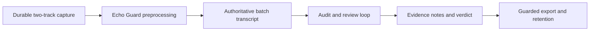
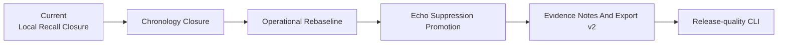
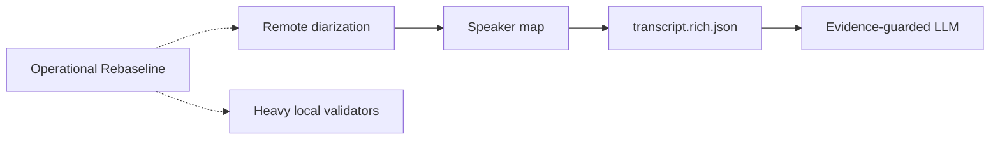
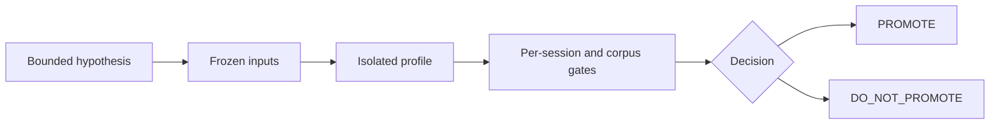

# MurmurMark CLI Roadmap

Updated: 2026-07-19

This is the readable view of the active OpsKarta v3 plan:

- `docs/roadmap/murmurmark-cli-roadmap.plan.yaml`

The YAML plan owns statuses and dependencies. `docs/project/current-goal.md` expands the one
executable goal. Historical experiment detail is preserved under `docs/history/` and does not
redefine current priorities.

## Planning Rules

- `done`: implemented and evidenced capability;
- `current`: work being executed now;
- `next`: unlocked goal that follows the current one;
- `later`: dependent stage whose prerequisites are not complete;
- `idea`: research hypothesis outside the committed path;
- `optional`: useful but nonessential capability;
- `blocked`: work with an explicit unsatisfied gate.

Evergreen capabilities such as corpus regression are `done`, not permanently `current`. A completed
experiment ends in `PROMOTE` or `DO_NOT_PROMOTE`; either outcome closes its hypothesis.

## What Works Now



The supported product path is:

```text
record -> process -> next -> review when required -> finish
```

Raw CAF files and batch output are authoritative. Committed-PCM Live Shadow is capture-safe and
advisory; its promotion remains blocked by quality and runtime evidence.

## Current Goal

**Residual Local Recall Closure v1** handles the isolated `13` local-recall rows / `48.073s` left by
the selected `residual_me_evidence_v1` profile. It may insert only independently confirmed local
speech with word-level timestamps and remote-forbidden evidence.

The previous Residual Audio Evidence Arbitration v1 completed with `DO_NOT_PROMOTE`: all `66`
audio-review rows / `196.920s` have outcomes, but only `1` row / `0.640s` closed safely.

## Critical Path



### 1. Residual Local Recall Closure

Resolve `13` insertion-specific rows without changing chronology or audio-review dispositions.

### 2. Residual Chronology Closure

Resolve the separate `14` chronology rows / `62.690s` with lossless split, retime or reorder. Do not
mix insertion and chronology mutation in one profile.

### 3. Operational Rebaseline

Recompute selected profile, quality verdict, review burden, notes evidence, guarded export and
end-to-end user metrics. This determines whether transcript repair or audio-layer suppression has
the highest remaining value.

### 4. Echo Suppression Promotion

Use one promotion contract for future audio candidates. The user-facing target is remote speech
below the ASR-detectable threshold in `Me` while confirmed local speech remains intact.

### 5. Evidence Notes And Export v2

Improve the already working notes/export handoff over the selected transcript. Generated or
extractive claims remain traceable to evidence IDs.

### 6. Release-quality CLI

Finalize the supported environment, installation, model/config handling, acceptance, release notes
and public operational contract. UI is not required.

## Parallel Research



Remote diarization works on authoritative `remote` and does not require complete Echo suppression.
It starts after base quality closure, first produces anonymous stable speaker IDs, then an
evidence-backed speaker map and rich transcript.

Heavy local models begin as bounded validators. They do not replace the primary ASR without their
own corpus gates.

## Parking Lot

- Live result promotion: blocked by reproducible `DO_NOT_PROMOTE` evidence;
- docs and issue-tracker proposals: optional and reviewed before external writes;
- UI/Menu Bar: optional after release-quality CLI.

These branches do not block the critical path.

## Promotion Gate



No candidate may mutate raw capture or silently replace the selected profile. A negative result must
record the evidence ceiling and leave the authoritative output unchanged.

## Validation

```bash
scripts/check-planning-consistency.py

PYTHONPATH=../opskarta .venv/bin/python -m specs.v3.tools.cli \
  validate docs/roadmap/murmurmark-cli-roadmap.plan.yaml

PYTHONPATH=../opskarta .venv/bin/python -m specs.v3.tools.cli \
  render tree docs/roadmap/murmurmark-cli-roadmap.plan.yaml

PYTHONPATH=../opskarta .venv/bin/python -m specs.v3.tools.cli \
  render executive docs/roadmap/murmurmark-cli-roadmap.plan.yaml --view exec-top
```

Detailed planning and experiment history through 2026-07-19 is archived in
`docs/history/README.md`.
