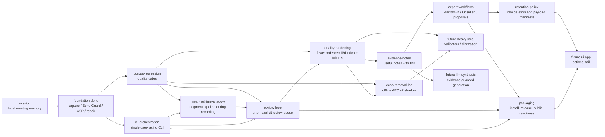

# MurmurMark CLI Roadmap

This roadmap is mirrored as an opskarta v3 plan:

- `docs/roadmap/murmurmark-cli-roadmap.plan.yaml`
- no calendar dates;
- dependencies, statuses and effort instead of delivery promises;
- CLI-first, local-first, evidence-backed.

## Product Direction

MurmurMark should become a dependable local CLI pipeline for sensitive meetings:

1. record local `mic` and `remote` tracks;
2. process them locally;
3. produce a transcript with visible uncertainty;
4. produce evidence-backed notes;
5. offer a short review queue when needed;
6. export reviewed artifacts;
7. plan or apply raw-audio retention.

The current product shape is batch-first: a meeting is recorded, then processed. A future
near-realtime path should reduce the wait after a meeting by processing already-closed audio
segments during recording. That path must start as a shadow pipeline, not as a replacement: raw
capture and the existing batch pipeline remain the source of truth until corpus gates prove that
near-realtime drafts are no worse than batch outputs.

The optional UI/app path is deliberately late. It should not block the useful CLI product.

## Current State

The CLI MVP is already real:

- `murmurmark record` records separate local tracks;
- `murmurmark process SESSION|latest` runs the post-recording pipeline;
- `murmurmark next`, `status`, `report`, `open`, `notes`, `transcript` provide handoff and inspection;
- `murmurmark review` handles lane packs, answer sheets, suggested decisions and reviewed profiles;
- `murmurmark review suggested` previews and applies safe generated suggestions before manual listening;
- `murmurmark corpus` runs the regression/readiness loop;
- `murmurmark finish` turns readiness, export and retention/payload manifests into one final handoff;
- `murmurmark export` builds Export Bundle Quality v1 Markdown/Obsidian bundles with "Can I use
  this?", review burden, evidence-backed notes, transcript IDs and retention/privacy next steps;
- `murmurmark retention` plans payloads and raw deletion;
- `murmurmark doctor`, `self-test`, `acceptance`, release bundle and open-source checks exist.

Operational corpus snapshot from 2026-07-01:

- `review suggested apply` is cumulative: already reviewed rows are preserved even when the
  regenerated template changes;
- `review progress`, workspace `suggested_closure`, `status` and session-quality agree on the same
  remaining queue;
- safe suggested decisions and Target-Me evidence reduced the blocking queue to `5` actions;
- `murmurmark report corpus` now reports `pilot_ready_with_review`;
- irreducible review gate: `pilot_ready_with_irreducible_review`;
- operational scope: `20` working sessions, `26` diagnostic sessions excluded;
- readiness: `15/20 ready_for_notes`, `5/20 review_first`, `0/20 do_not_use_without_manual_review`;
- mandatory review queue: `5` actions / `8.78s` raw audio;
- notes review burden: `0.81 min`;
- transcript/export review burden: `3.48 min`;
- pending safe suggestions: `0`.

This is enough to use the corpus as a pilot-ready local tool with explicit review. It is not yet
`medium_risk_ready`: the remaining local-recall/lost-Me/uncertain rows still require a human check
before broader use. One risky session is now handled as formal residual risk because the remaining
scope is short, explicit and bounded by allowed risk flags. Guarded full transcript export can still
be blocked by transcript-only review surface; `finish` should keep that blocker visible instead of
silently exporting.

The 2026-06-30 daily sync showed the review-loop gap: a meeting can have healthy capture and no
harmful duplicate seconds, but still be marked `risky` because order/local-recall rows are not
formally closed. The immediate path is now `murmurmark review suggested SESSION`, then
`murmurmark review suggested apply SESSION`; this closes only high-confidence local-audio suggestions
when they match the current review queue, preserves earlier decisions, and prints the exact remaining
manual queue. Targeted stronger-audio-judge is cached-first by default; deliberate new decode is
opt-in through `MURMURMARK_TARGETED_JUDGE_COMPUTE=1`.

The same corpus also shows a deeper quality limit: much of the later cleanup work exists because
remote speech is still audible and sometimes recognizable in the mic track. `local_fir` remains the
right default because it protects local speech, but it is not a complete-removal engine.
`offline_aec_v2_v0` gives a repeatable shadow baseline: proxy masking can reduce remote energy and
harmful seconds, but ASR-token gates still do not beat `local_fir`. The follow-up vNext spike added
segment switching and `remote_forbidden_token_guard`; it produced the first ASR-positive improvement
on one difficult session without local-recall regression. That is enough to choose the next quality
direction. Remote-Forbidden Evidence Hardening v1 materialized that spike as normal evidence/status
artifacts. Coverage v2 then broadened ASR audit-window selection from speaker state and review
artifacts; the six-session smoke reached `4/6` safe improved sessions and zero local-recall
regressions. ASR-positive audio candidate v2 then added `coverage_v2_remote_gate_local_fir`, a real
shadow audio candidate that passes the ASR audio-candidate gate on `4/6` smoke sessions with zero
local-recall regressions. Target-Me extraction has now tested `mfcc_voiceprint_v0`,
`mfcc_contrastive_v0` and `resemblyzer_dvector_v0`. The MFCC baselines are useful only for
instrumentation. `resemblyzer_dvector_v0` is the first promising speaker-embedding layer: six-session
smoke found `13` new keep-evidence rows / `48.82s` and `54` corroborating rows / `306.95s`. The next
quality gap is hardening that signal into safe review suggestions without automatic transcript edits.

## Roadmap Tree



## Status By Block

### Done

- Two-track capture and session package.
- Echo Guard with local FIR and preserve-local policy.
- `whisper.cpp` transcription pipeline.
- Timeline/start-of-call repair.
- Conservative cleanup profiles and reviewed profiles.
- Group overlap, local recall, audio review and optional stronger-audio-judge audits.
- Extractive notes, quality verdict and review items.
- CLI process/status/next/report/open/notes/transcript/review/corpus/export/retention surface.
- Local install wrapper, self-test, acceptance gate, release bundle and public-readiness check.
- Recording reliability: normal duration/SIGINT stops complete, unexpected SIGTERM/SIGHUP/capture
  failures become explicit partial sessions, and `doctor` catches missing shareable displays.

### Current

- Keep the operational corpus at `pilot_ready_with_review` or better, with the short irreducible
  review queue visible in `murmurmark report corpus`.
- Keep readiness/status/next honest when the actionable review queue is empty but residual risk
  remains documented.
- Close safe review rows with local audio evidence before asking the user to listen manually.
  The 2026-06-30 daily sync showed the important pattern: the session was marked `risky`, but
  stronger audio judge confirmed most `check_transcript_order` rows as timing/double-talk, leaving
  only a few real manual checks.
- Continue **Echo Guard Complete Removal** after Remote-Forbidden Evidence Coverage v2:
  - keep `local_fir` as the production default;
  - use the shadow `offline_aec_v2_v0` lab as a repeatable diagnostic baseline;
  - treat `remote_floor` and segment switching as useful proxy/control candidates, not as production
    replacements;
  - use Coverage v2 windows as the ASR judge for audio candidates: v2 writes selection reasons,
    evidence rows, readiness metrics and corpus report; current smoke is `4/6` safe improved;
  - keep `coverage_v2_remote_gate_local_fir` as the current shadow audio candidate baseline;
  - keep `mfcc_voiceprint_v0` and `mfcc_contrastive_v0` as Target-Me baselines: useful for
    measurement, not enough for review-burden reduction;
  - harden `resemblyzer_dvector_v0` as the next Target-Me review/evidence layer;
  - keep neural residual suppression as a later spike behind corpus gates.
- Keep the final handoff readable: `finish` now opens a bundle whose `index.md` is the first working
  artifact, not a derived-file directory listing.
- Design **Near-Realtime Pipeline Shadow v1** as a future CLI branch:
  - first shadow implementation exists: `record --live-pipeline` writes durable mic/remote segment
    copies, starts an optional worker, writes `derived/live/transcript.draft.md`,
    `derived/live/live_pipeline_report.json`, post-stop final-reconcile report and advisory
    live-vs-batch comparison;
  - live segments are overlap-aware: each segment has a hard publish window and a wider ASR clip
    window; next work is per-segment Echo Guard stronger than speech-band preprocessing, resumable
    queue state and corpus parity gates;
  - after stop, the existing batch-grade repair/review/readiness layers run as final reconcile and
    remain authoritative;
  - keep the existing post-recording `process` path as source of truth until corpus comparison proves
    no worse order/local-recall/remote-duplicate behavior.
- Make the everyday path boring:

  ```bash
  murmurmark record --target-bundle system
  murmurmark process latest
  murmurmark next latest
  murmurmark review next latest   # only when printed
  murmurmark finish latest
  ```

- Keep documentation aligned with the actual command surface.

### Next

- Near-realtime shadow pipeline follow-up:
  - segment writer during capture exists with hard/clip overlap windows, but still needs better queue
    recovery;
  - worker queue exists as a safe shadow worker, but its v1 preprocessing is intentionally light and
    must be upgraded before it can compete with batch Echo Guard;
  - post-stop final reconcile exists; it can reuse strict-compatible live ASR cache, otherwise it
    reports `fallback_batch_asr`;
  - live-ASR cache bridge exists and writes `live_asr_cache_report.json`; it materializes raw cache
    only when chunk geometry, model, language and audio prep are compatible with batch ASR;
  - corpus-level live report exists as `murmurmark corpus live`; it keeps promotion blocked while
    order/local-recall/remote-leak/review-burden gates are not evaluated by live outputs;
  - delayed transcript commit: do not finalize the last few seconds until the next segment arrives;
  - live status: captured/preprocessed/ASR seconds, current lag and current worker;
  - final reconcile after stop: batch-grade transcript remains authoritative until gates promote the
    live output.
- Review loop polish:
  - keep suggested review closure first-class: show how many rows can be accepted from stronger
    local audio evidence, how many remain manual, and whether generated suggestions are actionable
    or still `needs_review`;
  - keep lane packs clear, but avoid sending the user to listen through rows already confirmed by the
    local judge;
  - explicit "safe to export / review first / do not use" handoff.
- Corpus regression discipline:
  - stable small operational corpus;
  - baseline comparison before new heuristics;
  - no-regression gates for order, local recall, duplicates and selected notes.
- Echo Guard evidence and promotion path:
  - keep candidate artifacts separate from `mic_for_asr.wav`;
  - use Coverage v2 ASR windows before promotion;
  - promote audio only after corpus gates prove lower remote-token leakage without worse local
    recall;
  - keep transcript-level remote-forbidden reconciliation as the final safety net.
- Export workflow:
  - keep `murmurmark finish` as the normal final handoff;
  - maintain Export Bundle Quality v1 and test it against real 1x1, group and review-blocked
    sessions;
  - add Obsidian-vault export only after the bundle is stable.

### Later

- Stronger extractive notes and stable `evidence_notes.json`.
- Reviewed docs/ticket export proposals.
- Configurable domain packs without committing private terms.
- Retention policy profiles and privacy manifests.
- Public release hardening: security contact, issue templates, generated/private artifact audit.

### Ideas

- Per-speaker diarization inside `Colleagues`.
- `transcript.rich.json` with stronger alignment and confidence fields.
- Heavy local ASR/forced-alignment validators.
- Local or controlled LLM synthesis with strict evidence guard.
- Optional menu bar or desktop UI after the CLI is mature.

## Latest Completed Goals

ASR-positive audio candidate v2 is the latest completed quality goal. It adds
`coverage_v2_remote_gate_local_fir`, a real shadow audio candidate judged against Coverage v2 ASR
windows.

Remote-Forbidden Evidence Coverage v2 broadened ASR audit window selection and made that
audio-candidate search measurable.

Export Bundle Quality v1 is the latest completed product-handoff goal. MurmurMark can now end a
successful pipeline with a readable local handoff instead of a pile of derived artifacts.

In practical terms, `murmurmark finish SESSION` now produces a Markdown or Obsidian bundle where:

- `index.md` answers "Can I use this?", shows selected profile, verdict, review burden, review
  blockers, retention/privacy summary and the next command;
- `quality_verdict.md` explains the verdict in human terms;
- `notes.md` is an evidence-backed extractive working summary;
- `transcript.md` keeps the full selected transcript with utterance IDs and review flags;
- forced/debug exports with blockers clearly say "Do not use yet";
- raw audio is not copied into the export bundle.

Success is not a zero-review transcript. Success is that the final artifact is usable as a working
handoff and keeps uncertainty visible.

Recently completed:

- **Review-loop stabilization v1.** `review suggested apply` is cumulative, key-based and
  report-consistent. It consumes cached stronger-audio-judge and Target-Me evidence in lane
  suggestions, preserves closed rows across regenerated templates, and makes progress/status/report
  agree on the same remaining rows and seconds.
- **ASR-positive audio candidate v2.** `coverage_v2_remote_gate_local_fir` starts from the safer
  local-fir/segment-switch path and applies remote-floor cleanup only in Coverage v2 risk windows
  without strong local-speech evidence. Six-session smoke: `4/6` ASR audio candidate gate-passed
  sessions, `0/6` local-recall regressions, `2/6` explained as `no_baseline_asr_visible_leak`, no
  default promotion.
- **Remote-Forbidden Evidence Coverage v2.** ASR audit-window selection now reads speaker state,
  audio-review, stronger-audio-judge, group-overlap, transcript-overlap and local/order risk
  artifacts. Six-session smoke: `4/6` safe improved sessions, `0/6` local-recall regressions, `24`
  evaluable ASR windows, `578` skipped by cap, no default promotion.
- **Remote-Forbidden Evidence Hardening v1.** The first ASR-positive guard is now a normal evidence
  layer: persistent remote/mic token rows, per-session review, readiness metrics and corpus
  explanation. Six-session smoke: one safe improved session, zero local-recall regressions, no
  default promotion. The next weakness is coverage.
- **Echo Guard Complete Removal vNext.** Segment switching plus `remote_forbidden_token_guard`
  produced the first ASR-positive remote-leakage improvement on a difficult real session:
  `asr_candidate_gate_passed: 1/6`, with no local-word recall regressions in the six-session smoke
  corpus. It remains shadow-only and became the baseline for remote-forbidden evidence hardening.
- **Export Bundle Quality v1.** `finish` now produces a user-facing Markdown/Obsidian handoff:
  "Can I use this?", selected profile, review burden, evidence-backed notes, transcript utterance IDs
  and retention/privacy next steps.
- **Recording reliability.** Duration and `SIGINT` stops complete normally; `SIGTERM`, `SIGHUP` and
  unrecovered capture interruptions write `status: partial`, show `inspect` as the safe next command
  and block normal processing unless `--allow-partial` is explicit.
- **Readiness reconciliation.** A zero-action review queue no longer turns into an empty
  `first-lane` handoff. MurmurMark now points to `ready_for_notes`, a non-empty actionable review
  pack, or a documented non-actionable blocker.

## Candidate Next Goals

Recommended nearest goal: **Operational Corpus Green v2**: keep the corpus at
`pilot_ready_with_review` or better, make the irreducible review queue explicit, and prevent future
algorithm changes from silently growing it.

1. **Target-Me Evidence Hardening v1.** Keep integrating `resemblyzer_dvector_v0` with review-lane
   suggestions and corpus reports: close true `Me` rows only when the local-speaker evidence is
   strong, keep ambiguous rows explicit, and do not auto-edit transcripts.
2. **Operational Corpus Green follow-up.** Keep `murmurmark report corpus` as the source of truth,
   preserve the short irreducible review queue, keep `0` `do_not_use_without_manual_review`
   sessions, keep guarded export blockers explicit, and close only rows with safe local evidence.
3. **Near-Realtime Pipeline Shadow v1.** Start processing closed audio segments while recording and
   write a live draft transcript, but keep the current batch pipeline as final authority until corpus
   gates prove parity.
4. **Corpus and review-loop closure.** Keep the operational corpus usable while echo work continues:
   close safe suggested review rows, preserve manual rows and keep status/report aligned.
5. **Audio candidate promotion readiness.** Keep `coverage_v2_remote_gate_local_fir` shadow-only
   until broader corpus gates prove it is safe beyond selected audit windows.
6. **Export follow-up.** Keep the v1 bundle stable, then add optional Obsidian-vault placement and
   reviewed docs/ticket proposal exports.
7. **Strengthen corpus gates.** Freeze the current good state as a baseline and require new pipeline
   changes to beat or preserve it.
8. **Improve notes quality.** Refine extractive decisions/actions/risks while keeping every item tied
   to utterance IDs and review flags.
9. **Prepare for public release.** Remove private fixtures, document setup, verify ignored generated
   artifacts and add security/contact guidance.

## Validation

```bash
OPSKARTA_REPO="${OPSKARTA_REPO:-../opskarta}"
PLAN="docs/roadmap/murmurmark-cli-roadmap.plan.yaml"

PYTHONPATH="$OPSKARTA_REPO" python3 -m specs.v3.tools.cli validate "$PLAN"
PYTHONPATH="$OPSKARTA_REPO" python3 -m specs.v3.tools.cli render tree "$PLAN"
PYTHONPATH="$OPSKARTA_REPO" python3 -m specs.v3.tools.cli render deps "$PLAN" --mode hierarchical
PYTHONPATH="$OPSKARTA_REPO" python3 -m specs.v3.tools.cli render executive "$PLAN" --view exec-top
PYTHONPATH="$OPSKARTA_REPO" python3 -m specs.v3.tools.cli render executive-report "$PLAN" --section status --lang ru
```
