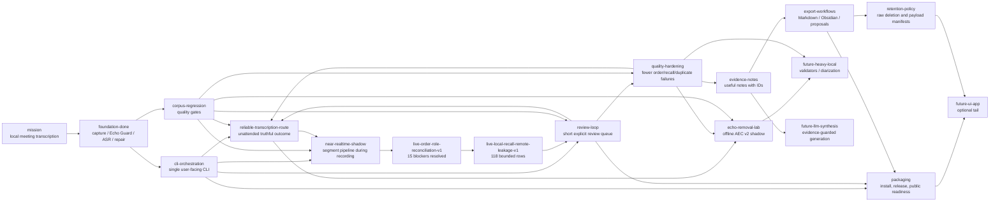

# MurmurMark CLI Roadmap

This roadmap is mirrored as an opskarta v3 plan:

- `docs/roadmap/murmurmark-cli-roadmap.plan.yaml`
- no calendar dates;
- dependencies, statuses and effort instead of delivery promises;
- CLI-first, local-first, evidence-backed.

## Product Direction

MurmurMark should become a dependable local CLI transcription pipeline for sensitive meetings:

1. record local `mic` and `remote` tracks;
2. process them locally;
3. produce a transcript with visible uncertainty;
4. produce evidence-backed notes;
5. offer a short review queue when needed;
6. export reviewed artifacts;
7. plan or apply raw-audio retention.

The product remains batch-first: a meeting is recorded, then processed. Current Pipeline
Stabilization v1 established this as the supported production route. The near-realtime branch now
produces an advisory preview from a committed-PCM sidecar and may eventually reduce post-meeting
wait. The old inline live writer stays quarantined because it can starve ScreenCaptureKit; its
replacement has a full fail-open proof and three fresh real transport proofs. Live promotion is
still blocked, but controlled Live Evidence runs may collect parity evidence while the batch
transcript remains authoritative. The intended shape is a single stable capture with a best-effort
experimental sidecar, documented in
[Experimental sidecar architecture](../architecture/experimental-sidecar.md).

The optional UI/app path is deliberately late. It should not block the useful CLI product.

## Current Strategic Focus

The major product route remains [Reliable Transcription Route](../project/reliable-transcription-route.md):
turn a complete recording into a truthful result without the user watching every stage. The batch
route, outcome contract, observable processing and resumable ASR are implemented. Live Order and
Role Reconciliation v1 is complete: all `23` auditable rows have stable classes, the `15` previous
effective blockers became `0`, and no transcript mutation was required. Live Local Recall and
Remote Leakage Hardening v1 is also complete: all `118` bounded rows have dispositions and its
causal shadow recovers `678.32s` aggregate missing `Me` with all seven no-regression gates passing.
Causal Local-Island Micro-ASR v2 is complete as an explicit-only shadow: all `40` previously
unresolved rows have stable outcomes and aggregate missing `Me` falls by another `255.77s` without
regressing remote-like `Me`, effective order, token F1 or review burden.
Causal Remote-Active Me Separation v1 is also complete: all `19` primary rows and `16`
mixed/double-talk cross-check rows have stable outcomes. It accepts `9` primary rows and reduces
aggregate missing `Me` by another `252.90s` with all seven no-regression gates passing.
Recording-Time Causal Me Recovery Integration v1 is complete: a latest-only bounded child now runs
both proven layers after the base chunk is durable. Fixed-corpus paced replay reproduces candidate
sets and profile metrics `7/7`; timeout, lag and overload preserve the normal preview and batch.
Live Recovery Runtime Efficiency and Real Evidence v1 is complete. Persistent stage watermarks,
content-addressed DSP/candidate/micro-ASR caches and bounded invalidation pass the fixed corpus, and
the strict fresh evidence aggregate now passes `3/3`. The third proof
(`2026-07-17_11-15-54-live`) has complete `2304.1s` raw tracks, `77` recording-time invocations,
`59` pre-stop candidate runs, no timeout/backpressure and zero final lag.
Fast Authoritative Handoff v1 is complete. `process` now publishes an atomic authoritative
transcript/verdict checkpoint before deferred enrichment; `enrich` and `process --full` expose the
remaining work explicitly. Bounded two-track ASR, deterministic micro-ASR scheduling and parallel
byte-equivalent clip generation reduced the three-session cold handoff corpus to p50 `12m25s` and
p95 `14m40s`; checkpoint reuse is at most `0.032s`. Transcript fingerprints, selected profiles and
quality metrics match sequential baselines, and all six raw CAF files remain unchanged. Existing
`30s/5s` live cache stays ineligible against `60s/5s` batch geometry and falls back per track.
Causal Double-Talk Me Recovery v1 is complete. Its immutable `16`-row / `65.07s` corpus has stable
outcomes; `4` rows / `11.56s` are safely recovered, aggregate missing `Me` falls to `1639.73s`, and
every per-session, runtime and frozen-input gate passes. Its completion audit covers `161` views
from four residual families, explains all rejected views and records evaluation-only boundary
evidence for every recovered row. Causal Recovery Generalization and Promotion Readiness v1 is now
complete with `DO_NOT_PROMOTE`: `963` outcomes, three holdouts / `9105.631s`, `832` unchanged input
hashes and zero accepted negative controls. Promotion is blocked by `268/783` expensive-stage
coverage, three recording-time timeouts and one holdout order regression. The nearest goal is
Causal Candidate Coverage and Cheap Negative Prefilter v1: reject cheap remote/noise negatives
before micro-ASR and replay the same immutable corpus at full decision coverage.
Near-Realtime Live Parity Coverage v1 already proved complete raw capture, pre-stop preview,
terminal workers, zero final lag and successful batch output on three fresh real sessions. Live
promotion remains blocked.

The selected capture-safe shadow profile is
`online_live_me_remote_overlap_filter_live_boundary_split_retime_causal_remote_energy_local_island_micro_asr_v2_causal_remote_active_me_separation_v1`
in both per-session comparison reports and the corpus reconciliation report.

The target outcome is:

```text
record meeting -> process unattended -> ready_for_notes | review_first | blocked
```

This is broader than Echo Guard and narrower than "perfect meeting intelligence". At the current
roadmap point it means:

- `process` is progress-aware and interruption-safe;
- ASR/heavy-stage work is chunk-addressed, cacheable and safely resumable;
- near-realtime chunks remain shadow-only; committed-PCM transport protects raw capture and batch
  remains authoritative;
- progressive Target-Me enrollment uses only closed earlier chunks and focused micro-ASR; the
  runtime profile localizes candidates to remote-free or speaker-confirmed subwindows and is judged
  by paired text/local-recall/remote/order no-regression gates;
- base live chunks now become visible before optional Target-Me enrichment; Target-Me has a bounded
  child timeout and a `60s` lag budget, so speaker recovery can degrade to explicit shadow skips
  without making the draft delay grow without bound;
- a full `34m49s` real run now validates the corrected duration-bounded sidecar: raw and sidecar
  both cover `2089.1s`, all `70` chunks complete, final lag is zero and no packets are dropped;
- a later `69m06s` real run confirms the transport at `139` chunks and `279` preview snapshots,
  `274` of them pre-stop, but exposes the remaining quality gap: `749.71s` missing batch `Me`, `60.30s`
  suspected remote-like `Me` and five blocking order rows;
- independent causal live evidence now recovers `14` probable-lost-`Me` review rows / `65.54s`
  that were invisible to timeline-island-only audit; these rows are evidence for review and never
  automatic transcript edits;
- a non-live `10m51s` control run confirms that stable raw capture and authoritative batch remain
  healthy independently of the live experiment;
- the focused capture-safe corpus has `6` meaningful comparisons and zero parity passes; a
  conservative boundary-retime shadow keeps missing `Me` (`2146.97s`) and remote-like `Me`
  (`67.44s`) unchanged while reducing contentful order mismatches `15 -> 14` and blocking rows
  `5 -> 4`;
- order/role reconciliation now passes `7/7`; raw matcher ambiguity remains visible as audit data;
- live local-recall hardening classified the refreshed seven-session queue of `118` blocker rows /
  `451.03s`; `9` rows are safe shadow candidates and `109` remain blocked;
- the selected shadow reduces aggregate missing `Me` from `2844.88s` to `2166.56s`, while
  remote-like `Me` remains `108.42s`, effective order blockers remain `0`, and review burden
  remains `490.38s`;
- local-island v2 gives all `40` unresolved rows / `210.41s` stable outcomes (`2 accepted`, `38`
  rejected), adds `44` deduplicated turns / `267.12s`, and reduces missing `Me` further to
  `1910.79s` with all seven no-regression gates passing;
- remote-active separation gives all `19` primary rows / `88.39s` and `16` mixed/double-talk
  cross-check rows / `65.07s` stable outcomes, adds `42` turns / `289.46s`, and reduces missing
  `Me` further to `1657.89s` without increasing remote-like `Me`, order risk or review burden;
- double-talk recovery gives all `16` cross-check rows stable outcomes, safely matches `4` rows /
  `11.56s`, reduces missing `Me` to `1639.73s`, keeps remote-like `Me=108.42s` and blockers `0`,
  and passes runtime p95/final-lag plus `356`-input SHA gates;
- recording-time integration reproduces both replay candidate sets and profile metrics across all
  seven sessions; it remains an explicit-only `_runtime_v1` shadow;
- incremental runtime efficiency is implemented, passes the `p95 <= 30s` source-time gate and the
  strict fresh-session aggregate `3/3`; Fast Authoritative Handoff has since separated the first
  usable result from deferred enrichment, and the next bounded work is causal recovery
  generalization/promotion readiness;
- `status`, `next`, `finish`, session report and corpus report agree;
- safe review suggestions are applied before asking for manual listening;
- remaining review is short, explicit and backed by audio/transcript evidence;
- export stays blocked while transcript/export blockers remain;
- stronger Echo Guard candidates stay shadow-only until corpus gates prove lower remote leakage
  without local-recall regression.

External consultation converged on the same implementation order. The reliability foundation and
capture-safe sidecar boundary are implemented; current quality work stays inside these contracts:

1. build `Outcome Contract v1` and a deterministic gate evaluator;
2. write `outcome.json`, `outcome.md`, `review_plan.json` and `next_command.txt` for every processed
   or failed session;
3. add a resumable run manifest for long ASR stages;
4. add ASR/window-level cache and resume, with stable metadata hashes;
5. keep normal non-live capture/process/status/next/finish as the production baseline;
6. keep silent/partial/interrupted captures blocked before ASR;
7. keep the experimental sidecar contract as the boundary for live work:
   `derived/experiments/live-shadow-v1` must prove fail-open behavior and raw capture isolation;
   real live-pipeline coverage returns only through controlled Live Evidence runs with that proof;
8. improve live local recall without publishing remote speech, using only causal runtime evidence
   and no per-session parity regression;
9. reproduce replay-proven causal recovery inside the recording-time worker without weakening
   capture isolation or the lag budget; completed with fixed-corpus agreement `7/7`;
10. make recovery incremental and collect fresh bounded-latency recording-time evidence;
11. reuse or promote live output only after every required corpus gate passes.

The explicit non-goal for this phase is changing the default ASR, default `local_fir`, UI, cloud
services or broad repair heuristics before the outcome contract can measure the effect.

## Current State

The CLI MVP is already real:

- `murmurmark record` records separate local tracks;
- `murmurmark process SESSION|latest` runs the post-recording pipeline;
- `murmurmark next`, `status`, `report`, `open`, `notes`, `transcript` provide handoff and inspection;
- `murmurmark review` handles lane packs, answer sheets, suggested decisions and reviewed profiles;
- `murmurmark review suggested` previews and applies safe generated suggestions before manual listening;
- `murmurmark corpus` runs the regression/readiness loop;
- `murmurmark experiment status|report|compare` exposes sidecar manifests under
  `derived/experiments/live-shadow-v1` while keeping batch authoritative;
- `murmurmark finish` turns readiness, export and retention/payload manifests into one final handoff;
- `murmurmark export` builds Export Bundle Quality v1 Markdown/Obsidian bundles with "Can I use
  this?", review burden, evidence-backed notes, transcript IDs and retention/privacy next steps;
- `murmurmark retention` plans payloads and raw deletion;
- `murmurmark doctor`, `self-test`, `acceptance`, release bundle and open-source checks exist.

Operational corpus snapshot from 2026-07-02:

- `review suggested apply` is cumulative: already reviewed rows are preserved even when the
  regenerated template changes;
- `review progress`, workspace `suggested_closure`, `status` and session-quality agree on the same
  remaining queue;
- safe suggested decisions and Target-Me evidence reduced the blocking queue; no safe suggestions are
  currently pending;
- `murmurmark report corpus` now reports `pilot_ready_with_review`;
- irreducible review gate: `irreducible_manual_review_queue_present`;
- operational scope: `24` working sessions, `26` diagnostic sessions excluded;
- readiness: `15/24 ready_for_notes`, `9/24 review_first`, `0/24 do_not_use_without_manual_review`;
- mandatory review queue: `9` actions / `12` rows;
- low-materiality rows outside mandatory review: `28` rows / `70.95s`;
- corpus gate review limits: `15` actions / `25` rows;
- notes review burden: `1.32 min`;
- transcript/export review burden: `4.09 min`;
- pending safe suggestions: `0`.

The latest narrowing treats single-word `так` tails without action/decision/risk markers as
low-materiality, not mandatory review. Content-bearing uncertain rows remain manual.
Short exact partial duplicates with no unique `Me` content are also outside the mandatory queue.
One `check_transcript_order` overlap is now closed by stronger-audio-judge evidence as a safe
`keep_me`; conflicting order/audio rows remain manual.

This is enough to use the corpus as a pilot-ready local tool with explicit review. It is not yet
`medium_risk_ready`: the remaining local-recall/lost-Me/uncertain rows still require a human check
before broader use. One risky session is now handled as formal residual risk because the remaining
scope is short, explicit and bounded by allowed risk flags. The stronger local audio judge now has a
keep-only timing-overlap rule: when group-overlap evidence already proves strong local support and
weak remote/leak support, the row can be closed as `keep_me`. Conflicting double-talk remains manual.
Guarded full transcript export can still
be blocked by transcript-only review surface; `finish` should keep that blocker visible instead of
silently exporting.

The 2026-06-30 daily sync showed the review-loop gap: a meeting can have healthy capture and no
harmful duplicate seconds, but still be marked `risky` because order/local-recall rows are not
formally closed. The immediate path is now `murmurmark review suggested SESSION`, then
`murmurmark review suggested apply SESSION`; this closes only high-confidence local-audio suggestions
when they match the current review queue, preserves earlier decisions, and prints the exact remaining
manual queue. Targeted stronger-audio-judge is cached-first by default; deliberate new decode is
opt-in through `MURMURMARK_TARGETED_JUDGE_COMPUTE=1`.

The same corpus also shows a deeper quality limit: much of the later cleanup work exists because
remote speech is still audible and sometimes recognizable in the mic track. `local_fir` remains the
right default because it protects local speech, but it is not a complete-removal engine.
`offline_aec_v2_v0` gives a repeatable shadow baseline: proxy masking can reduce remote energy and
harmful seconds, but ASR-token gates still do not beat `local_fir`. The follow-up vNext spike added
segment switching and `remote_forbidden_token_guard`; it produced the first ASR-positive improvement
on one difficult session without local-recall regression. That is enough to choose the next quality
direction. Remote-Forbidden Evidence Hardening v1 materialized that spike as normal evidence/status
artifacts. Coverage v2 then broadened ASR audit-window selection from speaker state and review
artifacts; the six-session smoke reached `4/6` safe improved sessions and zero local-recall
regressions. ASR-positive audio candidate v2 then added `coverage_v2_remote_gate_local_fir`, a real
shadow audio candidate that passes the ASR audio-candidate gate on `4/6` smoke sessions with zero
local-recall regressions. Target-Me extraction has now tested `mfcc_voiceprint_v0`,
`mfcc_contrastive_v0` and `resemblyzer_dvector_v0`. The MFCC baselines are useful only for
instrumentation. `resemblyzer_dvector_v0` is the first promising speaker-embedding layer, and the
first hardening pass connected it to review-plan rows and closed two safe `keep_me` cases. The next
quality gap is earlier in the pipeline: harden the ASR-positive shadow audio candidate so less remote
speech reaches ASR as `Me` in the first place. This now feeds the larger reliability route: better
audio matters when it lowers unattended review burden and passes corpus gates.

## Roadmap Tree



## Status By Block

### Done

- Two-track capture and session package.
- Echo Guard with local FIR and preserve-local policy.
- `whisper.cpp` transcription pipeline.
- Timeline/start-of-call repair.
- Conservative cleanup profiles and reviewed profiles.
- Group overlap, local recall, audio review and optional stronger-audio-judge audits.
- Extractive notes, quality verdict and review items.
- CLI process/status/next/report/open/notes/transcript/review/corpus/export/retention surface.
- Local install wrapper, self-test, acceptance gate, release bundle and public-readiness check.
- Recording reliability: normal duration/SIGINT stops complete, unexpected SIGTERM/SIGHUP/capture
  failures become explicit partial sessions, and `doctor` catches missing shareable displays.

### Current

- Make the reliable transcription route first-class:
  - one complete recording should lead to `ready_for_notes`, `review_first` or `blocked`;
  - `status`, `next`, `finish`, session reports and corpus reports must agree;
  - long ASR stages must be resumable and visible enough not to look like a hang;
  - export must stay guarded by explicit blockers.
- Keep the operational corpus at `pilot_ready_with_review` or better, with the short irreducible
  review queue visible in `murmurmark report corpus`.
- Close safe review rows with local audio evidence before asking the user to listen manually.
  The 2026-06-30 daily sync showed the important pattern: the session was marked `risky`, but
  stronger audio judge confirmed most `check_transcript_order` rows as timing/double-talk, leaving
  only a few real manual checks.
- Use the broader stronger-audio-judge budget as the normal pipeline default. The old `12` item cap
  was a false economy: on the 2026-07-02 long strategy sync, a full `80` item pass turned most
  order-risk rows into safe `keep_me` suggestions and cut the manual tail to seconds.
- Continue **Echo Guard Complete Removal** after Remote-Forbidden Evidence Coverage v2:
  - keep `local_fir` as the production default;
  - use the shadow `offline_aec_v2_v0` lab as a repeatable diagnostic baseline;
  - treat `remote_floor` and segment switching as useful proxy/control candidates, not as production
    replacements;
  - use Coverage v2 windows as the ASR judge for audio candidates: v2 writes selection reasons,
    evidence rows, readiness metrics and corpus report; hardened profile is `5/6` safe improved;
  - keep `coverage_v2_remote_gate_local_fir` as the current explicit experimental audio candidate;
  - keep `mfcc_voiceprint_v0` and `mfcc_contrastive_v0` as Target-Me baselines: useful for
    measurement, not enough for review-burden reduction;
  - keep `resemblyzer_dvector_v0` as a review/evidence layer, now wired into review-plan rows;
  - keep `coverage_v2_remote_gate_local_fir` shadow-only while promotion readiness is defined on a
    broader corpus;
  - keep neural residual suppression as a later spike behind corpus gates.
- Keep the final handoff readable: `finish` now opens a bundle whose `index.md` is the first working
  artifact, not a derived-file directory listing.
- Continue **Near-Realtime Pipeline Shadow v1** as a single-capture sidecar:
  - legacy `record --live-pipeline` remains quarantined because inline segment work correlated with
    sparse raw ScreenCaptureKit audio;
  - the current redesign is `record --experiment live-shadow-v1`: raw CAF is written first, then a
    bounded committed-PCM queue writes closed experiment segments under
    `derived/experiments/live-shadow-v1/audio/`;
  - `raw_segment_commits.jsonl` remains as audit and post-stop fallback; normal preview does not read
    still-open CAF files;
  - `derived/live/segments.jsonl` remains a compatibility alias pointing to those canonical
    experiment files; live draft output is advisory only;
  - the design rule is one ScreenCaptureKit owner plus derived sidecar artifacts, never two
    concurrent `record` processes;
  - after stop, the normal `murmurmark process` path runs separately and remains authoritative;
  - keep the existing post-recording `process` path as source of truth until corpus comparison proves
    no worse order/local-recall/remote-duplicate behavior.
- Make the everyday path boring:

  ```bash
  SESSION="sessions/$(date +%Y-%m-%d_%H-%M-%S)"
  murmurmark record --out "$SESSION" --target-bundle system
  murmurmark process "$SESSION"
  murmurmark next "$SESSION"
  murmurmark review next "$SESSION"   # only when printed
  murmurmark finish "$SESSION"
  ```

- Keep documentation aligned with the actual command surface.

### Next

- Causal Candidate Coverage and Cheap Negative Prefilter v1:
  - reuse the immutable `963`-row generalization corpus; no new recording is initially required;
  - give all `783` eligible source rows a cheap causal outcome before expensive residual/ASR work;
  - reject obvious remote-only and ASR-noise rows without weakening remote-forbidden guards;
  - preserve the fixed `4` recoveries / `11.56s` and zero accepted negative controls;
  - make all three holdout replays finish with p95 at most `30s`, final lag `0` and deterministic
    offline/runtime decisions;
  - remove the holdout order regression while preserving remote-like `Me`, token F1 and review
    burden per session;
- keep `--live-pipeline` disabled by default; all new evidence should go through
  `record --experiment live-shadow-v1`.
- Near-realtime shadow pipeline follow-up:
  - previous inline segment writing during capture is quarantined: live tests showed it can starve
    ScreenCaptureKit audio delivery and leave raw tracks mostly silent;
  - first redesign step is now implemented as committed PCM after durable raw writes; the callback
    no longer passes `CMSampleBuffer` objects to sidecar workers and normal preview no longer reads
    open CAF files;
  - `scripts/check-capture-regressions.sh` now writes
    `sessions/_reports/capture-regression/capture_regression_check.json`; `static_only` is useful
    regression evidence, while `full_fail_open_proof_passed` is required before controlled
    Live Evidence runs; static reruns preserve an already-passed full proof instead of downgrading
    the operator state;
  - `murmurmark live pilot` now wraps the evidence path through `scripts/run-live-parity-pilot.sh`:
    safety probe, short lab live recording or controlled real Live Evidence run, batch process,
    live-vs-batch compare and refreshed corpus live report;
  - worker queue exists as a safe shadow worker, but its v1 preprocessing is intentionally light and
    must be upgraded before it can compete with batch Echo Guard;
  - post-stop final reconcile exists; it can reuse strict-compatible live ASR cache, otherwise it
    reports `fallback_batch_asr`;
  - live-ASR cache bridge exists and writes `live_asr_cache_report.json`; when eligible it
    materializes both top-level raw ASR JSON and `raw/chunks/<track>/chunk_cache_report.json`, then
    relies on the normal chunk rebuild check as the hard proof;
  - corpus-level live report exists as `murmurmark corpus live`; it keeps promotion blocked while
    capture-safety/order/local-recall/remote-leak/review-burden gates are not passed by live outputs;
  - delayed transcript commit: do not finalize the last few seconds until the next segment arrives;
  - live status: captured/preprocessed/ASR seconds, current lag and current worker;
  - final reconcile after stop: batch-grade transcript remains authoritative until gates promote the
    live output.
- Review loop polish:
  - keep suggested review closure first-class: show how many rows can be accepted from stronger
    local audio evidence, how many remain manual, and whether generated suggestions are actionable
    or still `needs_review`;
  - keep lane packs clear, but avoid sending the user to listen through rows already confirmed by the
    local judge;
  - explicit "safe to export / review first / do not use" handoff.
- Corpus regression discipline:
  - stable small operational corpus;
  - baseline comparison before new heuristics;
  - no-regression gates for order, local recall, duplicates and selected notes.
- Echo Guard evidence and promotion path:
  - keep candidate artifacts separate from `mic_for_asr.wav`;
  - use Coverage v2 ASR windows before promotion;
  - promote audio only after corpus gates prove lower remote-token leakage without worse local
    recall;
  - keep transcript-level remote-forbidden reconciliation as the final safety net.
- Export workflow:
  - keep `murmurmark finish` as the normal final handoff;
  - maintain Export Bundle Quality v1 and test it against real 1x1, group and review-blocked
    sessions;
  - add Obsidian-vault export only after the bundle is stable.

### Later

- Stronger extractive notes and stable `evidence_notes.json`.
- Reviewed docs/ticket export proposals.
- Configurable domain packs without committing private terms.
- Retention policy profiles and privacy manifests.
- Public release hardening: security contact, issue templates, generated/private artifact audit.

### Ideas

- Per-speaker diarization inside `Colleagues`.
- `transcript.rich.json` with stronger alignment and confidence fields.
- Heavy local ASR/forced-alignment validators.
- Local or controlled LLM synthesis with strict evidence guard.
- Optional menu bar or desktop UI after the CLI is mature.

## Latest Completed Goals

Fast Authoritative Handoff v1 is the latest completed operational goal. Its three-session machine
gate passes `3/3`: cold p50 `744.571s`, p95 `880.090s`, checkpoint reuse maximum `0.032s`, exact
transcript/profile/quality equivalence to sequential baselines, and unchanged source CAF hashes.
Strictly incompatible live cache remains an explicit per-track batch fallback.

Near-Realtime Live Parity Coverage v1 is the completed live transport reliability goal. Three fresh
real sessions prove complete raw capture, recording-time preview provenance, terminal workers, zero
final lag and successful authoritative batch output. A real comparison rerun left realtime
artifacts byte-identical. The milestone closes transport and blocker localization, not live
promotion: the refreshed corpus still has zero complete parity passes.

Chunked/Resumable Processing v1 remains the completed batch reliability foundation. Default `windowed`
whisper.cpp runs now write per-window chunk cache metadata, `murmurmark process` can resume
interrupted ASR work from verified chunks, legacy raw ASR cache without chunk reports is rebuilt
instead of being trusted, and corpus gates treat chunk rebuild failures as hard failures. Current
ASR chunk-cache corpus coverage at completion was `14/50`, with `0` failed rebuilds and `146/146`
completed chunks.

ASR-positive Echo Candidate Hardening v1 is a completed Echo Guard quality goal. It turns
`coverage_v2_remote_gate_local_fir` into an explicit experimental profile with one-session and
corpus reports, while keeping `local_fir` as the default.

Remote-Forbidden Evidence Coverage v2 broadened ASR audit window selection and made that
audio-candidate search measurable.

Export Bundle Quality v1 is the completed product-handoff foundation. MurmurMark can now end a
successful pipeline with a readable local handoff instead of a pile of derived artifacts.

In practical terms, `murmurmark finish SESSION` now produces a Markdown or Obsidian bundle where:

- `index.md` answers "Can I use this?", shows selected profile, verdict, review burden, review
  blockers, retention/privacy summary and the next command;
- `quality_verdict.md` explains the verdict in human terms;
- `notes.md` is an evidence-backed extractive working summary;
- `transcript.md` keeps the full selected transcript with utterance IDs and review flags;
- forced/debug exports with blockers clearly say "Do not use yet";
- raw audio is not copied into the export bundle.

Success is not a zero-review transcript. Success is that the final artifact is usable as a working
handoff and keeps uncertainty visible.

Recently completed:

- **Review-loop stabilization v1.** `review suggested apply` is cumulative, key-based and
  report-consistent. It consumes cached stronger-audio-judge and Target-Me evidence in lane
  suggestions, preserves closed rows across regenerated templates, and makes progress/status/report
  agree on the same remaining rows and seconds.
- **ASR-positive Echo Candidate Hardening v1.** `murmurmark audit asr-positive-echo-candidate`
  writes `asr_positive_echo_candidate_report.{json,md}`, and `murmurmark corpus echo-candidate`
  writes `asr_positive_echo_candidate_corpus_report.{json,md}`. Current six-session corpus: `5/6`
  safe improved, `1/6` not applicable, `0/6` local-recall regressions. `murmurmark corpus gate`
  enforces `shadow_only_do_not_promote`.
- **ASR-positive audio candidate v2.** `coverage_v2_remote_gate_local_fir` starts from the safer
  local-fir/segment-switch path and applies remote-floor cleanup only in Coverage v2 risk windows
  without strong local-speech evidence. Six-session smoke: `4/6` ASR audio candidate gate-passed
  sessions, `0/6` local-recall regressions, `2/6` explained as `no_baseline_asr_visible_leak`, no
  default promotion.
- **Remote-Forbidden Evidence Coverage v2.** ASR audit-window selection now reads speaker state,
  audio-review, stronger-audio-judge, group-overlap, transcript-overlap and local/order risk
  artifacts. Six-session smoke: `4/6` safe improved sessions, `0/6` local-recall regressions, `24`
  evaluable ASR windows, `578` skipped by cap, no default promotion.
- **Remote-Forbidden Evidence Hardening v1.** The first ASR-positive guard is now a normal evidence
  layer: persistent remote/mic token rows, per-session review, readiness metrics and corpus
  explanation. Six-session smoke: one safe improved session, zero local-recall regressions, no
  default promotion. The next weakness is coverage.
- **Echo Guard Complete Removal vNext.** Segment switching plus `remote_forbidden_token_guard`
  produced the first ASR-positive remote-leakage improvement on a difficult real session:
  `asr_candidate_gate_passed: 1/6`, with no local-word recall regressions in the six-session smoke
  corpus. It remains shadow-only and became the baseline for remote-forbidden evidence hardening.
- **Export Bundle Quality v1.** `finish` now produces a user-facing Markdown/Obsidian handoff:
  "Can I use this?", selected profile, review burden, evidence-backed notes, transcript utterance IDs
  and retention/privacy next steps.
- **Recording reliability.** Duration and `SIGINT` stops complete normally; `SIGTERM`, `SIGHUP` and
  unrecovered capture interruptions write `status: partial`, show `inspect` as the safe next command
  and block normal processing unless `--allow-partial` is explicit.
- **Readiness reconciliation.** A zero-action review queue no longer turns into an empty
  `first-lane` handoff. MurmurMark now points to `ready_for_notes`, a non-empty actionable review
  pack, or a documented non-actionable blocker.

## Goal Sequence

Recommended nearest goal: **Causal Candidate Coverage and Cheap Negative Prefilter v1**. The
generalization decision is complete and says `DO_NOT_PROMOTE`; the shortest path forward is to fix
the measured coverage/runtime/order blockers on the same frozen corpus.

1. **Causal Candidate Coverage and Cheap Negative Prefilter v1.** Give all eligible remote-active
   rows bounded decisions, filter cheap negatives before micro-ASR and pass the existing three
   holdout recording-time/no-regression gates.
2. **Causal recovery promotion reconsideration.** Reissue a promote/no-promote decision only after
   the coverage experiment passes; do not alter normal preview beforehand.
3. **Live review/notes/boundary readiness.** After generalized recovery remains safe, close review burden,
   selected-notes readiness and chunk-boundary gates without weakening batch authority.
4. **ASR-positive Echo promotion readiness.** Expand `coverage_v2_remote_gate_local_fir` validation
   beyond the current six sessions, add rollback/inspection criteria, compare review burden and
   local recall more broadly, and only then decide whether a non-default promoted bundle is worth
   testing.
5. **Target-Me evidence follow-up.** Keep integrating `resemblyzer_dvector_v0` with review-lane
   suggestions, live local-recall diagnostics and corpus reports. The new live Target-Me audit shows
   that suppressed live mic chunks contain a large recoverable local slice: `287.98s` of `295.34s`
   audited local/mixed seconds are possible or confirmed Target-Me. The first policy candidate,
   `target_me_confirmed_remote_guard_v1`, looked safe by interval-overlap accounting (`94.68s`
   missing-Me recovered at `2.44s` remote-risk). The stricter counterfactual live-shadow comparison
   now shows the real blocker: the same policy recovers `128.85s` missing-Me with `0.00s` measured
   remote leak, but adds `3` contentful role-constrained order mismatches. The broader
   `target_me_possible_v1` recovers more but is unsafe. The conservative
   `target_me_confirmed_remote_guard_timeline_safe_v1` subset is now the first safe shadow candidate:
   it recovers `103.82s` missing-Me with `0.00s` measured remote leak and `0` contentful
   order-mismatch delta, and is materialized as
   `derived/live/target-me-shadow/target_me_confirmed_remote_guard_timeline_safe_v1/draft.{json,md}`.
   The same `parity_gates` now evaluate that materialized profile: `1` real-live session passes all
   gates, profile missing-Me is `315.34s`, and existing live remote leak remains `15.96s`. A
   diagnostic batch-oracle profile,
   `target_me_confirmed_remote_guard_timeline_safe_batch_remote_forbidden_oracle_v1`, removes those
   `15.96s` of remote-like live `Me` turns and leaves `0.00s` measured remote leak, but it only
   reduces non-passing profile gates from `42` to `41`. It is not promotable because it uses batch
   truth. The remaining `315.34s` missing-Me are now decomposed: `278.13s` are visible in suppressed
   mic ASR, `174.33s` have a broader Target-Me candidate, and `141.01s` have no Target-Me candidate.
   The stronger visible-suppressed-mic oracle profile adds `145.54s` of safe suppressed mic segments
   and drops profile missing-Me to `140.41s` while keeping measured remote leak at `0.00s` and
   contentful order mismatches at `4`. First live-accessible approximations were not enough:
   `audio_safe_union_v1` is safe but weak, while `audio_low_corr_text_guard_v1` recovers much more
   local speech but leaks too much remote-like text. The dedicated suppressed-mic policy lab confirms
   that this is not just a bad hand-picked threshold: in the full real scope, the best zero-risk
   generated threshold recovers only `27.78s` from a `409.50s` local/mixed ceiling, the best <=3s
   remote-risk rule recovers `60.16s`, and higher-recall rules quickly leak hundreds of seconds of
   remote-risk text. In the capture-safe candidate scope, the best safe threshold recovers only
   `1.80s` from `13.06s`. The next safe step is therefore not another simple threshold tweak, but a
   stronger online role-gate/fallback design with local-speaker or remote-forbidden evidence, while
   keeping order, review/readiness and capture-safe blockers explicit; ambiguous rows and sessions
   without enough enrollment stay explicit. The live Target-Me enrollment lab narrows that further:
   in capture-safe candidate sessions there is currently no usable positive live `Me` enrollment; in
   the full real scope, prefix/live-causal enrollment recovers only `9.24s` local at `0.00s`
   remote-risk, while full-session non-causal enrollment reaches `56.94s`. So Target-Me can help, but
   not from same-session live-published `Me` alone. The next design should add an enrollment
   fallback/warmup or persistent local-speaker evidence before trying to promote Target-Me-based live
   rescue. The first persistent-profile lab has now tested the historical-profile variant: in the
   full real scope it recovers `75.72s` local/mixed speech but still selects `8.64s` remote-risk
   speech under the conservative remote guard; in the stricter capture-safe candidate scope it
   recovers `0.00s`. That keeps persistent Target-Me as supporting evidence, not the main promotion
   path. The composite gate lab checked that combination explicitly: `dual_target_remote_guard_v1`
   gives the first zero-risk composite slice (`47.70s` local/mixed in the full real scope), while
   `target_me_remote_guard_v1` reaches `116.10s` local/mixed at `2.44s` remote-risk. The stricter
   capture-safe candidate scope still gets `0.00s`. The next live-local-recall work should
   keep building stricter remote-forbidden/local-speaker gates for the remaining suppressed mic
   regions. The tiny safe composite is already materialized as
   `online_suppressed_mic_dual_target_remote_guard_v1`: it adds `47.70s`, leaves `380.17s`
   missing-Me and leaves the existing `15.96s` live remote leak untouched. The paired
   `online_live_me_remote_overlap_filter_plus_dual_target_remote_guard_v1` shadow removes that
   `15.96s` remote-like live `Me`, preserves the `47.70s` rescue and keeps measured remote leak at
   `0.00s`, but still leaves `380.17s` missing-Me and `4` contentful order mismatches. The previous
   best live-implementable profile,
   `online_live_me_remote_overlap_filter_plus_target_me_possible_timeline_safe_remote_forbidden_relaxed_boundary_classifier_v1`,
   reaches `100.23s` missing-Me with `0.00s` remote leak, `4` contentful order mismatches and `41`
   non-passing gates. It keeps a remote-forbidden multi-cut boundary classifier around relaxed
   suppressed-mic local anchors and closes `9.90s` versus the previous best live-implementable
   profile without measured remote leak or contentful order regressions. The current local-speaker
   boundary shadow improves this to `51.50s` missing-Me on real live sessions. The current
   live-only split/retime variant keeps that `51.50s` missing-Me and `0.00s` remote leak while reducing contentful order
   mismatches from `4` to `2`. Its residual missing-Me splits into
   `37.73s` visible without Target-Me evidence and `13.77s` not visible in suppressed mic. The
   remaining-gap report now identifies no-policy rows as the largest bucket
   (`51.50s`) and also groups their overlapping suppressed-mic evidence: top gate reason
   `(none)` (`34.45s`), top batch-role labels `remote_dominant` (`32.90s`), `mixed` (`29.28s`)
   and `me_dominant` (`10.90s`), plus `known_hallucination` (`12.42s`) that is explicitly
   forbidden from rescue. The local-island split/retime oracle family now stays at `51.50s`
   missing-Me on the real-live subset, so it no longer proves an additional missing-Me gain.
   After the diagnostic remote-guarded voice-boundary materialization, actionability points at
   `25.00s` `mixed_needs_segmentation_or_speaker_evidence`, not at a clean publication queue. The
   mixed/speaker subset is `25.32s`: `10.58s` are `local_island_split_candidate`, `5.36s` need
   mixed boundary voice gating, `8.58s` are duplicate-heavy voice-disambiguation rows, `0.32s` are
   already materialized in the diagnostic remote-guarded boundary profile, and `0.48s` are low-value
   tail. This proves the materialization and online remote-forbidden mechanism, not parity. The
   local-island split lab now
   has only `1` candidate / `10.58s` with `5.10s` of local-island evidence and rejects it by token
   recall. The diagnostic split/retime oracle no longer closes extra missing-Me on the real-live
   subset, but ordinary parity gates still block promotion. The
   nearest work is therefore online local-speaker and boundary evidence for mixed regions, with
   stricter order-matcher handling for the remaining advisory weak/short/generic rows.
   `live_next_unlock` records full-corpus diagnostics, but the current unlock path now uses
   `capture_safe_candidate_scope`. Materializing the local-speaker/split-retime candidate disproved
   the earlier advisory-only order result: missing profile artifacts had hidden blocking rows. The
   follow-up causal token-density profile uses closed-chunk live ASR token timing plus a short-phrase
   temporal prior. On the refreshed 14-session real corpus the profile has `5` advisory gate rows
   and `0` gate-blocking rows. The active capture-safe triage has `2` advisory / `0` blocking rows;
   historical full-corpus triage retains one blocking row outside that active slice. The next
   implementation focus is `fix_live_local_recall_gap`; remote leakage remains a parallel gate, and
   no extra recording is required for this step.
   The first long pre-stop runtime proof exposed remote/order regressions in direct Target-Me. The
   conservative `live_runtime_causal_target_me_remote_energy_v1` profile now gates those candidates
   by contemporary remote loudness or 20 dB mic dominance. Across 11 comparable sessions it recovers
   634.43s missing Me with no increase in remote leakage or order mismatches, improves weighted F1
   by 0.029584 and has no per-session F1 regression. It is the current best live-implementable
   `safe_shadow_candidate`; promotion remains blocked until three fresh real sessions pass all gates.
   `remote_dominant_without_new_evidence` / `known_hallucination` stay blocked. Historical base
   triage had `14` contentful rows; the former voice-activity profile exposed `9` blocking boundary
   candidates and `12` advisory weak matches. The token-density follow-up clears blocking order risk
   in the active capture-safe path while retaining two advisory rows for audit. Historical
   full-corpus triage still retains one blocking row. Strict order gates continue to block genuine
   contradictions; the active implementation focus now moves to live local recall.
   The causal Target-Me remote-gap trim follow-up keeps only mic ASR token pieces between guarded
   remote intervals and after sustained local activity. On the full real corpus it materializes
   `42` pieces / `176.262s`, closes `15.38s` of missing Me and leaves remote-like Me (`40.29s`) and
   order counters unchanged. Focused live-only micro-ASR then adds `3` non-duplicate pieces /
   `10.74s`, rejects `3` unsafe or already-covered candidates and closes the remaining known
   Target-Me row / `4.68s` (`719.49s -> 714.81s`). The next step is the broader classified
   local-recall queue, not further tuning of this one row.
   The causal local-only enrollment probe now supports `33` closed live segments / `111.18s` using
   only seeds from the past. Focused micro-ASR accepts `13` groups / `62.54s`; the diagnostic corpus
   profile lowers missing Me to `683.55s` (`31.26s` recovered) without changing remote-like Me or
   order counters. This establishes the next implementation target: progressive enrollment and
   focused micro-ASR inside the sidecar. The profile remains non-promotable until that runtime path
   exists and passes the same corpus gates.
   The diagnostic boundary-order retime oracle remains non-promotable evidence: timing repair needs
   local-speaker preservation and must not relax remote-forbidden gates.
   The split/retime oracle preserves the local prefix (`1 / 6.62s`) and keeps missing-Me unchanged
   at `86.85s`, while still lowering contentful order mismatches to `2` with `0.00s` remote leak.
   The live-only split/retime profile materializes that shape; the next concrete quality-hardening
   target is speaker/boundary evidence for the remaining mixed missing-Me queue.
   `live_speaker_boundary_evidence_lab` now splits the same gap into `17.90s` future shadow-probe
   candidates, `68.95s` blocked rows and `0.0s` publication-ready. A soft local-speaker boundary
   shadow was also tested and produced `no_incremental_gain`: `0.00s` missing-Me delta and `0.00s`
   remote-leak delta versus the best live-implementable profile. This rules out the cheap path of
   merely weakening loudness thresholds. The new online speaker/boundary design lab splits the
   remaining queue into `40.18s` actionable mixed/speaker rows and `14.132s` potential publishable
   seconds after new evidence, with `0.0s` publication-ready now. Its top unit is
   `boundary_island_micro_asr` (`10.58s`, potential `5.10s`), so the nearest useful target is
   local-island micro-ASR/alignment, not broad rescue.
   `live_boundary_island_micro_asr_lab` now confirms that this unit is real but still not
   promotable: `1` live alignment candidate / `5.10s`, live batch-token recall improves from
   `0.154` to `0.385`, batch-reference recall reaches `0.462`, and publication remains `0.0s`.
   The candidate is now materialized as the diagnostic lab-shadow profile
   `online_live_me_remote_overlap_filter_plus_target_me_possible_timeline_safe_audio_safe_union_live_boundary_micro_asr_lab_shadow_v1`:
   it adds `1` micro-ASR turn / `5.10s`, lowers missing-Me to `76.27s`, keeps measured remote leak
   at `0.00s` and keeps contentful order mismatches at `2`. The first live-only candidate lab finds
   `99.40s` of suppressed mic
   candidates and `83.04s` local/mixed evidence, but
   still carries `16.36s` remote-risk. Its stricter zero-risk profile finds `36.12s` with `0.00s`
   remote-risk. That strict profile is now materialized as a normal shadow draft: after
   deduplication against existing live/Target-Me turns, the standalone version adds `0.00s`, leaves
   `117.57s` missing-Me and `0.00s` remote leak; the combined strict+audio-safe version adds the same
   `52.76s` as `audio_safe_union_v1`, while the current local-speaker boundary profile leaves
   `86.85s` with `0.00s` remote leak. `live_strict_local_island_shadow_delta_lab/v1` records `0.00s` incremental strict turns and
   `13.38s` closed missing-Me, but a negative net delta versus the current relaxed profile. This is
   not a call for more live recording, broader rescue or relaxed
   publication gates. The micro-ASR live-only candidate mode is now also materialized as
   `online_live_me_remote_overlap_filter_plus_target_me_possible_timeline_safe_audio_safe_union_live_boundary_micro_asr_live_only_shadow_v1`:
   the lab finds `3` alignment candidates / `13.76s`, but after deduplication and timeline safety
   the profile adds `0.00s`, keeps missing-Me at `86.85s`, remote leak at `0.00s` and contentful
   order mismatches at `2`. This makes the next step online timing anchors and remote-forbidden
   speaker/boundary evidence for still-uncovered mixed local islands.
   The new `live_only_retime_boundary_candidate_lab/v1` confirms the boundary of that approach:
   strict zero-remote anchors recover `0.00s` of the current best-live-implementable remaining gap,
   while the relaxed `oracle_gap_probe_v1` recovers `18.69s` but brings `27.20s` remote-risk. The
   next implementation target is therefore a remote-forbidden context/boundary gate around relaxed
   anchors, not additional recordings or relaxed live publication. The evaluation-only ceiling now
   shows the target shape: `14.79s` missing-Me can be recovered at `0.00s` remote-risk if the future
   live classifier learns to keep the same zero-risk groups without batch labels. The first
   live-only classifier now recovers `13.44s` at `0.00s` remote-risk. It has now been materialized as
   `online_live_me_remote_overlap_filter_plus_target_me_possible_timeline_safe_remote_forbidden_boundary_classifier_v1`.
   The unguarded version added `12.68s` and lowered missing-Me from `130.97s` to `127.01s`, but
   increased contentful order mismatches from `4` to `5`. The guarded version adds only `1.48s`.
   The relaxed materialized variant
   `online_live_me_remote_overlap_filter_plus_target_me_possible_timeline_safe_remote_forbidden_relaxed_boundary_classifier_v1`
   adds `4.10s`, leaves `100.23s` missing-Me, keeps measured remote leak at `0.00s` and keeps
   contentful order mismatches at `4`. The local-speaker boundary materialized variant
   `online_live_me_remote_overlap_filter_plus_target_me_possible_timeline_safe_audio_safe_union_local_speaker_boundary_shadow_v1`
   is now the pre-split/retime baseline at `86.85s` missing-Me, `0.00s` measured remote leak and
   `4` contentful order mismatches. The current best live-implementable profile adds live-only
   split/retime. The previous `7` advisory / `0` blocking result was incomplete because the
   candidate profile was absent from several comparisons. Focused materialization found `9`
   blocking boundary rows and `12` advisory weak-match rows. Token-density retime plus short-phrase
   temporal matching now leaves `2` advisory rows and `0` blocking rows in the active capture-safe
   path. The refreshed full real corpus has `5` advisory gate rows and one historical triage blocker
   outside that path. The first voice-coverage
   check now narrows that further: `live_mixed_speaker_boundary_voice_coverage_lab` sees `5`
   mixed/speaker rows / `25.32s`. After Target-Me is rerun with `--include-remaining-gap` and the
   diagnostic `--fallback-persistent-profile`, all rows have Target-Me coverage; `0.32s` have been
   materialized in the diagnostic remote-guarded boundary profile and `25.00s` stay weak or
   ambiguous. Those labs remain diagnostic-only. Order risk is now closed for the active
   capture-safe path. Remote-gap trim closes two live-visible Target-Me rows / `15.38s`; focused
   live-only micro-ASR closes the third / `4.68s` and rejects covered or remote-like alternatives.
   The direct runtime causal profile starts from the ordinary online remote-overlap filter and
   publishes only candidates localized outside live remote intervals. On 10 comparable real
   sessions it reduces missing Me `2426.91s -> 1869.02s`, keeps remote-like Me and order counters
   unchanged, and raises weighted token F1 `0.746153 -> 0.785490`; maximum per-session regression is
   `0.001712`. Speaker-confirmed sliding-window candidates remain diagnostic because their insertion
   point is ambiguous. Algorithmic no-regression passes, but temporal provenance reports
   `historical_replay_only`: one sparse session has ordinary pre-stop live chunks, but `0` sessions
   have both pre-stop causal candidates and a usable batch comparison. Live remains shadow-only until
   a fresh controlled soak proves latency and fail-open behavior.
   Cross-profile ranking now uses common quality gates. The runtime-only pre-stop provenance gate
   remains mandatory for promotion but is not counted against the runtime algorithm when comparing
   it with the baseline. Current result: `72` total / `66` comparable non-passing gates and `0`
   passing real sessions.
   The stricter `live_runtime_causal_target_me_speaker_overlap_v1` profile now adds
   speaker-confirmed windows only across short backchannel or known-hallucination remote context. It
   reduces missing Me `1881.44s -> 1829.64s`, leaves remote/order unchanged, improves F1 by
   `0.001874`, and has zero per-session F1 regression. It remains `historical_replay_only` because
   no qualifying candidate has pre-stop provenance.
5. **Operational Corpus Green follow-up.** Keep `murmurmark report corpus` as the source of truth,
   preserve the short irreducible review queue, keep `0` `do_not_use_without_manual_review`
   sessions, keep guarded export blockers explicit, and close only rows with safe local evidence.
6. **Near-Realtime Pipeline Shadow v1.** Continue hardening draft transcripts from safe derived
   segments while keeping the batch pipeline as final authority until corpus gates prove parity.
   Worker handoff reliability, immutable realtime provenance and the three fresh transport proofs
   are complete. Order/role reconciliation also passes `7/7` without turn mutation. Current work is
   the bounded `118`-row local-recall/remote-leakage set; `murmurmark live evidence SESSION` remains
   the compact per-session transport and parity gate.
   The normal `murmurmark live watch` path now reads `transcript.preview.md`: ordinary role-gated
   chunks plus only causal Target-Me candidates accepted by recording-time remote energy. The full
   `transcript.draft.md` remains available through `--diagnostic-draft`, so conservative user preview
   and complete parity evidence no longer conflict.
   Append-only `preview_snapshots.jsonl` now records creation time, covered end and content hash.
   A future passing real session must prove at least one non-empty snapshot before stop; file
   existence alone is no longer accepted as near-realtime evidence.
   Post-stop latency is reduced conservatively by applying cheap cleanup before the stronger audio
   judge, rebuilding only the residual review pack and using two-source triage by default; exhaustive
   four-source decoding remains opt-in.
   Fresh session `2026-07-13_11-16-02-live` closes the immediate transport uncertainty: full
   `1392s` raw capture, `46` pre-stop chunks, `90` pre-stop preview snapshots, first chunk in
   `36.243s`, zero final lag and no backpressure. Quality parity remains the blocker. The baseline
   misses about `200s` of batch `Me`; runtime Target-Me policies recover part of it but introduce a
   blocking order regression while leaving remote-like `Me` unchanged. Further progress therefore
   moves to `murmurmark live replay SESSION --refresh`: an offline policy matrix over existing
   evidence. It may nominate a shadow candidate only when missing `Me` falls without extra remote
   leakage or blocking order errors. The same lab records the `30/5` live versus `60/5` batch ASR
   cache mismatch; production window defaults stay unchanged until a shadow comparison passes.
7. **Corpus and review-loop closure.** Keep the operational corpus usable while echo work continues:
   close safe suggested review rows, preserve manual rows and keep status/report aligned.
8. **Audio candidate promotion readiness.** Keep `coverage_v2_remote_gate_local_fir` shadow-only
   until broader corpus gates prove it is safe beyond selected audit windows.
9. **Export follow-up.** Keep the v1 bundle stable, then add optional Obsidian-vault placement and
   reviewed docs/ticket proposal exports.
10. **Strengthen corpus gates.** Freeze the current good state as a baseline and require new pipeline
   changes to beat or preserve it. Operational review is bounded by both packed human actions and
   raw rows: default limits are `15` actions and `25` rows, while the current corpus is at `9`
   actions and `12` rows.
11. **Improve notes quality.** Refine extractive decisions/actions/risks while keeping every item tied
   to utterance IDs and review flags.
12. **Prepare for public release.** Remove private fixtures, document setup, verify ignored generated
   artifacts and add security/contact guidance.

## Validation

```bash
OPSKARTA_REPO="${OPSKARTA_REPO:-../opskarta}"
PLAN="docs/roadmap/murmurmark-cli-roadmap.plan.yaml"

PYTHONPATH="$OPSKARTA_REPO" python3 -m specs.v3.tools.cli validate "$PLAN"
PYTHONPATH="$OPSKARTA_REPO" python3 -m specs.v3.tools.cli render tree "$PLAN"
PYTHONPATH="$OPSKARTA_REPO" python3 -m specs.v3.tools.cli render deps "$PLAN" --mode hierarchical
PYTHONPATH="$OPSKARTA_REPO" python3 -m specs.v3.tools.cli render executive "$PLAN" --view exec-top
PYTHONPATH="$OPSKARTA_REPO" python3 -m specs.v3.tools.cli render executive-report "$PLAN" --section status --lang ru
```
