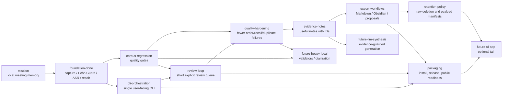

# MurmurMark CLI Roadmap

This roadmap is mirrored as an opskarta v3 plan:

- `docs/roadmap/murmurmark-cli-roadmap.plan.yaml`
- no calendar dates;
- dependencies, statuses and effort instead of delivery promises;
- CLI-first, local-first, evidence-backed.

## Product Direction

MurmurMark should become a dependable local CLI pipeline for sensitive meetings:

1. record local `mic` and `remote` tracks;
2. process them locally;
3. produce a transcript with visible uncertainty;
4. produce evidence-backed notes;
5. offer a short review queue when needed;
6. export reviewed artifacts;
7. plan or apply raw-audio retention.

The optional UI/app path is deliberately late. It should not block the useful CLI product.

## Current State

The CLI MVP is already real:

- `murmurmark record` records separate local tracks;
- `murmurmark process SESSION|latest` runs the post-recording pipeline;
- `murmurmark next`, `status`, `report`, `open`, `notes`, `transcript` provide handoff and inspection;
- `murmurmark review` handles lane packs, answer sheets, suggested decisions and reviewed profiles;
- `murmurmark corpus` runs the regression/readiness loop;
- `murmurmark export` builds Markdown/Obsidian bundles;
- `murmurmark retention` plans payloads and raw deletion;
- `murmurmark doctor`, `self-test`, `acceptance`, release bundle and open-source checks exist.

Operational corpus snapshot from 2026-06-30:

- status: `medium_risk_ready`;
- usable for medium-risk notes: yes;
- working sessions: `15`;
- excluded diagnostic sessions: `26`;
- readiness: `14/15 ready_for_notes`, `1/15 review_first`;
- selected notes review burden: `0.55 min`;
- full transcript/export review surface: `3.05 min`;
- remaining actionable review queue: `0` actions;
- remaining `review_first` session: documented non-actionable blocker.

This is enough to use MurmurMark with caution on real working meetings. It is not enough to claim
zero-review transcript quality.

## Roadmap Tree



## Status By Block

### Done

- Two-track capture and session package.
- Echo Guard with local FIR and preserve-local policy.
- `whisper.cpp` transcription pipeline.
- Timeline/start-of-call repair.
- Conservative cleanup profiles and reviewed profiles.
- Group overlap, local recall, audio review and optional stronger-audio-judge audits.
- Extractive notes, quality verdict and review items.
- CLI process/status/next/report/open/notes/transcript/review/corpus/export/retention surface.
- Local install wrapper, self-test, acceptance gate, release bundle and public-readiness check.
- Recording reliability: normal duration/SIGINT stops complete, unexpected SIGTERM/SIGHUP/capture
  failures become explicit partial sessions, and `doctor` catches missing shareable displays.

### Current

- Keep the corpus at `medium_risk_ready` or better.
- Keep readiness/status/next honest when the actionable review queue is empty but residual risk
  remains documented.
- Make the everyday path boring:

  ```bash
  murmurmark record --target-bundle system
  murmurmark process latest
  murmurmark next latest
  murmurmark review next latest   # only when printed
  murmurmark export latest --format markdown --include-json
  murmurmark retention plan latest
  ```

- Keep documentation aligned with the actual command surface.

### Next

- Review loop polish:
  - better "what now?" output for partial recordings and long ASR runs;
  - clearer lane packs and suggested answers;
  - explicit "safe to export / review first / do not use" handoff.
- Corpus regression discipline:
  - stable small operational corpus;
  - baseline comparison before new heuristics;
  - no-regression gates for order, local recall, duplicates and selected notes.
- Export workflow:
  - better Markdown/Obsidian bundles;
  - one obvious artifact to read first;
  - clearer retention guidance after export.

### Later

- Stronger extractive notes and stable `evidence_notes.json`.
- Reviewed docs/ticket export proposals.
- Configurable domain packs without committing private terms.
- Retention policy profiles and privacy manifests.
- Public release hardening: security contact, issue templates, generated/private artifact audit.

### Ideas

- Per-speaker diarization inside `Colleagues`.
- `transcript.rich.json` with stronger alignment and confidence fields.
- Heavy local ASR/forced-alignment validators.
- Local or controlled LLM synthesis with strict evidence guard.
- Optional menu bar or desktop UI after the CLI is mature.

## Latest Completed Goal

Recording is now reliable enough to trust as a CLI workflow for everyday meetings.

In practical terms:

- `murmurmark record` continues until the user stops it explicitly or a requested duration ends;
- if capture ends unexpectedly, the session package records why, when and which stream failed;
- `inspect`, `status`, `next` and `process` treat interrupted recordings as partial unless
  the user explicitly allows processing;
- the CLI prints a clear next command after a stop, failure or partial capture;
- diagnostics preserve raw CAF tracks and never silently rewrite or discard captured audio;
- capture, Echo Guard and the main ASR path stay reproducible.

Success is not perfect audio. Success is that the user can trust whether a meeting was fully
recorded, and if not, immediately knows what was captured and what to do next.

Recently completed:

- **Recording reliability.** Duration and `SIGINT` stops complete normally; `SIGTERM`, `SIGHUP` and
  unrecovered capture interruptions write `status: partial`, show `inspect` as the safe next command
  and block normal processing unless `--allow-partial` is explicit.
- **Readiness reconciliation.** A zero-action review queue no longer turns into an empty
  `first-lane` handoff. MurmurMark now points to `ready_for_notes`, a non-empty actionable review
  pack, or a documented non-actionable blocker.

## Candidate Next Goals

1. **Polish export bundles.** Make the exported Markdown/Obsidian result the natural user-facing
   artifact, not just a dump of derived files.
2. **Strengthen corpus gates.** Freeze the current good state as a baseline and require new pipeline
   changes to beat or preserve it.
3. **Improve notes quality.** Refine extractive decisions/actions/risks while keeping every item tied
   to utterance IDs and review flags.
4. **Prepare for public release.** Remove private fixtures, document setup, verify ignored generated
   artifacts and add security/contact guidance.

## Validation

```bash
OPSKARTA_REPO="${OPSKARTA_REPO:-../opskarta}"
PLAN="docs/roadmap/murmurmark-cli-roadmap.plan.yaml"

PYTHONPATH="$OPSKARTA_REPO" python3 -m specs.v3.tools.cli validate "$PLAN"
PYTHONPATH="$OPSKARTA_REPO" python3 -m specs.v3.tools.cli render tree "$PLAN"
PYTHONPATH="$OPSKARTA_REPO" python3 -m specs.v3.tools.cli render deps "$PLAN" --mode hierarchical
PYTHONPATH="$OPSKARTA_REPO" python3 -m specs.v3.tools.cli render executive "$PLAN" --view exec-top
PYTHONPATH="$OPSKARTA_REPO" python3 -m specs.v3.tools.cli render executive-report "$PLAN" --section status --lang ru
```
