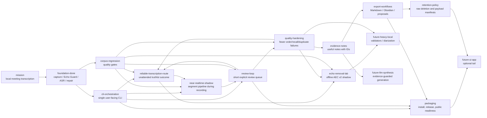

# MurmurMark CLI Roadmap

This roadmap is mirrored as an opskarta v3 plan:

- `docs/roadmap/murmurmark-cli-roadmap.plan.yaml`
- no calendar dates;
- dependencies, statuses and effort instead of delivery promises;
- CLI-first, local-first, evidence-backed.

## Product Direction

MurmurMark should become a dependable local CLI transcription pipeline for sensitive meetings:

1. record local `mic` and `remote` tracks;
2. process them locally;
3. produce a transcript with visible uncertainty;
4. produce evidence-backed notes;
5. offer a short review queue when needed;
6. export reviewed artifacts;
7. plan or apply raw-audio retention.

The current product shape is batch-first: a meeting is recorded, then processed. During Current
Pipeline Stabilization v1, this batch-first path is the only supported production route. A future
near-realtime path should eventually reduce the wait after a meeting. The old inline live segment
writer is quarantined because it can starve ScreenCaptureKit audio delivery; the new async bounded
segment queue has a full fail-open proof. Real live promotion is still blocked, but controlled Live
Evidence runs may now be used on real meetings to collect parity evidence while the batch transcript
remains authoritative. The intended shape is a single stable capture with a best-effort experimental
sidecar, documented in [Experimental sidecar architecture](../architecture/experimental-sidecar.md).

The optional UI/app path is deliberately late. It should not block the useful CLI product.

## Current Strategic Focus

The major product route remains [Reliable Transcription Route](../project/reliable-transcription-route.md):
turn a complete recording into a truthful result without the user watching every stage.
Outcome Contract v1 and Reliable Processing UX v1 are now implemented. The next meaningful gap is
not another report layer. Chunked/resumable ASR processing is now implemented; the immediate gap is
to stabilize the current production path end to end before returning to echo promotion, new repair
layers or a redesigned live path.

The target outcome is:

```text
record meeting -> process unattended -> ready_for_notes | review_first | blocked
```

This is broader than Echo Guard and narrower than "perfect meeting intelligence". At the current
roadmap point it means:

- `process` is progress-aware and interruption-safe;
- ASR/heavy-stage work is chunk-addressed, cacheable and safely resumable;
- near-realtime chunks remain diagnostic/shadow-only and are not the normal meeting command during
  current stabilization;
- `status`, `next`, `finish`, session report and corpus report agree;
- safe review suggestions are applied before asking for manual listening;
- remaining review is short, explicit and backed by audio/transcript evidence;
- export stays blocked while transcript/export blockers remain;
- stronger Echo Guard candidates stay shadow-only until corpus gates prove lower remote leakage
  without local-recall regression.

External consultation converged on the same implementation order. The first four steps are now
implemented as v1. The current stabilization pass freezes new product work until this route is
boring and repeatable:

1. build `Outcome Contract v1` and a deterministic gate evaluator;
2. write `outcome.json`, `outcome.md`, `review_plan.json` and `next_command.txt` for every processed
   or failed session;
3. add a resumable run manifest for long ASR stages;
4. add ASR/window-level cache and resume, with stable metadata hashes;
5. prove normal non-live capture/process/status/next/finish on fresh sessions;
6. prove silent/partial/interrupted captures block before ASR and never look successful;
7. keep the experimental sidecar contract as the boundary for live work:
   `derived/experiments/live-shadow-v1` must prove fail-open behavior and raw capture isolation;
   real live-pipeline coverage returns only through controlled Live Evidence runs with that proof;
8. reuse live/near-realtime chunks only when strict metadata and corpus parity gates pass;
9. only then promote audio candidates or heavier validators.

The explicit non-goal for this phase is changing the default ASR, default `local_fir`, UI, cloud
services or broad repair heuristics before the outcome contract can measure the effect.

## Current State

The CLI MVP is already real:

- `murmurmark record` records separate local tracks;
- `murmurmark process SESSION|latest` runs the post-recording pipeline;
- `murmurmark next`, `status`, `report`, `open`, `notes`, `transcript` provide handoff and inspection;
- `murmurmark review` handles lane packs, answer sheets, suggested decisions and reviewed profiles;
- `murmurmark review suggested` previews and applies safe generated suggestions before manual listening;
- `murmurmark corpus` runs the regression/readiness loop;
- `murmurmark experiment status|report|compare` exposes sidecar manifests under
  `derived/experiments/live-shadow-v1` while keeping batch authoritative;
- `murmurmark finish` turns readiness, export and retention/payload manifests into one final handoff;
- `murmurmark export` builds Export Bundle Quality v1 Markdown/Obsidian bundles with "Can I use
  this?", review burden, evidence-backed notes, transcript IDs and retention/privacy next steps;
- `murmurmark retention` plans payloads and raw deletion;
- `murmurmark doctor`, `self-test`, `acceptance`, release bundle and open-source checks exist.

Operational corpus snapshot from 2026-07-02:

- `review suggested apply` is cumulative: already reviewed rows are preserved even when the
  regenerated template changes;
- `review progress`, workspace `suggested_closure`, `status` and session-quality agree on the same
  remaining queue;
- safe suggested decisions and Target-Me evidence reduced the blocking queue; no safe suggestions are
  currently pending;
- `murmurmark report corpus` now reports `pilot_ready_with_review`;
- irreducible review gate: `irreducible_manual_review_queue_present`;
- operational scope: `24` working sessions, `26` diagnostic sessions excluded;
- readiness: `15/24 ready_for_notes`, `9/24 review_first`, `0/24 do_not_use_without_manual_review`;
- mandatory review queue: `9` actions / `12` rows;
- low-materiality rows outside mandatory review: `28` rows / `70.95s`;
- corpus gate review limits: `15` actions / `25` rows;
- notes review burden: `1.32 min`;
- transcript/export review burden: `4.09 min`;
- pending safe suggestions: `0`.

The latest narrowing treats single-word `так` tails without action/decision/risk markers as
low-materiality, not mandatory review. Content-bearing uncertain rows remain manual.
Short exact partial duplicates with no unique `Me` content are also outside the mandatory queue.
One `check_transcript_order` overlap is now closed by stronger-audio-judge evidence as a safe
`keep_me`; conflicting order/audio rows remain manual.

This is enough to use the corpus as a pilot-ready local tool with explicit review. It is not yet
`medium_risk_ready`: the remaining local-recall/lost-Me/uncertain rows still require a human check
before broader use. One risky session is now handled as formal residual risk because the remaining
scope is short, explicit and bounded by allowed risk flags. The stronger local audio judge now has a
keep-only timing-overlap rule: when group-overlap evidence already proves strong local support and
weak remote/leak support, the row can be closed as `keep_me`. Conflicting double-talk remains manual.
Guarded full transcript export can still
be blocked by transcript-only review surface; `finish` should keep that blocker visible instead of
silently exporting.

The 2026-06-30 daily sync showed the review-loop gap: a meeting can have healthy capture and no
harmful duplicate seconds, but still be marked `risky` because order/local-recall rows are not
formally closed. The immediate path is now `murmurmark review suggested SESSION`, then
`murmurmark review suggested apply SESSION`; this closes only high-confidence local-audio suggestions
when they match the current review queue, preserves earlier decisions, and prints the exact remaining
manual queue. Targeted stronger-audio-judge is cached-first by default; deliberate new decode is
opt-in through `MURMURMARK_TARGETED_JUDGE_COMPUTE=1`.

The same corpus also shows a deeper quality limit: much of the later cleanup work exists because
remote speech is still audible and sometimes recognizable in the mic track. `local_fir` remains the
right default because it protects local speech, but it is not a complete-removal engine.
`offline_aec_v2_v0` gives a repeatable shadow baseline: proxy masking can reduce remote energy and
harmful seconds, but ASR-token gates still do not beat `local_fir`. The follow-up vNext spike added
segment switching and `remote_forbidden_token_guard`; it produced the first ASR-positive improvement
on one difficult session without local-recall regression. That is enough to choose the next quality
direction. Remote-Forbidden Evidence Hardening v1 materialized that spike as normal evidence/status
artifacts. Coverage v2 then broadened ASR audit-window selection from speaker state and review
artifacts; the six-session smoke reached `4/6` safe improved sessions and zero local-recall
regressions. ASR-positive audio candidate v2 then added `coverage_v2_remote_gate_local_fir`, a real
shadow audio candidate that passes the ASR audio-candidate gate on `4/6` smoke sessions with zero
local-recall regressions. Target-Me extraction has now tested `mfcc_voiceprint_v0`,
`mfcc_contrastive_v0` and `resemblyzer_dvector_v0`. The MFCC baselines are useful only for
instrumentation. `resemblyzer_dvector_v0` is the first promising speaker-embedding layer, and the
first hardening pass connected it to review-plan rows and closed two safe `keep_me` cases. The next
quality gap is earlier in the pipeline: harden the ASR-positive shadow audio candidate so less remote
speech reaches ASR as `Me` in the first place. This now feeds the larger reliability route: better
audio matters when it lowers unattended review burden and passes corpus gates.

## Roadmap Tree



## Status By Block

### Done

- Two-track capture and session package.
- Echo Guard with local FIR and preserve-local policy.
- `whisper.cpp` transcription pipeline.
- Timeline/start-of-call repair.
- Conservative cleanup profiles and reviewed profiles.
- Group overlap, local recall, audio review and optional stronger-audio-judge audits.
- Extractive notes, quality verdict and review items.
- CLI process/status/next/report/open/notes/transcript/review/corpus/export/retention surface.
- Local install wrapper, self-test, acceptance gate, release bundle and public-readiness check.
- Recording reliability: normal duration/SIGINT stops complete, unexpected SIGTERM/SIGHUP/capture
  failures become explicit partial sessions, and `doctor` catches missing shareable displays.

### Current

- Make the reliable transcription route first-class:
  - one complete recording should lead to `ready_for_notes`, `review_first` or `blocked`;
  - `status`, `next`, `finish`, session reports and corpus reports must agree;
  - long ASR stages must be resumable and visible enough not to look like a hang;
  - export must stay guarded by explicit blockers.
- Keep the operational corpus at `pilot_ready_with_review` or better, with the short irreducible
  review queue visible in `murmurmark report corpus`.
- Close safe review rows with local audio evidence before asking the user to listen manually.
  The 2026-06-30 daily sync showed the important pattern: the session was marked `risky`, but
  stronger audio judge confirmed most `check_transcript_order` rows as timing/double-talk, leaving
  only a few real manual checks.
- Use the broader stronger-audio-judge budget as the normal pipeline default. The old `12` item cap
  was a false economy: on the 2026-07-02 long strategy sync, a full `80` item pass turned most
  order-risk rows into safe `keep_me` suggestions and cut the manual tail to seconds.
- Continue **Echo Guard Complete Removal** after Remote-Forbidden Evidence Coverage v2:
  - keep `local_fir` as the production default;
  - use the shadow `offline_aec_v2_v0` lab as a repeatable diagnostic baseline;
  - treat `remote_floor` and segment switching as useful proxy/control candidates, not as production
    replacements;
  - use Coverage v2 windows as the ASR judge for audio candidates: v2 writes selection reasons,
    evidence rows, readiness metrics and corpus report; hardened profile is `5/6` safe improved;
  - keep `coverage_v2_remote_gate_local_fir` as the current explicit experimental audio candidate;
  - keep `mfcc_voiceprint_v0` and `mfcc_contrastive_v0` as Target-Me baselines: useful for
    measurement, not enough for review-burden reduction;
  - keep `resemblyzer_dvector_v0` as a review/evidence layer, now wired into review-plan rows;
  - keep `coverage_v2_remote_gate_local_fir` shadow-only while promotion readiness is defined on a
    broader corpus;
  - keep neural residual suppression as a later spike behind corpus gates.
- Keep the final handoff readable: `finish` now opens a bundle whose `index.md` is the first working
  artifact, not a derived-file directory listing.
- Continue **Near-Realtime Pipeline Shadow v1** as a single-capture sidecar:
  - legacy `record --live-pipeline` remains quarantined because inline segment work correlated with
    sparse raw ScreenCaptureKit audio;
  - the current redesign is `record --experiment live-shadow-v1`: raw CAF is written first, then
    `raw_segment_commits.jsonl` records committed intervals, and a best-effort worker materializes
    sidecar WAVs under `derived/experiments/live-shadow-v1/audio/`;
  - `derived/live/segments.jsonl` remains a compatibility alias pointing to those canonical
    experiment files; live draft output is advisory only;
  - the design rule is one ScreenCaptureKit owner plus derived sidecar artifacts, never two
    concurrent `record` processes;
  - after stop, the normal `murmurmark process` path runs separately and remains authoritative;
  - keep the existing post-recording `process` path as source of truth until corpus comparison proves
    no worse order/local-recall/remote-duplicate behavior.
- Make the everyday path boring:

  ```bash
  murmurmark record --target-bundle system
  murmurmark process latest
  murmurmark next latest
  murmurmark review next latest   # only when printed
  murmurmark finish latest
  ```

- Keep documentation aligned with the actual command surface.

### Next

- Current Pipeline Stabilization v1:
  - freeze new product work and use only the supported production command sequence:
    `record --target-bundle system`, `process latest`, `next`, `status`, `finish`;
  - prove at least one fresh short non-live recording with audible content reaches a non-empty
    transcript;
  - prove silent/partial/interrupted captures block before ASR and never look like successful empty
    transcripts;
  - verify `status` and `next` agree for successful, review-first, blocked and failed-capture
    sessions;
- keep `--live-pipeline` disabled by default; all new evidence should go through
  `record --experiment live-shadow-v1`.
- Near-realtime shadow pipeline follow-up, after stabilization:
  - previous inline segment writing during capture is quarantined: live tests showed it can starve
    ScreenCaptureKit audio delivery and leave raw tracks mostly silent;
  - first redesign step is now implemented as a raw commit sidecar after durable raw writes; the
    callback no longer writes derived live audio or passes sample buffers to the sidecar;
  - `scripts/check-capture-regressions.sh` now writes
    `sessions/_reports/capture-regression/capture_regression_check.json`; `static_only` is useful
    regression evidence, while `full_fail_open_proof_passed` is required before controlled
    Live Evidence runs; static reruns preserve an already-passed full proof instead of downgrading
    the operator state;
  - `murmurmark live pilot` now wraps the evidence path through `scripts/run-live-parity-pilot.sh`:
    safety probe, short lab live recording or controlled real Live Evidence run, batch process,
    live-vs-batch compare and refreshed corpus live report;
  - worker queue exists as a safe shadow worker, but its v1 preprocessing is intentionally light and
    must be upgraded before it can compete with batch Echo Guard;
  - post-stop final reconcile exists; it can reuse strict-compatible live ASR cache, otherwise it
    reports `fallback_batch_asr`;
  - live-ASR cache bridge exists and writes `live_asr_cache_report.json`; when eligible it
    materializes both top-level raw ASR JSON and `raw/chunks/<track>/chunk_cache_report.json`, then
    relies on the normal chunk rebuild check as the hard proof;
  - corpus-level live report exists as `murmurmark corpus live`; it keeps promotion blocked while
    capture-safety/order/local-recall/remote-leak/review-burden gates are not passed by live outputs;
  - delayed transcript commit: do not finalize the last few seconds until the next segment arrives;
  - live status: captured/preprocessed/ASR seconds, current lag and current worker;
  - final reconcile after stop: batch-grade transcript remains authoritative until gates promote the
    live output.
- Review loop polish:
  - keep suggested review closure first-class: show how many rows can be accepted from stronger
    local audio evidence, how many remain manual, and whether generated suggestions are actionable
    or still `needs_review`;
  - keep lane packs clear, but avoid sending the user to listen through rows already confirmed by the
    local judge;
  - explicit "safe to export / review first / do not use" handoff.
- Corpus regression discipline:
  - stable small operational corpus;
  - baseline comparison before new heuristics;
  - no-regression gates for order, local recall, duplicates and selected notes.
- Echo Guard evidence and promotion path:
  - keep candidate artifacts separate from `mic_for_asr.wav`;
  - use Coverage v2 ASR windows before promotion;
  - promote audio only after corpus gates prove lower remote-token leakage without worse local
    recall;
  - keep transcript-level remote-forbidden reconciliation as the final safety net.
- Export workflow:
  - keep `murmurmark finish` as the normal final handoff;
  - maintain Export Bundle Quality v1 and test it against real 1x1, group and review-blocked
    sessions;
  - add Obsidian-vault export only after the bundle is stable.

### Later

- Stronger extractive notes and stable `evidence_notes.json`.
- Reviewed docs/ticket export proposals.
- Configurable domain packs without committing private terms.
- Retention policy profiles and privacy manifests.
- Public release hardening: security contact, issue templates, generated/private artifact audit.

### Ideas

- Per-speaker diarization inside `Colleagues`.
- `transcript.rich.json` with stronger alignment and confidence fields.
- Heavy local ASR/forced-alignment validators.
- Local or controlled LLM synthesis with strict evidence guard.
- Optional menu bar or desktop UI after the CLI is mature.

## Latest Completed Goals

Chunked/Resumable Processing v1 is the latest completed reliability goal. Default `windowed`
whisper.cpp runs now write per-window chunk cache metadata, `murmurmark process` can resume
interrupted ASR work from verified chunks, legacy raw ASR cache without chunk reports is rebuilt
instead of being trusted, and corpus gates treat chunk rebuild failures as hard failures. Current
ASR chunk-cache corpus coverage is `14/50`, with `0` failed rebuilds and `146/146` completed chunks.

ASR-positive Echo Candidate Hardening v1 is the latest completed quality goal. It turns
`coverage_v2_remote_gate_local_fir` into an explicit experimental profile with one-session and
corpus reports, while keeping `local_fir` as the default.

Remote-Forbidden Evidence Coverage v2 broadened ASR audit window selection and made that
audio-candidate search measurable.

Export Bundle Quality v1 is the latest completed product-handoff goal. MurmurMark can now end a
successful pipeline with a readable local handoff instead of a pile of derived artifacts.

In practical terms, `murmurmark finish SESSION` now produces a Markdown or Obsidian bundle where:

- `index.md` answers "Can I use this?", shows selected profile, verdict, review burden, review
  blockers, retention/privacy summary and the next command;
- `quality_verdict.md` explains the verdict in human terms;
- `notes.md` is an evidence-backed extractive working summary;
- `transcript.md` keeps the full selected transcript with utterance IDs and review flags;
- forced/debug exports with blockers clearly say "Do not use yet";
- raw audio is not copied into the export bundle.

Success is not a zero-review transcript. Success is that the final artifact is usable as a working
handoff and keeps uncertainty visible.

Recently completed:

- **Review-loop stabilization v1.** `review suggested apply` is cumulative, key-based and
  report-consistent. It consumes cached stronger-audio-judge and Target-Me evidence in lane
  suggestions, preserves closed rows across regenerated templates, and makes progress/status/report
  agree on the same remaining rows and seconds.
- **ASR-positive Echo Candidate Hardening v1.** `murmurmark audit asr-positive-echo-candidate`
  writes `asr_positive_echo_candidate_report.{json,md}`, and `murmurmark corpus echo-candidate`
  writes `asr_positive_echo_candidate_corpus_report.{json,md}`. Current six-session corpus: `5/6`
  safe improved, `1/6` not applicable, `0/6` local-recall regressions. `murmurmark corpus gate`
  enforces `shadow_only_do_not_promote`.
- **ASR-positive audio candidate v2.** `coverage_v2_remote_gate_local_fir` starts from the safer
  local-fir/segment-switch path and applies remote-floor cleanup only in Coverage v2 risk windows
  without strong local-speech evidence. Six-session smoke: `4/6` ASR audio candidate gate-passed
  sessions, `0/6` local-recall regressions, `2/6` explained as `no_baseline_asr_visible_leak`, no
  default promotion.
- **Remote-Forbidden Evidence Coverage v2.** ASR audit-window selection now reads speaker state,
  audio-review, stronger-audio-judge, group-overlap, transcript-overlap and local/order risk
  artifacts. Six-session smoke: `4/6` safe improved sessions, `0/6` local-recall regressions, `24`
  evaluable ASR windows, `578` skipped by cap, no default promotion.
- **Remote-Forbidden Evidence Hardening v1.** The first ASR-positive guard is now a normal evidence
  layer: persistent remote/mic token rows, per-session review, readiness metrics and corpus
  explanation. Six-session smoke: one safe improved session, zero local-recall regressions, no
  default promotion. The next weakness is coverage.
- **Echo Guard Complete Removal vNext.** Segment switching plus `remote_forbidden_token_guard`
  produced the first ASR-positive remote-leakage improvement on a difficult real session:
  `asr_candidate_gate_passed: 1/6`, with no local-word recall regressions in the six-session smoke
  corpus. It remains shadow-only and became the baseline for remote-forbidden evidence hardening.
- **Export Bundle Quality v1.** `finish` now produces a user-facing Markdown/Obsidian handoff:
  "Can I use this?", selected profile, review burden, evidence-backed notes, transcript utterance IDs
  and retention/privacy next steps.
- **Recording reliability.** Duration and `SIGINT` stops complete normally; `SIGTERM`, `SIGHUP` and
  unrecovered capture interruptions write `status: partial`, show `inspect` as the safe next command
  and block normal processing unless `--allow-partial` is explicit.
- **Readiness reconciliation.** A zero-action review queue no longer turns into an empty
  `first-lane` handoff. MurmurMark now points to `ready_for_notes`, a non-empty actionable review
  pack, or a documented non-actionable blocker.

## Candidate Next Goals

Recommended nearest goal: **Process Observability & Run Monitor v1**. Current Pipeline
Stabilization v1 restored one supported production path: normal non-live recording, then batch
processing. The next reliability gap is visibility while `murmurmark process` is still running or
has been interrupted: `status`, `next` and `sessions --all` must not depend on stale readiness when a
newer run-state exists.

1. **Process Observability & Run Monitor v1.** Write a current run-state artifact during
   `murmurmark process`, expose the active step and ASR chunk progress through `status`/`next`, keep
   interruption recovery obvious and make stale readiness harmless.
2. **Near-Realtime Capture Isolation v1.** Legacy controlled-real live produced sparse raw capture,
   so `--live-pipeline` stays quarantined. Prove the new `record --experiment live-shadow-v1`
   architecture where one durable raw writer emits raw commit events and a best-effort sidecar
   consumes them without owning capture buffers. Keep production on plain `record -> process`.
3. **ASR-positive Echo promotion readiness.** Expand `coverage_v2_remote_gate_local_fir` validation
   beyond the current six sessions, add rollback/inspection criteria, compare review burden and
   local recall more broadly, and only then decide whether a non-default promoted bundle is worth
   testing.
4. **Target-Me evidence follow-up.** Keep integrating `resemblyzer_dvector_v0` with review-lane
   suggestions, live local-recall diagnostics and corpus reports. The new live Target-Me audit shows
   that suppressed live mic chunks contain a large recoverable local slice: `287.98s` of `295.34s`
   audited local/mixed seconds are possible or confirmed Target-Me. The first policy candidate,
   `target_me_confirmed_remote_guard_v1`, looked safe by interval-overlap accounting (`94.68s`
   missing-Me recovered at `2.44s` remote-risk). The stricter counterfactual live-shadow comparison
   now shows the real blocker: the same policy recovers `128.85s` missing-Me with `0.00s` measured
   remote leak, but adds `3` contentful role-constrained order mismatches. The broader
   `target_me_possible_v1` recovers more but is unsafe. The conservative
   `target_me_confirmed_remote_guard_timeline_safe_v1` subset is now the first safe shadow candidate:
   it recovers `103.82s` missing-Me with `0.00s` measured remote leak and `0` contentful
   order-mismatch delta, and is materialized as
   `derived/live/target-me-shadow/target_me_confirmed_remote_guard_timeline_safe_v1/draft.{json,md}`.
   The same `parity_gates` now evaluate that materialized profile: `1` real-live session passes all
   gates, profile missing-Me is `315.34s`, and existing live remote leak remains `15.96s`. A
   diagnostic batch-oracle profile,
   `target_me_confirmed_remote_guard_timeline_safe_batch_remote_forbidden_oracle_v1`, removes those
   `15.96s` of remote-like live `Me` turns and leaves `0.00s` measured remote leak, but it only
   reduces non-passing profile gates from `42` to `41`. It is not promotable because it uses batch
   truth. The remaining `315.34s` missing-Me are now decomposed: `278.13s` are visible in suppressed
   mic ASR, `174.33s` have a broader Target-Me candidate, and `141.01s` have no Target-Me candidate.
   The stronger visible-suppressed-mic oracle profile adds `145.54s` of safe suppressed mic segments
   and drops profile missing-Me to `140.41s` while keeping measured remote leak at `0.00s` and
   contentful order mismatches at `4`. First live-accessible approximations were not enough:
   `audio_safe_union_v1` is safe but weak, while `audio_low_corr_text_guard_v1` recovers much more
   local speech but leaks too much remote-like text. The dedicated suppressed-mic policy lab confirms
   that this is not just a bad hand-picked threshold: in the full real scope, the best zero-risk
   generated threshold recovers only `27.78s` from a `409.50s` local/mixed ceiling, the best <=3s
   remote-risk rule recovers `60.16s`, and higher-recall rules quickly leak hundreds of seconds of
   remote-risk text. In the capture-safe candidate scope, the best safe threshold recovers only
   `1.80s` from `13.06s`. The next safe step is therefore not another simple threshold tweak, but a
   stronger online role-gate/fallback design with local-speaker or remote-forbidden evidence, while
   keeping order, review/readiness and capture-safe blockers explicit; ambiguous rows and sessions
   without enough enrollment stay explicit. The live Target-Me enrollment lab narrows that further:
   in capture-safe candidate sessions there is currently no usable positive live `Me` enrollment; in
   the full real scope, prefix/live-causal enrollment recovers only `9.24s` local at `0.00s`
   remote-risk, while full-session non-causal enrollment reaches `56.94s`. So Target-Me can help, but
   not from same-session live-published `Me` alone. The next design should add an enrollment
   fallback/warmup or persistent local-speaker evidence before trying to promote Target-Me-based live
   rescue. The first persistent-profile lab has now tested the historical-profile variant: in the
   full real scope it recovers `75.72s` local/mixed speech but still selects `8.64s` remote-risk
   speech under the conservative remote guard; in the stricter capture-safe candidate scope it
   recovers `0.00s`. That keeps persistent Target-Me as supporting evidence, not the main promotion
   path. The composite gate lab checked that combination explicitly: `dual_target_remote_guard_v1`
   gives the first zero-risk composite slice (`47.70s` local/mixed in the full real scope), while
   `target_me_remote_guard_v1` reaches `116.10s` local/mixed at `2.44s` remote-risk. The stricter
   capture-safe candidate scope still gets `0.00s`. The next live-local-recall work should
   keep building stricter remote-forbidden/local-speaker gates for the remaining suppressed mic
   regions. The tiny safe composite is already materialized as
   `online_suppressed_mic_dual_target_remote_guard_v1`: it adds `47.70s`, leaves `380.17s`
   missing-Me and leaves the existing `15.96s` live remote leak untouched. The paired
   `online_live_me_remote_overlap_filter_plus_dual_target_remote_guard_v1` shadow removes that
   `15.96s` remote-like live `Me`, preserves the `47.70s` rescue and keeps measured remote leak at
   `0.00s`, but still leaves `380.17s` missing-Me and `4` contentful order mismatches. The current
   best live-implementable profile,
   `online_live_me_remote_overlap_filter_plus_target_me_timeline_safe_audio_safe_union_v1`, reaches
   `301.96s` missing-Me with `0.00s` remote leak, `4` contentful order mismatches and `41`
   non-passing gates. This proves the materialization and online remote-forbidden mechanism, not
   parity.
5. **Operational Corpus Green follow-up.** Keep `murmurmark report corpus` as the source of truth,
   preserve the short irreducible review queue, keep `0` `do_not_use_without_manual_review`
   sessions, keep guarded export blockers explicit, and close only rows with safe local evidence.
6. **Near-Realtime Pipeline Shadow v1.** Continue hardening draft transcripts from safe derived
   segments while keeping the batch pipeline as final authority until corpus gates prove parity.
7. **Corpus and review-loop closure.** Keep the operational corpus usable while echo work continues:
   close safe suggested review rows, preserve manual rows and keep status/report aligned.
8. **Audio candidate promotion readiness.** Keep `coverage_v2_remote_gate_local_fir` shadow-only
   until broader corpus gates prove it is safe beyond selected audit windows.
9. **Export follow-up.** Keep the v1 bundle stable, then add optional Obsidian-vault placement and
   reviewed docs/ticket proposal exports.
10. **Strengthen corpus gates.** Freeze the current good state as a baseline and require new pipeline
   changes to beat or preserve it. Operational review is bounded by both packed human actions and
   raw rows: default limits are `15` actions and `25` rows, while the current corpus is at `9`
   actions and `12` rows.
11. **Improve notes quality.** Refine extractive decisions/actions/risks while keeping every item tied
   to utterance IDs and review flags.
12. **Prepare for public release.** Remove private fixtures, document setup, verify ignored generated
   artifacts and add security/contact guidance.

## Validation

```bash
OPSKARTA_REPO="${OPSKARTA_REPO:-../opskarta}"
PLAN="docs/roadmap/murmurmark-cli-roadmap.plan.yaml"

PYTHONPATH="$OPSKARTA_REPO" python3 -m specs.v3.tools.cli validate "$PLAN"
PYTHONPATH="$OPSKARTA_REPO" python3 -m specs.v3.tools.cli render tree "$PLAN"
PYTHONPATH="$OPSKARTA_REPO" python3 -m specs.v3.tools.cli render deps "$PLAN" --mode hierarchical
PYTHONPATH="$OPSKARTA_REPO" python3 -m specs.v3.tools.cli render executive "$PLAN" --view exec-top
PYTHONPATH="$OPSKARTA_REPO" python3 -m specs.v3.tools.cli render executive-report "$PLAN" --section status --lang ru
```
