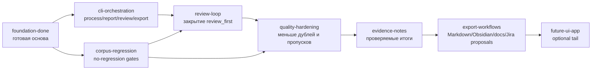

# MurmurMark CLI Roadmap

Roadmap лежит в формате opskarta v3:

- `docs/roadmap/murmurmark-cli-roadmap.plan.yaml`
- no-schedule: без календарных дат, только структура, зависимости, статусы и effort
- основной путь: CLI-first, local-first, evidence-backed

## Смысл карты

MurmurMark уже прошёл стадию proof of concept: запись, подавление эха, локальная транскрибация, timeline repair, audit cleanup, audio review, agent-reviewed слой, extractive notes и quality verdict уже работают.

CLI MVP уже закрыт: есть автоматический acceptance, release bundle, live-session gate,
export bundle и retention plan. То, что раньше было лабораторией скриптов, теперь имеет
пользовательскую командную поверхность и проверяемые evidence-артефакты.

Готовый CLI-путь:

1. `murmurmark process SESSION` — готово.
2. `murmurmark process latest` — готово.
3. `murmurmark sessions` — готов короткий список последних записей с временем, длительностью, review burden, readiness-статусом, фильтром, JSON-выводом и next-командой.
4. `murmurmark status SESSION`, `murmurmark report SESSION`, `murmurmark report corpus` и `murmurmark next corpus` — готово.
5. `murmurmark open SESSION` — готов короткий CLI-вход к выбранным notes/transcript/verdict/readiness/audit артефактам.
6. `murmurmark audit local-recall|group-overlaps|audio-review` — готов CLI-вход к audit-слоям со сводкой.
7. `murmurmark cleanup` и `murmurmark synthesize` — готовы CLI-входы к cleanup-профилям и extractive notes.
8. `murmurmark review SESSION` — готов базовый CLI-контур.
9. `murmurmark corpus process all` — готов базовый контур качества по корпусу.
10. `murmurmark corpus taxonomy` — готова сводная таксономия аудио-ошибок для следующей итерации качества.
11. `murmurmark corpus gate` — готов no-regression gate с локальным baseline-сравнением, local-recall blockers и warnings по remote-leak очереди.
12. `murmurmark corpus local-recall` — готова корпусная очередь возможных пропусков `Me`.
13. `murmurmark corpus local-recall-repair` — готова сводка эффекта `local_recall_repair_v1` перед auto-promotion.
14. `murmurmark export SESSION --format markdown|obsidian` — готов базовый пользовательский output-блок.
15. `scripts/install-local.sh` — готов минимальный локальный install wrapper для команды `murmurmark`.
16. `murmurmark doctor` — готов расширенный health check локальной установки и pipeline-зависимостей.
17. `scripts/build-release-bundle.sh` — готов локальный release layout с manifest и без приватных данных.
18. `murmurmark retention plan SESSION` — готов локальный retention plan; raw deletion защищён отдельным `apply`.
19. `murmurmark retention payload SESSION` — готов provider payload manifest; default policy блокирует внешние payload’ы.
20. `scripts/check-open-source-readiness.sh` — готов public-readiness gate; MIT LICENSE добавлена.
21. `murmurmark self-test` — готов быстрый CLI smoke через сам инструмент.
22. `murmurmark acceptance` — готов единый автоматический gate для CLI MVP.
23. `murmurmark acceptance --live-session latest` — готов проверяемый gate для живой сессии.

UI App не является обязательной частью roadmap. Он остаётся optional tail после зрелого CLI, review loop, export и retention policy.

## Крупные направления

- `foundation-done` — уже готовая основа: capture, Echo Guard, whisper.cpp, repair/audit, agent_reviewed_v1, notes, readiness.
- `cli-orchestration` — закрытый CLI MVP: process/report/audit/review/corpus/export/config, локальная установка, self-test, release bundle и acceptance gates готовы.
- `corpus-regression` — текущий контур: корпус сессий, пересборка, baseline thresholds,
  out-of-fold оценка audio judge, local-recall blockers, remote-leak queue и явные notes/export
  blockers.
- `review-loop` — текущий этап: удерживать 13/13 `ready_for_notes` и снижать отдельные
  transcript/export blockers; ручный workspace review и агентный `review agent` уже есть. Оставшаяся
  очередь считается после `agent_reviewed_v1`, поэтому следующий шаг должен закрывать новые
  доказуемые классы, а не повторно запускать уже применённый агентный слой.
- `quality-hardening` — текущий этап: улучшение качества transcript без смены топологии; первый
  явный `order_repair_v1` уже чинит только те order-risk регионы, которые безопасно режутся по
  сохранённым source ASR segments. `local_recall_repair_v1` уже восстанавливает короткие
  boundary-сдвинутые `Me`-фразы через micro-ASR, а вставки проходят через обычный review loop;
  следующий короткий шаг — расширение boundary repair только по доказанным случаям.
- `evidence-notes` и `export-workflows` — пользовательские артефакты; базовый export готов, дальше нужны vault/docs/Jira proposals.
- `retention-policy` и `packaging` — приватность, хранение raw audio, release layout, provider payload manifest, self-test, CLI MVP acceptance и readiness gate готовы; перед публичной публикацией нужен security contact.
- `future-heavy-local`, `future-llm-synthesis`, `future-ui-app` — дальние ветки.

## Проверка

```bash
OPSKARTA_REPO="${OPSKARTA_REPO:-../opskarta}"
PLAN="docs/roadmap/murmurmark-cli-roadmap.plan.yaml"

PYTHONPATH="$OPSKARTA_REPO" python3 -m specs.v3.tools.cli validate "$PLAN"
PYTHONPATH="$OPSKARTA_REPO" python3 -m specs.v3.tools.cli render tree "$PLAN"
PYTHONPATH="$OPSKARTA_REPO" python3 -m specs.v3.tools.cli render deps "$PLAN" --mode hierarchical
PYTHONPATH="$OPSKARTA_REPO" python3 -m specs.v3.tools.cli render executive "$PLAN" --view exec-top
PYTHONPATH="$OPSKARTA_REPO" python3 -m specs.v3.tools.cli render executive-report "$PLAN" --section status --lang ru
```

## Ближайшая дуга



## Следующая цель

Сделать MurmurMark уверенно применимым для регулярных рабочих встреч и довести полный transcript/export
до короткой, понятной проверки:

- удержать corpus verdict на уровне `medium_risk_ready` или выше;
- удержать рабочий корпус на 13/13 `ready_for_notes`;
- опираться на текущую точку 2026-06-29: `0.02 min` проверки для selected notes и `2.68 min`
  отдельной transcript/export проверки на 13 рабочих сессиях;
- держать export-review очередь явной и исполнимой: сейчас это `40` raw rows / `31` packed actions
  уже после `agent_reviewed_v1` + `audit_cleanup_v7`, через `murmurmark review next` / `review workspace`;
- учитывать применённые repair decisions в readiness: local-recall очередь уже сокращена до одной
  короткой unresolved строки, остальные high-confidence repair insertions закрыты как reviewed;
- снизить `transcript_review_burden` с `2.68 min` до `<= 1.5 min` и очередь с `31` до `<= 15`
  packed actions, не смешивая это с готовностью notes;
- расширять repair/cleanup только через corpus gates и audio-review evidence;
- держать raw capture, Echo Guard и основной ASR неизменными без отдельного решения;
- считать успехом не идеальный transcript, а готовые evidence-backed notes при явно сохранённых
  transcript/export blockers.

Выбранный ближайший шаг: идти через уже подготовленный `murmurmark next corpus`, закрыть первую
`check_unique_me_content` lane, применить решения и заново построить readiness. Только после этого
имеет смысл добавлять новое автоматическое правило: оно должно повторять фактически подтверждённый
класс, а не угадывать его по метрикам.

Первый блок уже применён: transcript-only `uncertain` rows снимаются из burden только когда тот же
selected `Me` interval покрыт high-confidence `likely_reliable` audio-review evidence. Второй блок
применён частично: `audit_cleanup_v7` режет доказанные partial `remote_duplicate` spans поверх
`agent_reviewed_v1` и наследует уже закрытые audio-review decisions. Третий маленький блок добавлен:
сильная локальная audio-evidence может объяснить узкий `remote_leak` без редактирования transcript.
Четвёртый маленький блок: bounded short `remote_leak` с уникальным локальным текстом и низкой
remote similarity закрывается как `keep_me` в `agent_reviewed_v1`. Пятый маленький блок:
short `remote_leak` без remote-utterance закрывается как `keep_me`, если Echo Guard
`speaker_state` независимо показывает почти чистый `local_only`. Шестой маленький блок: короткий
`remote_leak` с крошечным remote-контекстом тоже закрывается как `keep_me`, если `speaker_state`
показывает чистый `local_only`, overlap с remote-репликой мал, а в `Me` есть уникальный локальный
текст. Следующий исполнительный блок — закрыть первую `check_unique_me_content` lane через
`murmurmark review first-lane --session sessions/2026-06-26_11-15-50`, применить ответы и только
после этого переносить подтверждённые повторяющиеся случаи в automation. `check_local_recall`
сейчас содержит только одну короткую unresolved строку и не должен становиться основным фокусом.
