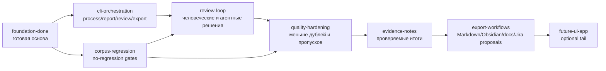

# MurmurMark CLI Roadmap

Roadmap лежит в формате opskarta v3:

- `docs/roadmap/murmurmark-cli-roadmap.plan.yaml`
- no-schedule: без календарных дат, только структура, зависимости, статусы и effort
- основной путь: CLI-first, local-first, evidence-backed

## Смысл карты

MurmurMark уже прошёл стадию proof of concept: запись, подавление эха, локальная транскрибация, timeline repair, audit cleanup, audio review, agent-reviewed слой, extractive notes и quality verdict уже работают.

Ближайшая цель — закончить превращение набора отдельных скриптов в нормальный CLI-пайплайн:

1. `murmurmark process SESSION` — готово.
2. `murmurmark process latest` — готово.
3. `murmurmark report SESSION` и `murmurmark report corpus` — готово.
4. `murmurmark review SESSION` — готов базовый CLI-контур.
5. `murmurmark corpus process all` — готов базовый контур качества по корпусу.
6. `murmurmark corpus gate` — готов no-regression gate с локальным baseline-сравнением.
7. `murmurmark export SESSION --format markdown|obsidian` — готов базовый пользовательский output-блок.
8. `scripts/install-local.sh` — готов минимальный локальный install wrapper для команды `murmurmark`.
9. `murmurmark doctor` — готов расширенный health check локальной установки и pipeline-зависимостей.
10. `scripts/build-release-bundle.sh` — готов локальный release layout с manifest и без приватных данных.
11. `murmurmark retention plan SESSION` — готов локальный retention plan; raw deletion защищён отдельным `apply`.
12. `murmurmark retention payload SESSION` — готов provider payload manifest; default policy блокирует внешние payload’ы.
13. `scripts/check-open-source-readiness.sh` — готов public-readiness gate; LICENSE остаётся owner decision.

UI App не является обязательной частью roadmap. Он остаётся optional tail после зрелого CLI, review loop, export и retention policy.

## Крупные направления

- `foundation-done` — уже готовая основа: capture, Echo Guard, whisper.cpp, repair/audit, agent_reviewed_v1, notes, readiness.
- `cli-orchestration` — текущий фокус: единые команды process/report/review/corpus/export/config; минимальная локальная установка уже готова.
- `corpus-regression` — текущий контур: корпус сессий, пересборка, сравнение метрик, baseline thresholds; следующий слой — оценка audio judge на корпусе.
- `review-loop` — ближайший этап: удобный CLI-review спорных участков.
- `quality-hardening` — ближайший этап: улучшение качества transcript без смены топологии.
- `evidence-notes` и `export-workflows` — пользовательские артефакты; базовый export готов, дальше нужны vault/docs/Jira proposals.
- `retention-policy` и `packaging` — приватность, хранение raw audio, release layout, provider payload manifest и readiness gate; перед публикацией нужно выбрать LICENSE.
- `future-heavy-local`, `future-llm-synthesis`, `future-ui-app` — дальние ветки.

## Проверка

```bash
OPSKARTA_REPO="${OPSKARTA_REPO:-../opskarta}"
PLAN="docs/roadmap/murmurmark-cli-roadmap.plan.yaml"

PYTHONPATH="$OPSKARTA_REPO" python3 -m specs.v3.tools.cli validate "$PLAN"
PYTHONPATH="$OPSKARTA_REPO" python3 -m specs.v3.tools.cli render tree "$PLAN"
PYTHONPATH="$OPSKARTA_REPO" python3 -m specs.v3.tools.cli render deps "$PLAN" --mode hierarchical
PYTHONPATH="$OPSKARTA_REPO" python3 -m specs.v3.tools.cli render executive "$PLAN" --view exec-top
PYTHONPATH="$OPSKARTA_REPO" python3 -m specs.v3.tools.cli render executive-report "$PLAN" --section status --lang ru
```

## Ближайшая дуга


