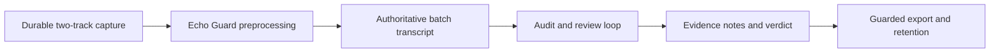
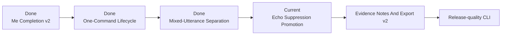
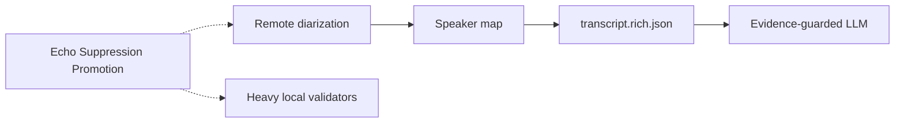
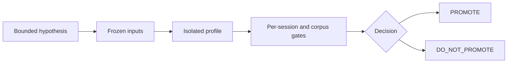

# MurmurMark CLI Roadmap

Updated: 2026-07-22

This is the readable view of the active OpsKarta v3 plan:

- `docs/roadmap/murmurmark-cli-roadmap.plan.yaml`

The YAML plan owns statuses and dependencies. `docs/project/current-goal.md` expands the one
executable goal. Historical experiment detail is preserved under `docs/history/` and does not
redefine current priorities.

## Planning Rules

- `done`: implemented and evidenced capability;
- `current`: work being executed now;
- `next`: unlocked goal that follows the current one;
- `later`: dependent stage whose prerequisites are not complete;
- `idea`: research hypothesis outside the committed path;
- `optional`: useful but nonessential capability;
- `blocked`: work with an explicit unsatisfied gate.

Evergreen capabilities such as corpus regression are `done`, not permanently `current`. A completed
experiment ends in `PROMOTE` or `DO_NOT_PROMOTE`; either outcome closes its hypothesis.

## What Works Now



The supported product path is:

```text
murmurmark meeting -> first Ctrl-C -> bounded authoritative lifecycle -> honest result
```

Raw CAF files and batch output are authoritative. Committed-PCM Live Shadow is capture-safe and
advisory; its promotion remains blocked by quality and runtime evidence.

## Current Goal

**Echo Suppression Promotion** is the current goal. Two conservative post-ASR experiments have now
measured the same limit: remote speech can be identified, but deleting it safely requires stronger
proof that every retained local island belongs to `Me`. The next bounded step compares derived-audio
echo candidates against `local_fir` and promotes one only after corpus-wide remote-reduction,
local-preservation and no-regression gates pass.

**One-Command Meeting Lifecycle v1** is complete. `murmurmark meeting` owns durable capture,
authoritative processing, evidence enrichment, conservative review and guarded export. It uses
machine-readable readiness, checkpoints every action and gives a precise resume command after
interruption. Automated checks, real-artifact interrupt/resume, a fresh permission-capable capture
soak and strict lifecycle acceptance all pass.

Speaker-Mode Transcript Quality Hardening v1 completed with `DO_NOT_PROMOTE`. The frozen corpus
proved three lossless retimes, one real double-talk interval and one genuine `Me` row, but no whole
`Me` deletion. Duplicate reduction was `2.7%` and review reduction `7.9%`, below the `25%` and `15%`
promotion gates.

The immediate Evidence-Backed Me Completion v2 predecessor is now complete and promoted for its
frozen two-session scope. It closed `3/6` residual local-recall rows and `22.4/35.85s`, repaired one
duplicate text tail, preserved raw/remote/chronology/notes evidence, and exposed the remaining
`13.45s` plus unresolved transcript text through concrete review lanes. Outside that frozen scope,
`residual_local_recall_v1` remains the fallback.

Mixed-Utterance Remote Span Separation v1 completed with `DO_NOT_PROMOTE`. It froze `12` mixed
`Me` rows / `54.940s` across `7` sessions and produced deterministic evidence for all of them.
Seven rows are probable ASR noise and five remain ambiguous, but no row proved both the removable
remote span and the identity of every retained local edge. It applied no text changes and introduced
no raw, remote, local-recall, chronology, notes or verdict regression.

## Critical Path



### 0. Evidence-Backed Me Completion v2

Completed with a scoped `PROMOTE`. Independent mic ASR, word timestamps, speaker state, calibrated
Target-Me and remote-forbidden evidence may materialize bounded local speech. Weak or conflicting
evidence stays unchanged and reviewable. Auto-selection requires exact frozen-input and output
fingerprints plus corpus membership.

### 1. One-Command Meeting Lifecycle

Completed. One command now runs durable capture and plain authoritative processing, applies only
allowlisted enrichment and suggested-review actions, guards export from structured outcome state,
verifies raw SHA-256 identities and supports lock-safe resume after a second `Ctrl-C`.

### 2. Mixed-Utterance Remote Span Separation

Completed with `DO_NOT_PROMOTE`. Clean/raw/role-masked word timestamps, authoritative remote timing,
speaker state and Target-Me evidence were sufficient to identify suspicious remote-supported spans,
but not to prove safe local prefixes or tails. The isolated profile remains audit evidence and is
never selected automatically.

### 3. Echo Suppression Promotion

Current. Freeze one representative acoustic corpus and use one promotion contract for `local_fir`,
WebRTC AEC3, SpeexDSP and any justified bounded candidate. The user-facing target is remote speech
below the ASR-detectable threshold in `Me` while at least `99%` of confirmed local speech remains
intact. Missing helpers or failed session gates fall back to `local_fir`.

### 4. Evidence Notes And Export v2

Improve the already working notes/export handoff over the selected transcript. Generated or
extractive claims remain traceable to evidence IDs.

### 5. Release-quality CLI

Finalize the supported environment, installation, model/config handling, acceptance, release notes
and public operational contract. UI is not required.

## Parallel Research



Remote diarization works on authoritative `remote` and does not require complete Echo suppression.
It starts after base quality closure, first produces anonymous stable speaker IDs, then an
evidence-backed speaker map and rich transcript.

Heavy local models begin as bounded validators. They do not replace the primary ASR without their
own corpus gates.

## Parking Lot

- Live result promotion: blocked by reproducible `DO_NOT_PROMOTE` evidence;
- docs and issue-tracker proposals: optional and reviewed before external writes;
- UI/Menu Bar: optional after release-quality CLI.

These branches do not block the critical path.

## Promotion Gate



No candidate may mutate raw capture or silently replace the selected profile. A negative result must
record the evidence ceiling and leave the authoritative output unchanged.

## Validation

```bash
scripts/check-planning-consistency.py

PYTHONPATH=../opskarta .venv/bin/python -m specs.v3.tools.cli \
  validate docs/roadmap/murmurmark-cli-roadmap.plan.yaml

PYTHONPATH=../opskarta .venv/bin/python -m specs.v3.tools.cli \
  render tree docs/roadmap/murmurmark-cli-roadmap.plan.yaml

PYTHONPATH=../opskarta .venv/bin/python -m specs.v3.tools.cli \
  render executive docs/roadmap/murmurmark-cli-roadmap.plan.yaml --view exec-top
```

Detailed planning and experiment history through 2026-07-19 is archived in
`docs/history/README.md`.
