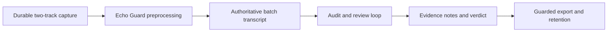
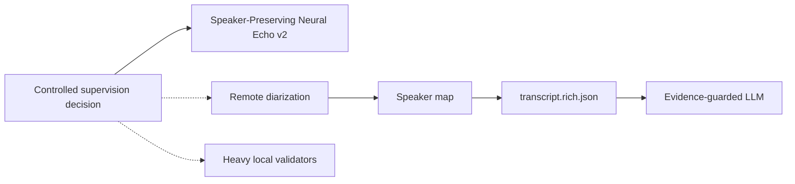
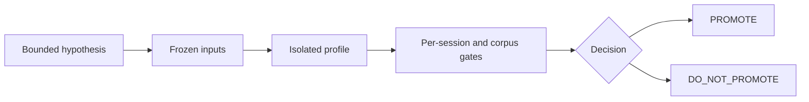

# MurmurMark CLI Roadmap

Updated: 2026-08-04

This is the readable view of the active OpsKarta v3 plan:

- `docs/roadmap/murmurmark-cli-roadmap.plan.yaml`

The YAML plan owns statuses and dependencies. `docs/project/current-goal.md` expands the one
executable goal. Historical experiment detail is preserved under `docs/history/` and does not
redefine current priorities.

## Planning Rules

- `done`: implemented and evidenced capability;
- `current`: work being executed now;
- `next`: unlocked goal that follows the current one;
- `later`: dependent stage whose prerequisites are not complete;
- `idea`: research hypothesis outside the committed path;
- `optional`: useful but nonessential capability;
- `blocked`: work with an explicit unsatisfied gate.

Evergreen capabilities such as corpus regression are `done`, not permanently `current`. A completed
experiment ends in `PROMOTE` or `DO_NOT_PROMOTE`; either outcome closes its hypothesis.

## What Works Now


```mermaid
flowchart LR
    C["Durable two-track capture"]
    E["Echo Guard preprocessing"]
    T["Authoritative batch transcript"]
    R["Audit and review loop"]
    N["Evidence notes and verdict"]
    X["Guarded export and retention"]

    C --> E --> T --> R --> N --> X
```

The supported product path is:

```text
murmurmark meeting -> first Ctrl-C -> bounded authoritative lifecycle -> honest result
```

Raw CAF files and batch output are authoritative. Committed-PCM Live Shadow is capture-safe and
advisory; its promotion remains blocked by quality and runtime evidence.

Successful guarded export now has a thin-session retention path: raw CAF and structured evidence
remain, while rebuildable media below `derived/` can be removed through
`retention compact plan|apply|verify`. Ordinary `meeting`/`finish` runs compact automatically;
`--keep-debug-artifacts` preserves the full diagnostic workspace.

## Current Goal

**Evidence Notes And Export v2** is the current goal. It turns the selected transcript, quality
verdict, review evidence, notes and export readiness into one versioned deterministic handoff. Every
visible claim must cite a compatible evidence ID; stale or blocked inputs fail closed instead of
producing a mixed-generation bundle.

The preceding **Speaker-Preserving Neural Echo v2** goal is complete with
`PROMOTE_SPEAKER_PRESERVING_NEURAL_ECHO_V2`. The sealed twelve-session corpus selected personalized
candidate audio in `5/12` sessions and exact fallback in `7/12`; it removed `41.940s` and `90`
remote-supported tokens with candidate local retention `1.0`. Headphones and unsafe or inapplicable
speaker sessions remain byte-exact `local_fir_role_masked` fallback. Post-ASR cleanup received zero
promotion credit.

Two suppression families established the same safety ceiling. Classical state-level suppression
removed `68.2845%` of bounded remote-risk, but lost protected `Me` in two speaker sessions. The
pinned Microsoft DEC model removed all `3.49s` of bounded remote-risk in those hard sessions, yet
protected-local recall fell to `45.45%`, chronology and double-talk recall to `0%`, and incremental
runtime reached `52.85%` of `local_fir`. AECMOS still rated the audio well, so it remains a secondary
metric rather than a word-preservation gate. These failures established the exact fallback retained
by the later promoted hybrid.

Speaker-Preserving Echo Adaptation Corpus v1 then completed with reproducible `DO_NOT_TRAIN`.
Privacy checks and session-disjoint splits passed; local-only target coverage reached `192s` train
and `96s` dev. However, no remote-only interval passed the frozen confidence gate, so the corpus
contains neither measured echo supervision nor valid synthetic pairs. Hard-test retained four
protected-local and four chronology examples, but only `6s` double-talk and no independently
confirmed opening acknowledgement. Replay matched `414/414` files. Training on that passive corpus
would manufacture ground truth. The controlled lab below later supplied the required measured
supervision.

**One-Command Meeting Lifecycle v1** is complete. `murmurmark meeting` owns durable capture,
authoritative processing, evidence enrichment, conservative review and guarded export. It uses
machine-readable readiness, checkpoints every action and gives a precise resume command after
interruption. Capture now runs in a short-lived child: ScreenCaptureKit/ReplayKit is gone before
post-processing, so the next meeting can start while an older one is still being recognized.
Startup and shutdown are bounded, and a failed startup releases the recording lock. Automated
checks, real-artifact interrupt/resume, a fresh permission-capable capture soak and strict lifecycle
acceptance all pass.

Speaker-Mode Transcript Quality Hardening v1 completed with `DO_NOT_PROMOTE`. The frozen corpus
proved three lossless retimes, one real double-talk interval and one genuine `Me` row, but no whole
`Me` deletion. Duplicate reduction was `2.7%` and review reduction `7.9%`, below the `25%` and `15%`
promotion gates.

The immediate Evidence-Backed Me Completion v2 predecessor is now complete and promoted for its
frozen two-session scope. It closed `3/6` residual local-recall rows and `22.4/35.85s`, repaired one
duplicate text tail, preserved raw/remote/chronology/notes evidence, and exposed the remaining
`13.45s` plus unresolved transcript text through concrete review lanes. Outside that frozen scope,
`residual_local_recall_v1` remains the fallback.

Mixed-Utterance Remote Span Separation v1 completed with `DO_NOT_PROMOTE`. It froze `12` mixed
`Me` rows / `54.940s` across `7` sessions and produced deterministic evidence for all of them.
Seven rows are probable ASR noise and five remain ambiguous, but no row proved both the removable
remote span and the identity of every retained local edge. It applied no text changes and introduced
no raw, remote, local-recall, chronology, notes or verdict regression.

Echo Suppression Promotion v1 then aligned Offline AEC, WebRTC AEC3 and SpeexDSP under one signed
timeline and automatic fail-open policy. The nine-session corpus kept `local_fir` in production and
froze the exact overlap intervals that classical state-level suppression could not handle safely.

Neural Residual Echo Suppression v1 then tested a pinned, offline Microsoft DEC ONNX model against
those failures. It completed with deterministic `DO_NOT_PROMOTE`; full shadow was intentionally
skipped after the mandatory local-loss stop rule fired. This rules out another blind engine swap
and motivates proving supervision quality before any adaptation.

## Critical Path


```mermaid
flowchart LR
    P["Done<br/>Me Completion v2"]
    L["Done<br/>One-Command Lifecycle"]
    A["Done<br/>Mixed-Utterance Separation"]
    B["Done<br/>Echo Suppression Promotion v1"]
    N["Done<br/>Neural Residual Echo v1"]
    S["Done: DO_NOT_TRAIN<br/>Speaker-Preserving<br/>Adaptation Corpus v1"]
    C["Done: READY<br/>Controlled Echo<br/>Supervision Lab v1"]
    E["Done: PROMOTE<br/>Speaker-Preserving<br/>Neural Echo v2"]
    H["Current<br/>Evidence Notes And Export v2"]
    D["Next dependent<br/>Release-quality CLI"]

    P --> L --> A --> B --> N --> S --> C --> E --> H --> D
```

### 0. Evidence-Backed Me Completion v2

Completed with a scoped `PROMOTE`. Independent mic ASR, word timestamps, speaker state, calibrated
Target-Me and remote-forbidden evidence may materialize bounded local speech. Weak or conflicting
evidence stays unchanged and reviewable. Auto-selection requires exact frozen-input and output
fingerprints plus corpus membership.

### 1. One-Command Meeting Lifecycle

Completed. One command now runs durable capture and plain authoritative processing, applies only
allowlisted enrichment and suggested-review actions, guards export from structured outcome state,
verifies raw SHA-256 identities, isolates capture from post-processing in a short-lived process and
supports lock-safe resume after a second `Ctrl-C`.

### 2. Mixed-Utterance Remote Span Separation

Completed with `DO_NOT_PROMOTE`. Clean/raw/role-masked word timestamps, authoritative remote timing,
speaker state and Target-Me evidence were sufficient to identify suspicious remote-supported spans,
but not to prove safe local prefixes or tails. The isolated profile remains audit evidence and is
never selected automatically.

### 3. Echo Suppression Promotion

Completed with `DO_NOT_PROMOTE`. The exact role-aware `local_fir` baseline, signed delay contract,
candidate matrix, bounded ASR probes and policy are reproducible. Coverage passed `3/5` applicable
speaker sessions; the failed protected-local and chronology gates keep production on `local_fir`.

### 4. Neural Residual Echo Suppression v1

Completed with deterministic `DO_NOT_PROMOTE`. The model-neutral adapter, pinned DEC and AECMOS
models, exact-duration inference, fail-open checks and frozen corpus are reproducible. The candidate
removed bounded remote-risk but failed protected-word, chronology, double-talk and runtime gates.
Production output was never changed.

### 5. Speaker-Preserving Echo Adaptation Corpus v1

Completed with reproducible `DO_NOT_TRAIN`. Provenance, session-disjoint train/dev/hard-test splits,
immutable counterexamples, privacy checks and byte-stable replay are available. The frozen corpus
has enough local-only targets, but no remote-only examples pass the independent confidence gate;
synthetic pairing is therefore forbidden. No training was run and production remained unchanged.

### 6. Controlled Echo Supervision Lab v1

Done with `READY_FOR_ADAPTATION`. The durable recorder ran a frozen phase schedule across five
train, one dev and one controlled hard-test speaker-mode sessions. Accept measured echo and local
targets only when schedule, signal, local ASR and Target-Me evidence agree. Build synthetic mixtures
inside a split, preserve existing real counterexamples as hard-test only, and issue a deterministic
adaptation decision. Final replay is `1465/1465`: train has `620s` local, `640s` remote and `1804s`
synthetic; dev has `124s` local, `128s` remote and `352s` synthetic; hard-test has `68s` measured
double-talk. Local-FIR residual Target-Me removes raw echo false positives while retaining their
diagnostic evidence. No gate failed. The lab itself did not alter production; the separately gated
v2.16 corpus later promoted the personalized hybrid.

### 7. Speaker-Preserving Neural Echo v2

Completed with guarded `PROMOTE`. Small residual-mask, complex-spectral, echo-mapper and pretrained
DEC candidates established the local-preservation ceiling. The winning hybrid uses controlled
Target-Me enrollment, WavLM/Resemblyzer, authoritative remote evidence, bounded attenuation and
direct whisper.cpp checks with per-window rollback. The immutable hard test proved fail-open safety;
the sealed corpus proved utility. Candidate publication is transactional and every incompatibility,
headphones session or regression restores the exact `local_fir` fallback.

### 8. Evidence Notes And Export v2

Current. Define one versioned, byte-stable handoff contract over the selected transcript profile,
quality verdict, evidence notes, unresolved review burden and export readiness. Every visible claim
must cite valid evidence IDs; stale or blocked input must fail closed. The normal lifecycle should
publish one coherent Markdown/Obsidian bundle or one precise blocker and next command.

### 9. Release-quality CLI

Finalize the supported environment, installation, model/config handling, acceptance, release notes
and public operational contract. UI is not required.

## Dependent And Parallel Research


```mermaid
flowchart LR
    Q["Controlled supervision decision"]
    E["Speaker-Preserving Neural Echo v2"]
    D["Remote diarization"]
    S["Speaker map"]
    T["transcript.rich.json"]
    V["Heavy local validators"]
    L["Evidence-guarded LLM"]

    Q --> E
    Q -.-> D --> S --> T --> L
    Q -.-> V
```

Speaker-Preserving Neural Echo v2 is complete; its controlled train/dev/hard ownership, hashes and
promotion evidence remain immutable. Evidence Notes And Export v2 is now the executable goal.

Remote diarization works on authoritative `remote` and does not require complete Echo suppression.
It starts after base quality closure, first produces anonymous stable speaker IDs, then an
evidence-backed speaker map and rich transcript.

Heavy local models begin as bounded validators. They do not replace the primary ASR without their
own corpus gates.

## Parking Lot

- Live result promotion: blocked by reproducible `DO_NOT_PROMOTE` evidence;
- docs and issue-tracker proposals: optional and reviewed before external writes;
- UI/Menu Bar: optional after release-quality CLI.

These branches do not block the critical path.

## Promotion Gate


```mermaid
flowchart LR
    H["Bounded hypothesis"]
    I["Frozen inputs"]
    P["Isolated profile"]
    G["Per-session and corpus gates"]
    D{"Decision"}
    Y["PROMOTE"]
    N["DO_NOT_PROMOTE"]

    H --> I --> P --> G --> D
    D --> Y
    D --> N
```

No candidate may mutate raw capture or silently replace the selected profile. A negative result must
record the evidence ceiling and leave the authoritative output unchanged.

## Validation

```bash
scripts/check-planning-consistency.py

PYTHONPATH=../opskarta .venv/bin/python -m specs.v3.tools.cli \
  validate docs/roadmap/murmurmark-cli-roadmap.plan.yaml

PYTHONPATH=../opskarta .venv/bin/python -m specs.v3.tools.cli \
  render tree docs/roadmap/murmurmark-cli-roadmap.plan.yaml

PYTHONPATH=../opskarta .venv/bin/python -m specs.v3.tools.cli \
  render executive docs/roadmap/murmurmark-cli-roadmap.plan.yaml --view exec-top
```

Detailed planning and experiment history through 2026-07-19 is archived in
`docs/history/README.md`.
