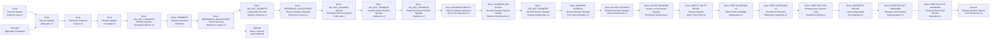

# MurmurMark CLI Roadmap

Updated: 2026-08-10
Это читаемое представление активного плана OpsKarta v3:

- `docs/roadmap/murmurmark-cli-roadmap.plan.yaml`
YAML владеет статусами и зависимостями. `docs/project/current-goal.md` раскрывает единственную
исполняемую цель. Завершённые эксперименты остаются в `docs/research/`, `docs/testing/` и
`docs/history/`, но не определяют текущий приоритет.

## Правила Планирования
- В работе находится ровно одна цель со статусом `current`.
- Основной путь заканчивается надёжной speaker-resolved транскрибацией, а не производными заметками.
- Завершённая гипотеза получает `PROMOTE` или `DO_NOT_PROMOTE`; оба исхода закрывают работу.
- Неуверенное слово, роль или speaker attribution остаётся явным `unknown`/review item.
- Отрицательный эксперимент не ослабляет выбранный transcript и всегда имеет точный fallback.
- Имена не выводятся по голосу. Разрешены только session-local anonymous IDs и явные review labels.
- UI, облако, суммаризация и запись во внешние системы не держат критический CLI-путь.

## Миссия И North Star
MurmurMark создаёт локальную, надёжную и проверяемую транскрибацию созвона с любым числом
участников. Он сохраняет слова, порядок, время и роли, различает участников remote-потока по голосу
внутри сессии и явно показывает предел доказательств. Если в будущем у одного ноутбука участвуют
несколько людей, тот же принцип должен быть расширен на mic-поток отдельным квалифицированным слоем.

```text
одна команда
  -> durable mic + remote
  -> защищённая Me-речь и чистый вход ASR
  -> точные слова, порядок и роли
  -> remote words по session-local speakers либо unknown
  -> проверяемый speaker-resolved transcript
```

Заметки, суммаризации, поиск и рабочие предложения полезны, но легко производятся из хорошей
транскрибации. Они остаются необязательными и не конкурируют за ресурсы с её качеством.

## Что Уже Работает

```mermaid
flowchart LR
    C["Durable two-track capture"]
    E["Guarded Echo and Target-Me"]
    T["Authoritative transcript"]
    A["Audit and review evidence"]
    S["Promoted remote speaker diarization"]
    X["Guarded export and retention"]

    C --> E --> T --> A --> S --> X
```

Поддерживаемый путь:

```text
murmurmark meeting -> первый Ctrl-C -> bounded authoritative lifecycle -> честный результат
```

Raw CAF и batch output authoritative. Live Shadow capture-safe, но advisory; он не выбирает
финальный текст или speaker attribution.

| Область | Состояние | Доказанный результат |
|---|---|---|
| Capture и lifecycle | `done` | Durable запись, resume, один пользовательский запуск |
| Echo / Target-Me | `done` | v2.17: safe personalized plateau, exact fallback |
| Сильнее разделить mic | `done` | `DO_NOT_ADVANCE`: нет надёжного Target-Me presence gate |
| Transcript / handoff | `done` | Authoritative batch, Evidence Handoff v2, guarded export |
| Remote speaker evidence v1 | `done` | B-cubed F1 `0.913884` на attributed части, coverage `50.3892%` |
| Remote speaker diarization v2 | `done` | Coverage `91.9071%`, B-cubed F1 `0.960690`, exact words |
| Remote speaker coverage v3 | `done` | Coverage `93.9312%`, B-cubed F1 `0.962171`, exact v2 labels |
| Remote speaker residual v4 | `done` | `DO_NOT_PROMOTE`: safe ceiling `14.57%` words / `13.98%` seconds |
| Speaker-resolved default | `done` | 6/6 sessions, 14 expected speakers, exact aggregate fallback |
| Lexical correctness | `done/blocker` | Exact 67-word subset WER/CER `0`; real meetings lack human truth |
| Independent remote speaker evidence | `done` | `DO_NOT_PROMOTE`: 53 words / `23.357s`, no direct candidate truth |
| Residual speaker reference | `done/blocker` | 278 blind items; `REFERENCE_INSUFFICIENT`, direct truth 0/53 |
| Controlled speaker truth lab | `done` | Coverage v3 control qualified; WavLM candidate `DO_NOT_ADVANCE` |
| Duration-aware speaker attribution | `done` | `DO_NOT_PROMOTE`: precision `1.0`, known recall `55.14%`, boundaries `9/28` |
| Segment-context speaker attribution | `done` | `DO_NOT_PROMOTE`: hard-v3 recall `44.51%`, boundaries `0/20` |
| Speaker-attribution error decomposition | `done` | Identity gain `0.351382` dominates boundary `0.063882` and special `0.036364` |
| Stronger speaker identity backend | `done` | ECAPA lab candidate: hard-v4 F1 `0.948042`, recall `0.947368`, zero open-set false |
| ECAPA real-session shadow | `done` | `DO_NOT_PROMOTE`: 156 words, 211.100s; word and precision gates failed |
| Three-session current pipeline debug | `done` | Raw intact, zero gaps, exact v2 cache replay; legacy reuse rebuilds before timeline repair |
| Remote shadow error decomposition | `done` | `ADVANCE_INTERVAL_PURIFICATION`: 93/214 failures, `201.274s`, dominance `0.128982` |
| Bounded interval purification | `done` | `DO_NOT_ADVANCE`: 2 new words / 4.155s, one new reference error |
| Session-local enrollment hardening | `done` | `DO_NOT_ADVANCE`: 11 gains / 44.694s, but five control accepts lost |
| Direct remote-speaker truth seed | `done` | 33 primary + 8 repeats; `DIRECT_TRUTH_SEED_READY`, consistency `7/8` |
| Blind remote-speaker review | `done` | 8 attributed, 11 unknown, 4 mixed, 10 unusable; production unchanged |
| Direct-truth candidate adjudication | `done` | `KEEP_COVERAGE_V3`: +3 correct, -2 correct controls, unsafe accepts 8 -> 13 |
| Enrollment purity / abstention v2 | `done` | `KEEP_COVERAGE_V3`: 7/14 profiles qualified, 0 additions, unsafe 13 -> 8 |
| Homogeneous enrollment mining | `done` | `KEEP_EXISTING_ENROLLMENT`: 39 windows, 0/3 gains preserved |
| Label-independent re-clustering | `done` | `EMBEDDING_GEOMETRY_BOUND`: ARI `0.090170`, stability `0.465715` |
| Stronger local speaker representation | `done` | `KEEP_EXPLICIT_UNKNOWN`: 3/3 gains, but 12 new false identities |
| Temporal end-to-end remote diarization | `done` | `KEEP_EXPLICIT_UNKNOWN`: stable timing, but speaker count `0/6`, seven false identities |
| Disjoint remote-speaker truth v2 | `current` | Expand real direct truth before another model selection or tuning |
## Актуальная Цепочка

```mermaid
flowchart LR
    B["Done<br/>Remote Speaker<br/>Evidence Map v1"]
    D["Done<br/>Remote Speaker<br/>Diarization v2"]
    F["Fail open<br/>aggregate Colleagues"]
    P["Done<br/>Transcript Perfection<br/>Corpus v1"]
    R["Done<br/>Remote Speaker<br/>Coverage v3"]
    V["Done: DO_NOT_PROMOTE<br/>Remote Speaker<br/>Residual Evidence v4"]
    H["Done: PROMOTE<br/>Speaker-Resolved<br/>Default v1"]
    L["Done: REFERENCE_INSUFFICIENT<br/>Lexical Accuracy<br/>Reference Corpus v1"]
    I["Done: DO_NOT_PROMOTE<br/>Independent Remote<br/>Speaker Evidence v1"]
    C["Done: REFERENCE_INSUFFICIENT<br/>Remote Speaker Residual<br/>Reference Corpus v1"]
    Q["Done: DO_NOT_ADVANCE WavLM<br/>Controlled Remote Speaker<br/>Truth Lab v1"]
    A["Done: DO_NOT_PROMOTE<br/>Duration-Aware Remote Speaker<br/>Attribution v2"]
    S["Done: DO_NOT_PROMOTE<br/>Segment-Context Remote Speaker<br/>Attribution v1"]
    E["Done: ADVANCE IDENTITY<br/>Remote Speaker Attribution<br/>Error Decomposition v1"]
    K["Done: PROMOTE LAB ECAPA<br/>Stronger Remote Speaker Identity<br/>Backend Qualification v1"]
    N["Done: DO_NOT_PROMOTE<br/>ECAPA Remote Speaker<br/>Shadow Qualification v1"]
    Z["Done: ADVANCE INTERVAL<br/>Remote Speaker Shadow<br/>Error Decomposition v1"]
    J["Done: DO NOT ADVANCE<br/>Bounded Remote Speaker<br/>Interval Purification v1"]
    G["Done: DO NOT ADVANCE<br/>Session-Local Remote Speaker<br/>Enrollment Hardening v1"]
    T["Done: DIRECT TRUTH READY<br/>Remote Speaker<br/>Direct Truth Seed v1"]
    W["Done: KEEP COVERAGE V3<br/>Direct-Truth Candidate<br/>Adjudication v1"]
    X["Done: KEEP COVERAGE V3<br/>Enrollment Purity and<br/>Abstention Hardening v2"]
    Y["Done: KEEP EXISTING<br/>Homogeneous Session-Local<br/>Enrollment Mining v1"]
    RC["Done: GEOMETRY BOUND<br/>Label-Independent<br/>Re-Clustering v1"]
    SR["Done: KEEP EXPLICIT UNKNOWN<br/>Stronger Local Speaker<br/>Representation v1"]
    TD["Done: KEEP EXPLICIT UNKNOWN<br/>Temporal End-to-End Remote<br/>Diarization v1"]
    M["Current<br/>Remote Speaker Disjoint<br/>Truth Expansion v2"]
    O["Optional<br/>Notes, retrieval,<br/>work proposals"]

    B --> D --> P --> R --> V --> H --> L --> I --> C --> Q --> A --> S --> E --> K --> N --> Z --> J --> G --> T --> W --> X --> Y --> RC --> SR --> TD --> M
    F --> D
    L -.-> O
```
### 1. Remote Speaker Evidence Map v1 — `done`
Selected remote utterances и local Resemblyzer дали 14 устойчивых anonymous clusters на шести
сессиях. На уже attributed речи качество высокое, но 606 из 1235 remote utterances остаются
aggregate `Colleagues`; internal speaker changes не разделяются. Решение `PROMOTE_AUDIT_ONLY`
доказывает осуществимость и одновременно фиксирует текущий пробел.

### 2. Remote Speaker Diarization v2 — `done`
Word/frame-level diarization работает по authoritative remote audio, обнаруживает смену говорящего
внутри ASR-реплики и связывает каждое remote word с session-local speaker или `unknown`. Решение
`PROMOTE`: coverage `0.919071`, attributed-only B-cubed F1 `0.960690`, pairwise precision
`0.959564`, 5/5 boundary cases и zero selected-word loss/duplication.

Результат этапа v2: promoted optional speaker-resolved read surface. Отдельная продуктовая
квалификация default была выполнена позже и не меняла v2 words или labels.

### 3. Transcript Perfection Corpus v1 — `done`

Единый корпус связывает проверку текста, порядка, ролей, speaker turns, overlap, missing `Me`,
remote leakage и acoustic modes. Baseline `BASELINE_ESTABLISHED`: 29/29 frozen sources verified,
восемь явных dimensions, exact lexical subset измерен, real meetings остаются
reference-insufficient, aggregate score запрещён. Interval и enrollment results включены frozen
sources; direct adjudication сохраняет Coverage v3 и направляет следующий monotonic candidate.

Результат: конечный критерий сходимости к идеальной транскрибации и защита от бесконечной цепочки
локальных эвристик.

### 4. Remote Speaker Coverage v3 — `done`

V3 применил единогласные rejected-frame evidence к unknown-словам, не меняя существующие speaker
labels. `PROMOTE`: восстановлено 368 слов / `199.533s`; coverage вырос с `91.9071%` до `93.9312%`,
B-cubed F1 до `0.962171`, pairwise precision до `0.961675`.

Результат: unknown words снижены на `30.1887%`, seconds на `25.0113%`; words, timestamps, v2 labels,
aggregate fallback и все Transcript Perfection gates остались точными.

### 5. Remote Speaker Residual Evidence v4 — `done`

V4 проверил speech-aware bounded окна и независимые половины enrollment, не ослабляя thresholds v3.
Восстановлено 124 words / `83.640s`; reductions `14.5711%` words и `13.9811%` seconds не достигли
порогов `20%`. B-cubed F1 `0.962171`, pairwise precision `0.961675`, conservation и boundaries
остались точными.

Результат: воспроизводимый `DO_NOT_PROMOTE`. Promoted v3 остаётся поддерживаемым источником, а
727 words / `514.599s` сохраняют честный aggregate fallback. Повторять тот же speaker backend с
пониженными порогами не нужно.

### 6. Speaker-Resolved Transcript Default v1 — `done`

Обычный CLI read surface, meeting handoff и guarded export выбирают promoted v3 на совместимых
сессиях. Слабая, отсутствующая или stale evidence возвращает exact aggregate
`Colleagues`; неподдержанные v3 words остаются aggregate внутри speaker-resolved результата.
Voice-only имена и cross-session identity запрещены.

Результат: `PROMOTE` на 6/6 sessions, две 1x1, четыре group, 14 expected speakers и 5/5 boundary
cases. Words, roles, `Me`, timestamps, raw и deterministic replay сохранены.

### 7. Lexical Accuracy Reference Corpus v1 — `done`

Private graded corpus отделил exact generated truth, scripted expected evidence и independent
machine references. Точный цифровой поднабор содержит 67 слов при WER/CER `0`; weak sources не
могут считаться truth. Реальная лексическая точность закрыта `REFERENCE_INSUFFICIENT`: нет ни одной
human-reviewed встречи.

### 8. Independent Remote Speaker Evidence v1 — `done`

Pinned local WavLM XVector проверен на frozen six-session Coverage v3 corpus и `598.240s` unknown
remote speech. Он восстановил 53 слова / `23.357s`: `6.2280%` words и `3.9043%` seconds при gates
`20%`. B-cubed F1 `0.962171`, pairwise precision `0.961675`, 5/5 boundaries и exact fallback
сохранены. Ни одно из пяти новых решений в reference session не покрыто прямой truth-меткой.

Результат: воспроизводимый `DO_NOT_PROMOTE`. Повторять WavLM с более мягкими порогами нельзя.

### 9. Remote Speaker Residual Reference Corpus v1 — `done`

Private blind pack покрывает все 851 residual words / `598.240s` в 278 items и отдельно все 53 WavLM
proposals / `23.357s`. Prediction запечатан отдельно; public artifacts не содержат речь, имена и
absolute paths. Все structural, privacy, conservation и replay gates проходят.

Результат: `REFERENCE_INSUFFICIENT`, потому что reviewed items и direct proposal truth остаются 0.
Точная приватная очередь сохранена; Coverage v3 и ordinary transcript не изменены.

### 10. Controlled Remote Speaker Truth Lab v1 — `done`

Локальная лаборатория заморозила 8 disjoint sessions, 6 anonymous voices и 240 exact words. Source
stems восстанавливают mixtures с ошибкой 0 PCM samples; hard содержит short turns, internal changes,
overlap, rare speaker и отдельный unseen open-set voice.

Coverage v3 control квалифицирован: B-cubed F1 `0.983505`, pairwise precision `1.0`, boundaries
`16/16`, open-set errors `0`. WavLM word-matched candidate получил `0.834325`, `0.950920`, `10/16`
и две false attributions. Итог: `DO_NOT_ADVANCE` для кандидата, deterministic replay и неизменный
production. Synthetic truth не заменяет blind review реальных 53 proposals.

### 11. Duration-Aware Remote Speaker Attribution v2 — `done`

До topology work заморожен новый hard-v2: 4 scenarios, 125 words, 4 enrolled и 2 unseen open-set
voices, отдельный enrollment и exact stems/truth. Три заявленных candidate выбирались только на v1
development; hard-v2 был открыт один раз после candidate freeze.

Conservative fusion сохранил pairwise precision `1.0`, zero open-set false attribution и превзошёл
Coverage v3 control, но получил hard B-cubed `0.499381`, known recall `0.551402`, boundaries `9/28`.
Итог: `DO_NOT_PROMOTE_TOPOLOGY`; production не изменён.

### 12. Segment-Context Remote Speaker Attribution v1 — `done`

Новый hard-v3 был заморожен до алгоритма: 5 scenarios, 197 words, 22 boundaries, 4 enrolled и 2
open-set voices. Из трёх topology только на v1 + open hard-v2 выбран conservative dual-backend
fusion; hard-v3 открыт ровно один раз.

Результат `DO_NOT_PROMOTE_SEGMENT_CONTEXT`: B-cubed `0.475586`, pairwise precision `0.966418`,
known recall `0.445087`, boundaries `0/20`, две open-set false attribution. Words/stems, mixed
fail-closed, deterministic replay и production boundary сохранены. Эту ветку пороговых
segment-context эвристик продолжать не нужно.

### 13. Remote Speaker Attribution Error Decomposition v1 — `done`

Oracle-матрица учла 393 exact words и 64 boundaries без нового candidate. Current primary получил
known recall `0.571006`; identity oracle при тех же границах поднял его до `0.934911`. Fixed gains:
identity `0.351382`, segmentation `0.063882`, overlap/open-set `0.036364`.

Результат `ADVANCE_STRONGER_SPEAKER_IDENTITY`: production и Coverage v3 не изменены, rejected
topology не перенастраиваются, а следующий эксперимент меняет семейство identity backend.

### 14. Stronger Remote Speaker Identity Backend Qualification v1 — `done`
WavLM control и независимо обученный SpeechBrain ECAPA были заморожены вместе с model, license,
runtime и SHA-256 provenance; disjoint hard-v4 запечатан до выбора и открыт один раз. Результат
`PROMOTE_LAB_IDENTITY_CANDIDATE`: B-cubed F1 `0.948042`, precision `1.0`, recall `0.947368`,
boundaries `13/23`, zero open-set false attribution и exact 154/154 words. Production не изменён.

### 15. ECAPA Remote Speaker Shadow Qualification v1 — `done`
Frozen ECAPA был применён только как fail-open shadow над 278 residual intervals шести реальных сессий. Заморозка охватила 851 unknown words, 28 session-local exemplars, model/runtime, clips, Coverage v3 и selected-transcript guards.
Результат `DO_NOT_PROMOTE_REAL_IDENTITY`: восстановлено 156 words (`0.183314`) и `211.099681s` (`0.352868`), projected coverage `0.960727`. Structural 1x1 precision `1.0`, но independent machine-reference precision `0.878788`; два silent clips дали fail-open. Exact words/timestamps, Coverage v3, selected transcripts и replay сохранены. Production не изменён.
### 16. Remote Speaker Shadow Error Decomposition v1 — `done`
Все 278 items / 851 words классифицированы; `ADVANCE_INTERVAL_PURIFICATION`: 93/214 failures и
`201.273504s`, dominance margin `0.128982`. Четыре mismatch words и два silent failures объяснены,
replay byte-exact, production и thresholds неизменны.
### 17. Bounded Remote Speaker Interval Purification v1 — `done`
Один frozen crop пересчитал 50/93 clips: coarse precision выросла до `0.967742`, но recovery составил
лишь 2 words / `4.154556s`, появилась одна новая reference error. `DO_NOT_ADVANCE`; tuning запрещён.
### 18. Session-Local Remote Speaker Enrollment Hardening v1 — `done`
Один exemplar-only candidate добавил 11 items / `44.694004s` без новых measured errors, но удалил
пять control acceptances и восстановил лишь 4/83 scope items. `DO_NOT_ADVANCE`; retuning запрещён.
### 19. Remote Speaker Direct Truth Seed v1 — `done`
33 primary / 116 words / `90.100820s`, 8 repeats; outcomes 8 attributed, 11 unknown, 4 mixed,
10 unusable. `DIRECT_TRUTH_SEED_READY`, consistency `7/8`, replay и 355 guards проходят.
### 20. Remote Speaker Direct-Truth Candidate Adjudication v1 — `done`
`KEEP_COVERAGE_V3`: candidate приобрёл 3 correct identities, потерял 2 correct controls и увеличил
fail-closed unsafe accepts 8 -> 13. Net gain 1/8 не прошёл material gates; replay byte-exact.
### 21. Enrollment Purity and Abstention v2 — `done`: `KEEP_COVERAGE_V3`, 68 accepts сохранены, unsafe 13 -> 8, 7/14 profiles rejected, 0 additions.
### 22. Session-Local Homogeneous Remote Speaker Enrollment Mining v1 — `done`
`KEEP_EXISTING_ENROLLMENT`: 39 окон, 9/14 profiles, 0/3 gains, 4 new false identities.
### 23. Session-Local Remote Speaker Re-Clustering Feasibility v1 — `done`
`EMBEDDING_GEOMETRY_BOUND`: 347 blind windows, ARI `0.090170`, stability `0.465715`, gains `0/3`.
### 24. Stronger Local Remote Speaker Representation Qualification v1 — `done`
`KEEP_EXPLICIT_UNKNOWN`: WeSpeaker ResNet34-LM сохранил 3/3 gains и все correct controls, но дал
17 unsafe accepts, 12 новых false identities и шесть ambiguous clusters; stability упала до `0.442394`.
### 25. Temporal End-to-End Remote Diarization Qualification v1 — `done`
`KEEP_EXPLICIT_UNKNOWN`: shift stability `0.814301` прошла, но expected speaker count совпал в `0/6`
sessions, boundary duration recall упал до `0.598626`, сохранились `2/3` gains и появились семь false identities.
### 26. Remote Speaker Disjoint Truth Expansion v2 — `current`
Собрать новый непересекающийся real-session truth pack и review-петлю до выбора следующего model class.
### 27. Производные Возможности — `optional`: notes и work proposals остаются отдельными производными после transcript gates.
## Закрытые И Отложенные Треки
- Human-Reviewed Lexical Seed заблокирован отсутствием реального reference; machine disagreement не заменяет truth.
- Пред-ASR разделение закрыто; открыть его может новая независимая проверка Target-Me presence.
- Free-text local synthesis закрыт `DO_NOT_PROMOTE`; ID-only selector остаётся opt-in.
- Cross-session voice identity запрещена без отдельного privacy contract. Имена только из review.
- Live promotion заблокирован; Live Shadow остаётся диагностическим черновиком.
- Cloud, автоматические внешние записи и UI остаются необязательным хвостом.
## Ворота Продвижения
Каждая гипотеза замораживает inputs и проверяет replay, integrity, fallback и non-regression; слабые интервалы остаются `unknown`.
## Проверка Плана
`scripts/check-planning-consistency.py`; `PYTHONPATH=../opskarta .venv/bin/python -m specs.v3.tools.cli validate docs/roadmap/murmurmark-cli-roadmap.plan.yaml`
