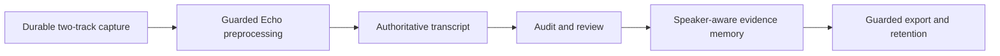
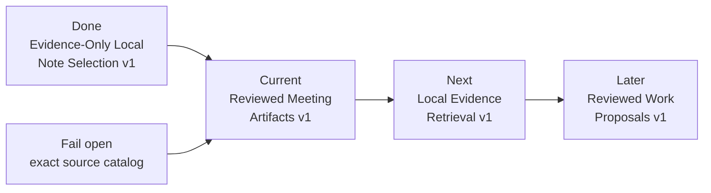

# MurmurMark CLI Roadmap

Updated: 2026-08-07

Это читаемое представление активного плана OpsKarta v3:

- `docs/roadmap/murmurmark-cli-roadmap.plan.yaml`

YAML владеет статусами и зависимостями. `docs/project/current-goal.md` раскрывает единственную
исполняемую цель. Подробности завершённых экспериментов сохранены в `docs/research/`,
`docs/testing/` и `docs/history/`; они не определяют текущий приоритет.

## Правила Планирования

- В работе находится ровно одна цель со статусом `current`.
- Завершённая гипотеза получает `PROMOTE` или `DO_NOT_PROMOTE`; оба исхода закрывают работу.
- Отрицательный результат не меняет обычный transcript, notes или export.
- Следующая продуктовая ступень обязана работать и после `PROMOTE`, и через точный fallback после
  `DO_NOT_PROMOTE`.
- UI, облако, запись во внешние системы и voice-only cross-session identity не держат CLI-путь.

## Миссия И North Star

MurmurMark превращает чувствительный рабочий созвон в локальную, достоверную и полезную память:
транскрипт, решения, действия, риски и вопросы, каждый из которых можно проверить по исходной
реплике.

Текущий продуктовый North Star:

```text
одна команда -> надёжная запись -> честный transcript -> короткие подтверждённые артефакты
             -> локальный поиск -> контролируемые рабочие предложения
```

Пред-ASR качество остаётся обязательным ограничением: подтверждённая речь `Me` должна сохраняться,
а распознаваемый authoritative remote не должен попадать в mic-ветку. Доступный предел
аудиообработки сейчас зафиксирован: Speaker-Preserving Neural Echo v2.17 является production
plateau, а более сильные локальные разделители не прошли presence/absence gates. Этот трек
открывается снова только при появлении независимого abstaining Target-Me presence evidence.

## Что Уже Работает


```mermaid
flowchart LR
    C["Durable two-track capture"]
    E["Guarded Echo preprocessing"]
    T["Authoritative transcript"]
    R["Audit and review"]
    M["Speaker-aware evidence memory"]
    X["Guarded export and retention"]

    C --> E --> T --> R --> M --> X
```

Поддерживаемый путь:

```text
murmurmark meeting -> первый Ctrl-C -> bounded authoritative lifecycle -> честный результат
```

Raw CAF и batch output authoritative. Live Shadow capture-safe, но advisory; его promotion
заблокирован доказательствами качества и времени выполнения.

Ключевые достигнутые границы:

| Область | Состояние | Доказанный результат |
|---|---|---|
| Capture и lifecycle | `done` | Durable запись, resume, один пользовательский запуск |
| Echo / Target-Me | `done` | v2.17: safe personalized plateau, exact fallback |
| Сильнее разделить mic | `done` | `DO_NOT_ADVANCE`: нет надёжного Target-Me presence gate |
| Transcript / handoff | `done` | Authoritative batch, Evidence Handoff v2, guarded export |
| Remote speakers | `done` | Anonymous map, rich transcript, explicit reviewed naming |
| Meeting memory | `done` | 726 exact statements на 6/6 frozen sessions |
| Свободный LLM-синтез | `done` | `DO_NOT_PROMOTE`: 69/142 claims отклонены verifier |
| ID-only отбор заметок | `done` | optional `PROMOTE`: 47 review candidates сокращены до 28 без нового текста |

## Актуальная Цепочка


```mermaid
flowchart LR
    S["Done<br/>Evidence-Only Local<br/>Note Selection v1"]
    A["Current<br/>Reviewed Meeting<br/>Artifacts v1"]
    F["Fail open<br/>exact source catalog"]
    Q["Next<br/>Local Evidence<br/>Retrieval v1"]
    W["Later<br/>Reviewed Work<br/>Proposals v1"]

    S --> A
    F --> A
    A --> Q --> W
```

### 1. Evidence-Only Local Note Selection v1 — `done`

Локальная модель может вернуть только известные statement IDs и порядок. Текст, speaker
provenance и utterance IDs копируются byte-for-byte из Reviewed Speaker-Aware Meeting Memory v1.
Frozen corpus завершён `PROMOTE_OPTIONAL_EVIDENCE_SELECTION`: 6/6 sessions, 47 review-marked
candidates сокращены до 28, category/speaker coverage `1.0/0.8`, generated published claims `0`.
Unknown/stale/malformed output возвращает exact extractive fallback. Обычные notes/export этот
тяжёлый opt-in слой не используют.

В frozen corpus не было baseline high-confidence artifacts, поэтому retention `1.0` вакуумен и не
разрешает автоматически удалять такие пункты в будущем.

### 2. Reviewed Meeting Artifacts v1 — `current`

Decisions, actions, risks и open questions превращаются в короткую fingerprint-bound очередь:
`confirmed`, `rejected`, `unresolved`. Promoted selector используется только через валидный handoff;
иначе используется deterministic exact source catalog. Подтверждение не переписывает текст и
всегда хранит evidence IDs. `unresolved` никогда не показывается как принятое обязательство.

Результат: MurmurMark отличает найденный кандидатом пункт от реально принятого обязательства.

### 3. Local Evidence Retrieval v1 — `next`

Локальный индекс ищет по сессиям, utterances и подтверждённым артефактам. Каждый результат содержит
точную цитату и provenance; stale fingerprint инвалидирует индекс. Retention учитывается явно.
Слой не генерирует ответы и не выводит личность по голосу между встречами.

Результат: накопленный корпус становится рабочей памятью, а не коллекцией отдельных Markdown.

### 4. Reviewed Work Proposals v1 — `later`

Подтверждённые артефакты материализуются в локальные Markdown/Obsidian/docs/issue proposal bundles
с provenance и diff. Автоматических внешних записей нет. Jira, docs repository или иной provider
потребует отдельного явного review и собственного integration gate.

Результат: путь от созвона до готового рабочего изменения завершён без скрытой публикации.

## Параллельные И Закрытые Треки

- Пред-ASR разделение закрыто на текущем ресурсе; открыть его может только новая независимая
  проверка присутствия Target-Me, а не ещё один separator поверх тех же данных.
- Free-text local synthesis закрыт; повтор возможен лишь с новым runtime/model и сравнением против
  более безопасного ID-only результата.
- ID-only selector завершён и остаётся opt-in; его не следует переносить в критический путь из-за
  расхода памяти и отсутствия high-confidence population в frozen corpus.
- Live promotion заблокирован; Live Shadow остаётся диагностическим черновиком.
- Cross-session participant identity, cloud и автоматические external writes требуют отдельных
  privacy и safety решений.
- UI/Menu Bar остаётся optional tail после зрелого CLI.

## Ворота Продвижения

Каждая гипотеза замораживает inputs, работает в отдельном профиле, проверяет deterministic replay,
referential integrity, fallback и ordinary-output non-regression. `PROMOTE` открывает только явно
ограниченную дополнительную поверхность. `DO_NOT_PROMOTE` фиксирует предел и оставляет production
неизменным.

## Проверка Плана

```bash
scripts/check-planning-consistency.py
PYTHONPATH=../opskarta .venv/bin/python -m specs.v3.tools.cli validate docs/roadmap/murmurmark-cli-roadmap.plan.yaml
PYTHONPATH=../opskarta .venv/bin/python -m specs.v3.tools.cli render tree docs/roadmap/murmurmark-cli-roadmap.plan.yaml
PYTHONPATH=../opskarta .venv/bin/python -m specs.v3.tools.cli render executive docs/roadmap/murmurmark-cli-roadmap.plan.yaml --view exec-top
```
