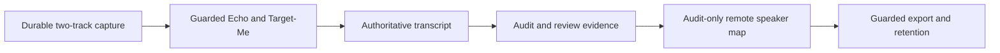
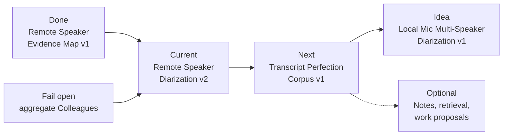

# MurmurMark CLI Roadmap

Updated: 2026-08-07

Это читаемое представление активного плана OpsKarta v3:

- `docs/roadmap/murmurmark-cli-roadmap.plan.yaml`

YAML владеет статусами и зависимостями. `docs/project/current-goal.md` раскрывает единственную
исполняемую цель. Завершённые эксперименты остаются в `docs/research/`, `docs/testing/` и
`docs/history/`, но не определяют текущий приоритет.

## Правила Планирования

- В работе находится ровно одна цель со статусом `current`.
- Основной путь заканчивается надёжной speaker-resolved транскрибацией, а не производными заметками.
- Завершённая гипотеза получает `PROMOTE` или `DO_NOT_PROMOTE`; оба исхода закрывают работу.
- Неуверенное слово, роль или speaker attribution остаётся явным `unknown`/review item.
- Отрицательный эксперимент не ослабляет выбранный transcript и всегда имеет точный fallback.
- Имена не выводятся по голосу. Разрешены только session-local anonymous IDs и явные review labels.
- UI, облако, суммаризация и запись во внешние системы не держат критический CLI-путь.

## Миссия И North Star

MurmurMark создаёт локальную, надёжную и проверяемую транскрибацию созвона с любым числом
участников. Он сохраняет слова, порядок, время и роли, различает участников remote-потока по голосу
внутри сессии и явно показывает предел доказательств. Если в будущем у одного ноутбука участвуют
несколько людей, тот же принцип должен быть расширен на mic-поток отдельным квалифицированным слоем.

```text
одна команда
  -> durable mic + remote
  -> защищённая Me-речь и чистый вход ASR
  -> точные слова, порядок и роли
  -> remote words по session-local speakers либо unknown
  -> проверяемый speaker-resolved transcript
```

Заметки, суммаризации, поиск и рабочие предложения полезны, но легко производятся из хорошей
транскрибации. Они остаются необязательными и не конкурируют за ресурсы с её качеством.

## Что Уже Работает


```mermaid
flowchart LR
    C["Durable two-track capture"]
    E["Guarded Echo and Target-Me"]
    T["Authoritative transcript"]
    A["Audit and review evidence"]
    S["Audit-only remote speaker map"]
    X["Guarded export and retention"]

    C --> E --> T --> A --> S --> X
```

Поддерживаемый путь:

```text
murmurmark meeting -> первый Ctrl-C -> bounded authoritative lifecycle -> честный результат
```

Raw CAF и batch output authoritative. Live Shadow capture-safe, но advisory; он не выбирает
финальный текст или speaker attribution.

| Область | Состояние | Доказанный результат |
|---|---|---|
| Capture и lifecycle | `done` | Durable запись, resume, один пользовательский запуск |
| Echo / Target-Me | `done` | v2.17: safe personalized plateau, exact fallback |
| Сильнее разделить mic | `done` | `DO_NOT_ADVANCE`: нет надёжного Target-Me presence gate |
| Transcript / handoff | `done` | Authoritative batch, Evidence Handoff v2, guarded export |
| Remote speaker evidence | `done` | B-cubed F1 `0.913884` на attributed части, coverage `50.3892%` |
| Anonymous rich view | `done` | Exact optional handoff и explicit session-local naming |
| Производные заметки | `done/optional` | Exact evidence memory и безопасный ID-only selector доступны |

## Актуальная Цепочка


```mermaid
flowchart LR
    B["Done<br/>Remote Speaker<br/>Evidence Map v1"]
    D["Current<br/>Remote Speaker<br/>Diarization v2"]
    F["Fail open<br/>aggregate Colleagues"]
    P["Next<br/>Transcript Perfection<br/>Corpus v1"]
    M["Idea<br/>Local Mic Multi-Speaker<br/>Diarization v1"]
    O["Optional<br/>Notes, retrieval,<br/>work proposals"]

    B --> D
    F --> D
    D --> P --> M
    P -.-> O
```

### 1. Remote Speaker Evidence Map v1 — `done`

Selected remote utterances и local Resemblyzer дали 14 устойчивых anonymous clusters на шести
сессиях. На уже attributed речи качество высокое, но 606 из 1235 remote utterances остаются
aggregate `Colleagues`; internal speaker changes не разделяются. Решение `PROMOTE_AUDIT_ONLY`
доказывает осуществимость и одновременно фиксирует текущий пробел.

### 2. Remote Speaker Diarization v2 — `done`

Word/frame-level diarization работает по authoritative remote audio, обнаруживает смену говорящего
внутри ASR-реплики и связывает каждое remote word с session-local speaker или `unknown`. Решение
`PROMOTE`: coverage `0.919071`, attributed-only B-cubed F1 `0.960690`, pairwise precision
`0.959564`, 5/5 boundary cases и zero selected-word loss/duplication.

Результат: speaker-resolved read surface, который можно продвинуть только после corpus-wide
`PROMOTE`; иначе остаётся воспроизводимый предел и прежний transcript.

### 3. Transcript Perfection Corpus v1 — `current`

Единый корпус связывает проверку текста, порядка, ролей, speaker turns, overlap, missing `Me`,
remote leakage, наушников, динамиков и шумного офиса. Для каждого известного дефекта есть reference,
метрика и regression gate. Следующая инженерная цель всегда выбирается по крупнейшему измеренному
остатку, а не по последней случайной сессии.

Результат: конечный критерий сходимости к идеальной транскрибации и защита от бесконечной цепочки
локальных эвристик.

### 4. Local Mic Multi-Speaker Diarization v1 — `idea`

Когда появится реальный сценарий нескольких людей у одного ноутбука и размеченный материал, mic-речь
будет разделяться на Target-Me, other local speakers и `unknown`. Этот этап зависит от remote v2 и
Transcript Perfection Corpus, но не нужен для нынешнего основного сценария одного пользователя.

### 5. Производные Возможности — `optional`

Extractive notes, quality verdict, reviewed speaker memory, ID-only selection, локальный поиск и
work proposals могут развиваться после достижения transcript gates или по отдельному явному запросу.
Они не являются мерой качества MurmurMark и не могут менять источник транскрибации.

## Закрытые И Отложенные Треки

- Пред-ASR разделение закрыто на текущем ресурсе; открыть его может новая независимая проверка
  присутствия Target-Me, а не ещё один separator поверх тех же данных.
- Free-text local synthesis закрыт `DO_NOT_PROMOTE`; ID-only selector остаётся opt-in.
- Cross-session voice identity запрещена без отдельного privacy contract. Имена только из review.
- Live promotion заблокирован; Live Shadow остаётся диагностическим черновиком.
- Cloud, автоматические внешние записи и UI остаются необязательным хвостом.

## Ворота Продвижения

Каждая гипотеза замораживает inputs, работает в отдельном профиле и проверяет deterministic replay,
referential integrity, fallback, word conservation и ordinary-output non-regression. Coverage нельзя
повышать ценой ложной уверенности: слабые интервалы остаются `unknown`.

## Проверка Плана

```bash
scripts/check-planning-consistency.py
PYTHONPATH=../opskarta .venv/bin/python -m specs.v3.tools.cli validate docs/roadmap/murmurmark-cli-roadmap.plan.yaml
PYTHONPATH=../opskarta .venv/bin/python -m specs.v3.tools.cli render tree docs/roadmap/murmurmark-cli-roadmap.plan.yaml
PYTHONPATH=../opskarta .venv/bin/python -m specs.v3.tools.cli render executive docs/roadmap/murmurmark-cli-roadmap.plan.yaml --view exec-top
```
