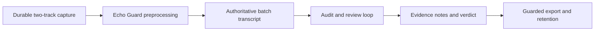
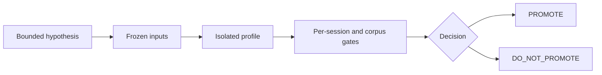

# MurmurMark CLI Roadmap

Updated: 2026-08-05

This is the readable view of the active OpsKarta v3 plan:

- `docs/roadmap/murmurmark-cli-roadmap.plan.yaml`

The YAML plan owns statuses and dependencies. `docs/project/current-goal.md` expands the one
executable goal. Historical experiment detail is preserved under `docs/history/` and does not
redefine current priorities.

## Planning Rules

- `done`: implemented and evidenced capability;
- `current`: work being executed now;
- `next`: unlocked goal that follows the current one;
- `later`: dependent stage whose prerequisites are not complete;
- `idea`: research hypothesis outside the committed path;
- `optional`: useful but nonessential capability;
- `blocked`: work with an explicit unsatisfied gate.

Evergreen capabilities such as corpus regression are `done`, not permanently `current`. A completed
experiment ends in `PROMOTE` or `DO_NOT_PROMOTE`; either outcome closes its hypothesis.

## What Works Now


```mermaid
flowchart LR
    C["Durable two-track capture"]
    E["Echo Guard preprocessing"]
    T["Authoritative batch transcript"]
    R["Audit and review loop"]
    N["Evidence notes and verdict"]
    X["Guarded export and retention"]

    C --> E --> T --> R --> N --> X
```

The supported product path is:

```text
murmurmark meeting -> first Ctrl-C -> bounded authoritative lifecycle -> honest result
```

Raw CAF files and batch output are authoritative. Committed-PCM Live Shadow is capture-safe and
advisory; its promotion remains blocked by quality and runtime evidence.

Successful guarded export now has a thin-session retention path: raw CAF and structured evidence
remain, while rebuildable media below `derived/` can be removed through
`retention compact plan|apply|verify`. Ordinary `meeting`/`finish` runs compact automatically;
`--keep-debug-artifacts` preserves the full diagnostic workspace.

## Current Goal

**Authoritative Incremental ASR v1** is current. It targets the remaining cold first-pass latency
without changing whisper.cpp or promoting provisional live text. A chunk may enter authoritative
replay only when canonical PCM, window, model, prompt and decode identities match exactly.

Its prerequisites are complete: One-Command Meeting Lifecycle owns the unattended product path;
Speaker-Preserving Neural Echo v2 remains the guarded pre-ASR profile; Evidence Notes And Export v2
passes the 110-session integrity/replay gate; Release-quality CLI provides deterministic archives,
transactional install/upgrade and packaged offline acceptance.

## Critical Path


```mermaid
flowchart LR
    P["Done<br/>Me Completion v2"]
    L["Done<br/>One-Command Lifecycle"]
    A["Done<br/>Mixed-Utterance Separation"]
    B["Done<br/>Echo Suppression Promotion v1"]
    N["Done<br/>Neural Residual Echo v1"]
    S["Done: DO_NOT_TRAIN<br/>Speaker-Preserving<br/>Adaptation Corpus v1"]
    C["Done: READY<br/>Controlled Echo<br/>Supervision Lab v1"]
    E["Done: PROMOTE<br/>Speaker-Preserving<br/>Neural Echo v2"]
    X["Done: DO_NOT_PROMOTE<br/>Reference-Conditioned<br/>Target-Me Separation v1"]
    I["Done: READY<br/>Target-Me Identifiability<br/>Corpus v1"]
    V["Done: DO_NOT_PROMOTE<br/>Reference-Conditioned<br/>Target-Me Separation v2"]
    H["Done<br/>Evidence Notes And Export v2"]
    D["Done<br/>Release-quality CLI"]
    F["Done<br/>Reliable Final<br/>Handoff v1"]
    G["Current<br/>Authoritative<br/>Incremental ASR v1"]
    R["Next<br/>Remote Speaker<br/>Evidence Map v1"]

    P --> L --> A --> B --> N --> S --> C --> E --> X --> I --> V --> H --> D --> F --> G --> R
```

### 0. Evidence-Backed Me Completion v2

Completed with a scoped `PROMOTE`. Independent mic ASR, word timestamps, speaker state, calibrated
Target-Me and remote-forbidden evidence may materialize bounded local speech. Weak or conflicting
evidence stays unchanged and reviewable. Auto-selection requires exact frozen-input and output
fingerprints plus corpus membership.

### 1. One-Command Meeting Lifecycle

Completed. One command now runs durable capture and plain authoritative processing, applies only
allowlisted enrichment and suggested-review actions, guards export from structured outcome state,
verifies raw SHA-256 identities, isolates capture from post-processing in a short-lived process and
supports lock-safe resume after a second `Ctrl-C`.

### 2. Mixed-Utterance Remote Span Separation

Completed with `DO_NOT_PROMOTE`. Clean/raw/role-masked word timestamps, authoritative remote timing,
speaker state and Target-Me evidence were sufficient to identify suspicious remote-supported spans,
but not to prove safe local prefixes or tails. The isolated profile remains audit evidence and is
never selected automatically.

### 3. Echo Suppression Promotion

Completed with `DO_NOT_PROMOTE`. The exact role-aware `local_fir` baseline, signed delay contract,
candidate matrix, bounded ASR probes and policy are reproducible. Coverage passed `3/5` applicable
speaker sessions; the failed protected-local and chronology gates keep production on `local_fir`.

### 4. Neural Residual Echo Suppression v1

Completed with deterministic `DO_NOT_PROMOTE`. The model-neutral adapter, pinned DEC and AECMOS
models, exact-duration inference, fail-open checks and frozen corpus are reproducible. The candidate
removed bounded remote-risk but failed protected-word, chronology, double-talk and runtime gates.
Production output was never changed.

### 5. Speaker-Preserving Echo Adaptation Corpus v1

Completed with reproducible `DO_NOT_TRAIN`. Provenance, session-disjoint train/dev/hard-test splits,
immutable counterexamples, privacy checks and byte-stable replay are available. The frozen corpus
has enough local-only targets, but no remote-only examples pass the independent confidence gate;
synthetic pairing is therefore forbidden. No training was run and production remained unchanged.

### 6. Controlled Echo Supervision Lab v1

Done with `READY_FOR_ADAPTATION`. The durable recorder ran a frozen phase schedule across five
train, one dev and one controlled hard-test speaker-mode sessions. Accept measured echo and local
targets only when schedule, signal, local ASR and Target-Me evidence agree. Build synthetic mixtures
inside a split, preserve existing real counterexamples as hard-test only, and issue a deterministic
adaptation decision. Final replay is `1465/1465`: train has `620s` local, `640s` remote and `1804s`
synthetic; dev has `124s` local, `128s` remote and `352s` synthetic; hard-test has `68s` measured
double-talk. Local-FIR residual Target-Me removes raw echo false positives while retaining their
diagnostic evidence. No gate failed. The lab itself did not alter production; the separately gated
v2.16 corpus later promoted the personalized hybrid.

### 7. Speaker-Preserving Neural Echo v2

Completed with guarded `PROMOTE`. Small residual-mask, complex-spectral, echo-mapper and pretrained
DEC candidates established the local-preservation ceiling. The winning hybrid uses controlled
Target-Me enrollment, WavLM/Resemblyzer, authoritative remote evidence, bounded attenuation and
direct whisper.cpp checks with per-window rollback. The immutable hard test proved fail-open safety;
the sealed corpus proved utility. Candidate publication is transactional and every incompatibility,
headphones session or regression restores the exact `local_fir` fallback.

### 8. Reference-Conditioned Target-Me Separation v1

Completed with fingerprinted `DO_NOT_PROMOTE`. All `1456` controlled artifacts, the train/dev
oracle and bounded overfit passed. Two deterministic candidates then passed seven of nine locked
dev gates; the best reached `11.470 dB` Target-Me SNR and `7.788 dB` echo SNR against `12/8 dB`
requirements. The corpus had no independently labelled non-target local speech and only one fixed
Target-Me enrollment, so correct `other_local speech` attribution was unidentifiable. Hard-test and
the sealed twelve-session corpus stayed unopened. Production v2 remained byte-exact.

### 9. Target-Me Identifiability Corpus v1

Completed with `READY_FOR_TARGET_CONDITIONED_TRAINING`. The private deterministic publication has
known Target-Me, remote echo, non-target local speech and local noise stems. Every speaker-bearing
mixture has paired correct/wrong enrollment queries over identical bytes. Split-local Target-Me
sources and enrollment audio never cross train/dev/hard; all non-target identities are fully
speaker-disjoint. Exact source replay, privacy/licensing checks and byte-level publication
verification pass. No model was trained and production remained byte-exact.

### 10. Reference-Conditioned Target-Me Separation v2

Completed with fingerprinted `DO_NOT_PROMOTE`. The v1 baseline replayed exactly. One frozen
FiLM+GRU paired-query candidate was trained three times with identical checkpoint, model-state and
report fingerprints. It learned query adherence (`4.991 dB` correct-vs-wrong margin, `0%`
collapse), but missed Target-Me, non-target and absent-query dev gates. Hard-test and sealed meeting
targets remained unopened, and production audio stayed byte-exact.

### 11. Evidence Notes And Export v2

Completed. `murmurmark.handoff_manifest/v2` and `murmurmark.handoff_evidence/v2` bind input schemas,
paths, SHA-256 values, selected profile, verdict, review burden and evidence IDs. Publication is
transactional and deterministic. Export consumes only a current `ready` or verified `no_speech`
handoff; `--force` cannot bypass review or integrity gates. The 110-session corpus passes with
`110/110` valid manifests and zero referential-integrity, stale or replay failures.

### 12. Release-quality CLI

Completed. The versioned archive has a complete SHA-256 inventory, compatibility and license
contracts, deterministic assembly and transactional install/upgrade with rollback. Packaged offline
acceptance covers strict doctor, self-test, Evidence Handoff v2 and guarded export while preserving
the external workspace and existing fingerprints.

### 13. Reliable Final Handoff v1

Completed. The first handoff excludes optional heavy candidates, enrichment has a recorded budget,
safe review uses fresh evidence, interruption has exact resume, and terminal review is a bounded
decision list. The frozen cache/resume verification passes `3/3` with p90 ratio `0.059041`, no dead
ends or stale handoffs, and exact candidate-window ASR reuse on `2/2` applicable sessions. Cold
first-pass ASR remains a separately measured ceiling.

### 14. Authoritative Incremental ASR v1

Current. Freeze cold/cache/live-origin timing separately, define a complete canonical ASR chunk
identity and reuse only byte-identical completed chunks from durable capture or interrupted runs.
Fallback batch output, quality gates and raw CAF remain unchanged. The result must be a measured
`PROMOTE` or `DO_NOT_PROMOTE`, never an approximate text cache.

### 15. Remote Speaker Evidence Map v1

Next. Split the authoritative remote track into stable anonymous speaker intervals, publish a
shadow rich transcript with full provenance and make a corpus-wide decision. The stage does not
invent names, rewrite transcript text or change Evidence Handoff v2 and guarded export.

## Dependent And Parallel Research


```mermaid
flowchart LR
    Q["Controlled supervision decision"]
    E["Speaker-Preserving Neural Echo v2"]
    X["Reference-conditioned Target-Me separation v1"]
    I["Target-Me identifiability corpus"]
    C["Reference-conditioned Target-Me separation v2"]
    R["Release-quality CLI"]
    F["Reliable Final Handoff v1"]
    A["Authoritative Incremental ASR v1"]
    D["Remote Speaker Evidence Map v1"]
    S["Speaker map"]
    T["transcript.rich.json"]
    V["Heavy local validators"]
    L["Evidence-guarded LLM"]

    Q --> E --> X --> I --> C --> R --> F --> A --> D
    D --> S --> T --> L
    Q -.-> V
```

Speaker-Preserving Neural Echo v2 remains production. Both Reference-Conditioned Target-Me
Separation experiments are complete with `DO_NOT_PROMOTE`; v2 showed that paired enrollment is
identifiable but the small scratch-trained separator is below the waveform-quality ceiling.
Evidence Notes And Export v2, Release-quality CLI and Reliable Final Handoff v1 are complete.
Authoritative Incremental ASR v1 is current; Remote Speaker Evidence Map v1 follows it.

Remote diarization works on authoritative `remote` and does not require complete Echo suppression.
Its next stage produces anonymous stable speaker IDs and an audit-only rich transcript. Naming,
cross-session speaker mapping and authoritative rich transcript promotion remain later gates.

Heavy local models begin as bounded validators. They do not replace the primary ASR without their
own corpus gates.

## Parking Lot

- Live result promotion: blocked by reproducible `DO_NOT_PROMOTE` evidence;
- docs and issue-tracker proposals: optional and reviewed before external writes;
- UI/Menu Bar: optional after release-quality CLI.

These branches do not block the critical path.

## Promotion Gate


```mermaid
flowchart LR
    H["Bounded hypothesis"]
    I["Frozen inputs"]
    P["Isolated profile"]
    G["Per-session and corpus gates"]
    D{"Decision"}
    Y["PROMOTE"]
    N["DO_NOT_PROMOTE"]

    H --> I --> P --> G --> D
    D --> Y
    D --> N
```

No candidate may mutate raw capture or silently replace the selected profile. A negative result must
record the evidence ceiling and leave the authoritative output unchanged.

## Validation

```bash
scripts/check-planning-consistency.py

PYTHONPATH=../opskarta .venv/bin/python -m specs.v3.tools.cli \
  validate docs/roadmap/murmurmark-cli-roadmap.plan.yaml

PYTHONPATH=../opskarta .venv/bin/python -m specs.v3.tools.cli \
  render tree docs/roadmap/murmurmark-cli-roadmap.plan.yaml

PYTHONPATH=../opskarta .venv/bin/python -m specs.v3.tools.cli \
  render executive docs/roadmap/murmurmark-cli-roadmap.plan.yaml --view exec-top
```

Detailed planning and experiment history through 2026-07-19 is archived in
`docs/history/README.md`.
