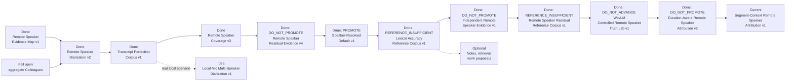

# MurmurMark CLI Roadmap

Updated: 2026-08-08

Это читаемое представление активного плана OpsKarta v3:

- `docs/roadmap/murmurmark-cli-roadmap.plan.yaml`

YAML владеет статусами и зависимостями. `docs/project/current-goal.md` раскрывает единственную
исполняемую цель. Завершённые эксперименты остаются в `docs/research/`, `docs/testing/` и
`docs/history/`, но не определяют текущий приоритет.

## Правила Планирования

- В работе находится ровно одна цель со статусом `current`.
- Основной путь заканчивается надёжной speaker-resolved транскрибацией, а не производными заметками.
- Завершённая гипотеза получает `PROMOTE` или `DO_NOT_PROMOTE`; оба исхода закрывают работу.
- Неуверенное слово, роль или speaker attribution остаётся явным `unknown`/review item.
- Отрицательный эксперимент не ослабляет выбранный transcript и всегда имеет точный fallback.
- Имена не выводятся по голосу. Разрешены только session-local anonymous IDs и явные review labels.
- UI, облако, суммаризация и запись во внешние системы не держат критический CLI-путь.

## Миссия И North Star

MurmurMark создаёт локальную, надёжную и проверяемую транскрибацию созвона с любым числом
участников. Он сохраняет слова, порядок, время и роли, различает участников remote-потока по голосу
внутри сессии и явно показывает предел доказательств. Если в будущем у одного ноутбука участвуют
несколько людей, тот же принцип должен быть расширен на mic-поток отдельным квалифицированным слоем.

```text
одна команда
  -> durable mic + remote
  -> защищённая Me-речь и чистый вход ASR
  -> точные слова, порядок и роли
  -> remote words по session-local speakers либо unknown
  -> проверяемый speaker-resolved transcript
```

Заметки, суммаризации, поиск и рабочие предложения полезны, но легко производятся из хорошей
транскрибации. Они остаются необязательными и не конкурируют за ресурсы с её качеством.

## Что Уже Работает


```mermaid
flowchart LR
    C["Durable two-track capture"]
    E["Guarded Echo and Target-Me"]
    T["Authoritative transcript"]
    A["Audit and review evidence"]
    S["Promoted remote speaker diarization"]
    X["Guarded export and retention"]

    C --> E --> T --> A --> S --> X
```

Поддерживаемый путь:

```text
murmurmark meeting -> первый Ctrl-C -> bounded authoritative lifecycle -> честный результат
```

Raw CAF и batch output authoritative. Live Shadow capture-safe, но advisory; он не выбирает
финальный текст или speaker attribution.

| Область | Состояние | Доказанный результат |
|---|---|---|
| Capture и lifecycle | `done` | Durable запись, resume, один пользовательский запуск |
| Echo / Target-Me | `done` | v2.17: safe personalized plateau, exact fallback |
| Сильнее разделить mic | `done` | `DO_NOT_ADVANCE`: нет надёжного Target-Me presence gate |
| Transcript / handoff | `done` | Authoritative batch, Evidence Handoff v2, guarded export |
| Remote speaker evidence v1 | `done` | B-cubed F1 `0.913884` на attributed части, coverage `50.3892%` |
| Remote speaker diarization v2 | `done` | Coverage `91.9071%`, B-cubed F1 `0.960690`, exact words |
| Remote speaker coverage v3 | `done` | Coverage `93.9312%`, B-cubed F1 `0.962171`, exact v2 labels |
| Remote speaker residual v4 | `done` | `DO_NOT_PROMOTE`: safe ceiling `14.57%` words / `13.98%` seconds |
| Speaker-resolved default | `done` | 6/6 sessions, 14 expected speakers, exact aggregate fallback |
| Lexical correctness | `done/blocker` | Exact 67-word subset WER/CER `0`; real meetings lack human truth |
| Independent remote speaker evidence | `done` | `DO_NOT_PROMOTE`: 53 words / `23.357s`, no direct candidate truth |
| Residual speaker reference | `done/blocker` | 278 blind items; `REFERENCE_INSUFFICIENT`, direct truth 0/53 |
| Controlled speaker truth lab | `done` | Coverage v3 control qualified; WavLM candidate `DO_NOT_ADVANCE` |
| Duration-aware speaker attribution | `done` | `DO_NOT_PROMOTE`: precision `1.0`, known recall `55.14%`, boundaries `9/28` |
| Segment-context speaker attribution | `current` | Long-span identity evidence on a new untouched hard-v3 |
| Производные заметки | `done/optional` | Exact evidence memory и безопасный ID-only selector доступны |

## Актуальная Цепочка


```mermaid
flowchart LR
    B["Done<br/>Remote Speaker<br/>Evidence Map v1"]
    D["Done<br/>Remote Speaker<br/>Diarization v2"]
    F["Fail open<br/>aggregate Colleagues"]
    P["Done<br/>Transcript Perfection<br/>Corpus v1"]
    R["Done<br/>Remote Speaker<br/>Coverage v3"]
    V["Done: DO_NOT_PROMOTE<br/>Remote Speaker<br/>Residual Evidence v4"]
    H["Done: PROMOTE<br/>Speaker-Resolved<br/>Default v1"]
    L["Done: REFERENCE_INSUFFICIENT<br/>Lexical Accuracy<br/>Reference Corpus v1"]
    I["Done: DO_NOT_PROMOTE<br/>Independent Remote<br/>Speaker Evidence v1"]
    C["Done: REFERENCE_INSUFFICIENT<br/>Remote Speaker Residual<br/>Reference Corpus v1"]
    Q["Done: DO_NOT_ADVANCE WavLM<br/>Controlled Remote Speaker<br/>Truth Lab v1"]
    A["Done: DO_NOT_PROMOTE<br/>Duration-Aware Remote Speaker<br/>Attribution v2"]
    S["Current<br/>Segment-Context Remote Speaker<br/>Attribution v1"]
    M["Idea<br/>Local Mic Multi-Speaker<br/>Diarization v1"]
    O["Optional<br/>Notes, retrieval,<br/>work proposals"]

    B --> D --> P --> R --> V --> H --> L --> I --> C --> Q --> A --> S
    F --> D
    P -. "real local scenario" .-> M
    L -.-> O
```

### 1. Remote Speaker Evidence Map v1 — `done`

Selected remote utterances и local Resemblyzer дали 14 устойчивых anonymous clusters на шести
сессиях. На уже attributed речи качество высокое, но 606 из 1235 remote utterances остаются
aggregate `Colleagues`; internal speaker changes не разделяются. Решение `PROMOTE_AUDIT_ONLY`
доказывает осуществимость и одновременно фиксирует текущий пробел.

### 2. Remote Speaker Diarization v2 — `done`

Word/frame-level diarization работает по authoritative remote audio, обнаруживает смену говорящего
внутри ASR-реплики и связывает каждое remote word с session-local speaker или `unknown`. Решение
`PROMOTE`: coverage `0.919071`, attributed-only B-cubed F1 `0.960690`, pairwise precision
`0.959564`, 5/5 boundary cases и zero selected-word loss/duplication.

Результат этапа v2: promoted optional speaker-resolved read surface. Отдельная продуктовая
квалификация default была выполнена позже и не меняла v2 words или labels.

### 3. Transcript Perfection Corpus v1 — `done`

Единый корпус связывает проверку текста, порядка, ролей, speaker turns, overlap, missing `Me`,
remote leakage и acoustic modes. Baseline `BASELINE_ESTABLISHED`: 16/16 frozen sources verified,
восемь явных dimensions, exact lexical subset измерен, real meetings остаются
reference-insufficient, aggregate score запрещён.

Результат: конечный критерий сходимости к идеальной транскрибации и защита от бесконечной цепочки
локальных эвристик.

### 4. Remote Speaker Coverage v3 — `done`

V3 применил единогласные rejected-frame evidence к unknown-словам, не меняя существующие speaker
labels. `PROMOTE`: восстановлено 368 слов / `199.533s`; coverage вырос с `91.9071%` до `93.9312%`,
B-cubed F1 до `0.962171`, pairwise precision до `0.961675`.

Результат: unknown words снижены на `30.1887%`, seconds на `25.0113%`; words, timestamps, v2 labels,
aggregate fallback и все Transcript Perfection gates остались точными.

### 5. Remote Speaker Residual Evidence v4 — `done`

V4 проверил speech-aware bounded окна и независимые половины enrollment, не ослабляя thresholds v3.
Восстановлено 124 words / `83.640s`; reductions `14.5711%` words и `13.9811%` seconds не достигли
порогов `20%`. B-cubed F1 `0.962171`, pairwise precision `0.961675`, conservation и boundaries
остались точными.

Результат: воспроизводимый `DO_NOT_PROMOTE`. Promoted v3 остаётся поддерживаемым источником, а
727 words / `514.599s` сохраняют честный aggregate fallback. Повторять тот же speaker backend с
пониженными порогами не нужно.

### 6. Speaker-Resolved Transcript Default v1 — `done`

Обычный CLI read surface, meeting handoff и guarded export выбирают promoted v3 на совместимых
сессиях. Слабая, отсутствующая или stale evidence возвращает exact aggregate
`Colleagues`; неподдержанные v3 words остаются aggregate внутри speaker-resolved результата.
Voice-only имена и cross-session identity запрещены.

Результат: `PROMOTE` на 6/6 sessions, две 1x1, четыре group, 14 expected speakers и 5/5 boundary
cases. Words, roles, `Me`, timestamps, raw и deterministic replay сохранены.

### 7. Lexical Accuracy Reference Corpus v1 — `done`

Private graded corpus отделил exact generated truth, scripted expected evidence и independent
machine references. Точный цифровой поднабор содержит 67 слов при WER/CER `0`; weak sources не
могут считаться truth. Реальная лексическая точность закрыта `REFERENCE_INSUFFICIENT`: нет ни одной
human-reviewed встречи.

### 8. Independent Remote Speaker Evidence v1 — `done`

Pinned local WavLM XVector проверен на frozen six-session Coverage v3 corpus и `598.240s` unknown
remote speech. Он восстановил 53 слова / `23.357s`: `6.2280%` words и `3.9043%` seconds при gates
`20%`. B-cubed F1 `0.962171`, pairwise precision `0.961675`, 5/5 boundaries и exact fallback
сохранены. Ни одно из пяти новых решений в reference session не покрыто прямой truth-меткой.

Результат: воспроизводимый `DO_NOT_PROMOTE`. Повторять WavLM с более мягкими порогами нельзя.

### 9. Remote Speaker Residual Reference Corpus v1 — `done`

Private blind pack покрывает все 851 residual words / `598.240s` в 278 items и отдельно все 53 WavLM
proposals / `23.357s`. Prediction запечатан отдельно; public artifacts не содержат речь, имена и
absolute paths. Все structural, privacy, conservation и replay gates проходят.

Результат: `REFERENCE_INSUFFICIENT`, потому что reviewed items и direct proposal truth остаются 0.
Точная приватная очередь сохранена; Coverage v3 и ordinary transcript не изменены.

### 10. Controlled Remote Speaker Truth Lab v1 — `done`

Локальная лаборатория заморозила 8 disjoint sessions, 6 anonymous voices и 240 exact words. Source
stems восстанавливают mixtures с ошибкой 0 PCM samples; hard содержит short turns, internal changes,
overlap, rare speaker и отдельный unseen open-set voice.

Coverage v3 control квалифицирован: B-cubed F1 `0.983505`, pairwise precision `1.0`, boundaries
`16/16`, open-set errors `0`. WavLM word-matched candidate получил `0.834325`, `0.950920`, `10/16`
и две false attributions. Итог: `DO_NOT_ADVANCE` для кандидата, deterministic replay и неизменный
production. Synthetic truth не заменяет blind review реальных 53 proposals.

### 11. Duration-Aware Remote Speaker Attribution v2 — `done`

До topology work заморожен новый hard-v2: 4 scenarios, 125 words, 4 enrolled и 2 unseen open-set
voices, отдельный enrollment и exact stems/truth. Три заявленных candidate выбирались только на v1
development; hard-v2 был открыт один раз после candidate freeze.

Conservative fusion сохранил pairwise precision `1.0`, zero open-set false attribution и превзошёл
Coverage v3 control, но получил hard B-cubed `0.499381`, known recall `0.551402`, boundaries `9/28`.
Итог: `DO_NOT_PROMOTE_TOPOLOGY`; production не изменён.

### 12. Segment-Context Remote Speaker Attribution v1 — `current`

Новый hard-v3 замораживается до алгоритма. Truth Lab v1 и hard-v2 становятся development evidence.
Кандидаты независимо находят silence/embedding change points, получают identity evidence на длинных
homogeneous spans и только затем проецируют anonymous ID на слова. Short unsupported, overlap,
open-set и конфликтующие spans остаются `unknown`/`mixed`.

### 13. Local Mic Multi-Speaker Diarization v1 — `idea`

Когда появится реальный сценарий нескольких людей у одного ноутбука и размеченный материал, mic-речь
будет разделяться на Target-Me, other local speakers и `unknown`. Этот этап зависит от remote v2 и
Transcript Perfection Corpus, но не нужен для нынешнего основного сценария одного пользователя.

### 14. Производные Возможности — `optional`

Extractive notes, quality verdict, reviewed speaker memory, ID-only selection, локальный поиск и
work proposals могут развиваться после достижения transcript gates или по отдельному явному запросу.
Они не являются мерой качества MurmurMark и не могут менять источник транскрибации.

## Закрытые И Отложенные Треки

- Human-Reviewed Lexical Seed заблокирован отсутствием проверенного реального reference; machine
  disagreement не является заменой.
- Пред-ASR разделение закрыто на текущем ресурсе; открыть его может новая независимая проверка
  присутствия Target-Me, а не ещё один separator поверх тех же данных.
- Free-text local synthesis закрыт `DO_NOT_PROMOTE`; ID-only selector остаётся opt-in.
- Cross-session voice identity запрещена без отдельного privacy contract. Имена только из review.
- Live promotion заблокирован; Live Shadow остаётся диагностическим черновиком.
- Cloud, автоматические внешние записи и UI остаются необязательным хвостом.

## Ворота Продвижения

Каждая гипотеза замораживает inputs, работает в отдельном профиле и проверяет deterministic replay,
referential integrity, fallback, word conservation и ordinary-output non-regression. Coverage нельзя
повышать ценой ложной уверенности: слабые интервалы остаются `unknown`.

## Проверка Плана

```bash
scripts/check-planning-consistency.py
PYTHONPATH=../opskarta .venv/bin/python -m specs.v3.tools.cli validate docs/roadmap/murmurmark-cli-roadmap.plan.yaml
PYTHONPATH=../opskarta .venv/bin/python -m specs.v3.tools.cli render tree docs/roadmap/murmurmark-cli-roadmap.plan.yaml
PYTHONPATH=../opskarta .venv/bin/python -m specs.v3.tools.cli render executive docs/roadmap/murmurmark-cli-roadmap.plan.yaml --view exec-top
```
